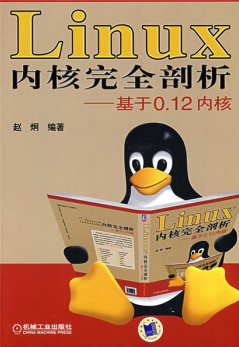
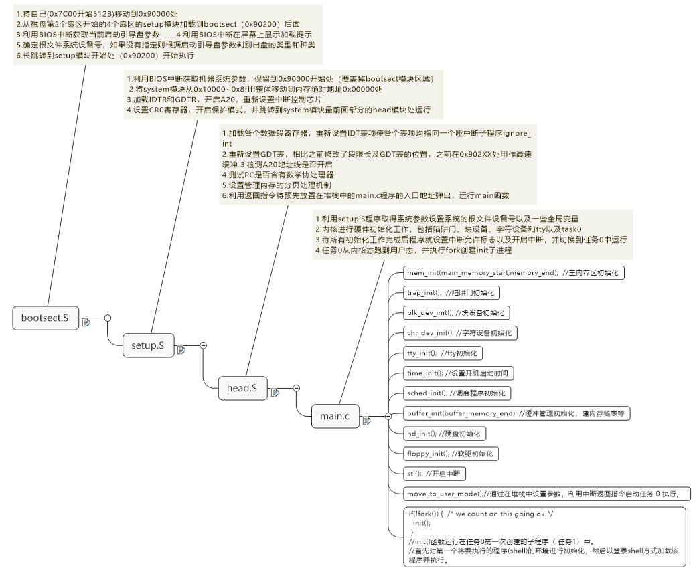
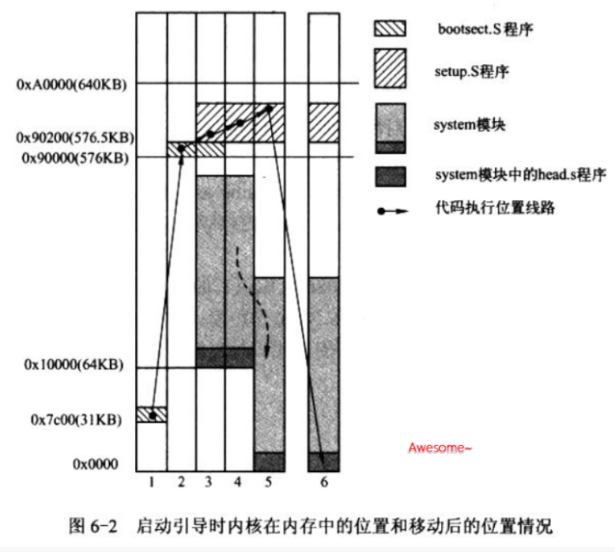
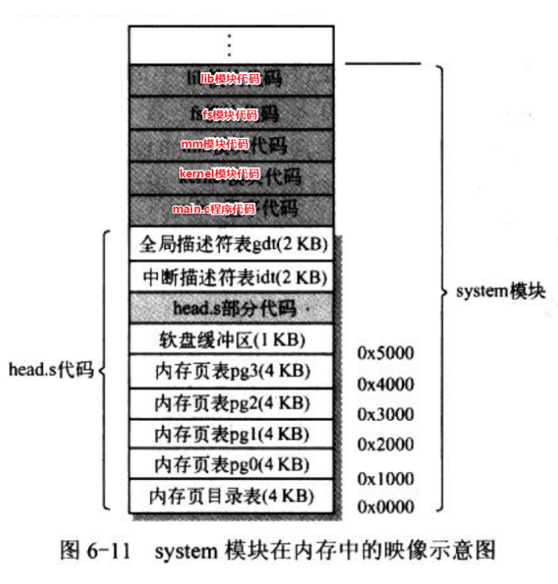
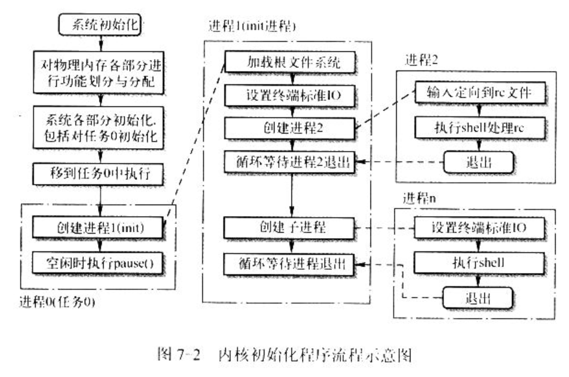
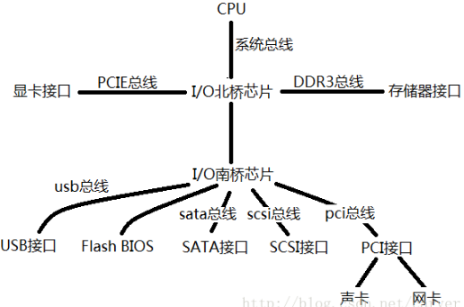
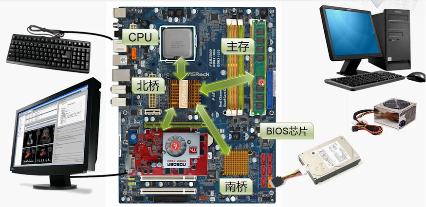
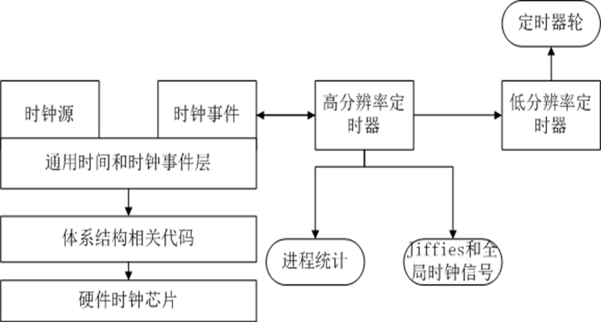

# 《linux-0.12 内核完全剖析》



赵炯，上海同济大学计算机通信专业毕业，多年从事操作系统，计算机网络和系统软件的研究工作，具有很高的学术水平。2004年编写的《Linux内核完全注释 -基于0.12内核》（**Linux 0.12版本发布于1992年1月15日**）一书，一年内印刷4次，在各大计算机排行榜始终名列前茅，并被《中华读书报》评为“2004年度十大电脑图书”之一。


## 本仓库内容

1. linux 0.12 源码
2. linux 0.12 各个章节笔记
3. 源码编译脚本及bochs启动运行脚本

```
Something I hope you know before go into the coding~
First, please watch or star this repo, I'll be more happy if you follow me.
Bug report, questions and discussion are welcome, you can post an issue or pull a request.
```

## 目录

* [第1章-概述](docs/第1章-概述/第1章-概述.md)
* [第2章-微型计算机组成结构](docs/第2章-微型计算机组成结构/第2章-微型计算机组成结构.md)
* [第3章-内核编程语言和环境](docs/第3章-内核编程语言和环境/第3章-内核编程语言和环境.md)
* [第4章-80x86保护模式及其编程](docs/第4章-80x86保护模式及其编程/第4章-80x86保护模式及其编程.md)
* [第5章-linux内核体系结构](docs/第5章-linux内核体系结构/第5章-linux内核体系结构.md)
* [第6章-引导启动程序](docs/第6章-引导启动程序/第6章-引导启动程序.md)
    * [第6章-bootsec_s](docs/第6章-引导启动程序/第6章-bootsec_s.md)
    * [第6章-setup_s](docs/第6章-引导启动程序/第6章-setup_s.md)
    * [第6章-head_s](docs/第6章-引导启动程序/第6章-head_s.md)
* [第7章-初始化程序](docs/第7章-初始化程序/第7章-初始化程序.md)
    * [第7章-main_c](docs/第7章-初始化程序/第7章-main_c.md)
* [第8章-内核代码](docs/第8章-内核代码/第8章-内核代码.md)
    * [第8章-asm_s](docs/第8章-内核代码/第8章-asm_s.md)
    * [第8章-trap_s](docs/第8章-内核代码/第8章-trap_s.md)
    * [第8章-sys_call_s](docs/第8章-内核代码/第8章-sys_call_s.md)
    * [第8章-sched_c](docs/第8章-内核代码/第8章-sched_c.md)
    * [第8章-signal_c](docs/第8章-内核代码/第8章-signal_c.md)
    * [第8章-mktime_c](docs/第8章-内核代码/第8章-mktime_c.md)
    * [第8章-fork_c](docs/第8章-内核代码/第8章-fork_c.md)
    * [第8章-sys_c](docs/第8章-内核代码/第8章-sys_c.md)
    * [第8章-vsprintf_c](docs/第8章-内核代码/第8章-vsprintf_c.md)
    * [第8章-printk_c](docs/第8章-内核代码/第8章-printk_c.md)
    * [第8章-panic_c](docs/第8章-内核代码/第8章-panic_c.md)
    * [第8章-exit_c](docs/第8章-内核代码/第8章-exit_c.md)
* [第9章-块设备驱动程序](docs/第9章-块设备驱动程序/第9章-块设备驱动程序.md)
* [第10章-字符设备驱动程序](docs/第10章-字符设备驱动程序/第10章-字符设备驱动程序.md)
* [第11章-数学协处理器](docs/第11章-数学协处理器/第11章-数学协处理器.md)
* [第12章-文件系统](docs/第12章-文件系统/第12章-文件系统.md)
* [第13章-内存管理](docs/第13章-内存管理/第13章-内存管理.md)
* [第14章-头文件](docs/第14章-头文件/第14章-头文件.md)
* [第15章-库文件](docs/第15章-库文件/第15章-库文件.md)
* [第16章-建造工具](docs/第16章-建造工具/第16章-建造工具.md)
* [第17章-实验环境设置与使用方法](docs/第17章-实验环境设置与使用方法/第17章-实验环境设置与使用方法.md)
* [勘误](docs/勘误.md)
* [要点-中断](docs/中断.md)
* [要点-任务切换](docs/任务切换.md)
* [要点-信号处理](docs/信号处理.md)
* [要点-五种IO模型](docs/五种IO模型.md)


## 相关站点

* GitHub地址:<https://github.com/yifengyou/linux-0.12>

* GibBook地址:<https://yifengyou.gitbooks.io/linux-0-12/content/>

* 《Linux操作系统实现原理》资源:<http://oldlinux.org/Book-Lite/>

* 配套网站:<http://oldlinux.org/>

## 思维导图

















## 一些个人看法

* 首先，读者如果是大佬，懂点Linux源码基础的可能会觉得这本书特么的废话注释真多~但身为菜鸡，读过一遍之后回过头来再看，个人觉得有些东西讲的细一点有好处，源码分析不能只讲理论，废话多的注释提供了很多信息，足够详细。但是缺点就是好比嚼烂了喂给你，你说恶心不恶心
* 因人而异吧，不少听到某某大佬直接间接批评国内内核书籍只是做注释，这本书，其实很到位，理论有了，注释有了。很适合菜鸡入门。大佬你就特么的闭嘴少说话，你要牛逼你也写一个。
* 读这本书需要掌握正确方法，论内核解析的正确打开姿势。首先，前面几章节基础，纯理论，必不可少的体系结构和基础汇编，如果掌握不了，或者看烦了，后面基本没啥玩头。如果你不知道体系结构，后面看的再透彻，你的瓶颈还是很明显的。反过来前面掌握透彻，后面，其实就是扩展补充
* 然后从第七章，第七章是个过渡，很重要的过渡，影响到你后面的阅读，第七章之前，引导程序和初始化程序有着很深刻的流程化节奏，你把握流程就ok了哟~
* 第八章开始，特么的就是一个一个文件的注释，谁看谁懵逼，谁看谁吐槽~四不四~
* 其实不然，你必须知道一点，内核其实就是一堆函数的集合，这对函数划分不同功能模块，但是内核要自举啊，自举肯定是流程化的，自举结束了呢？正常运行呗，然后接下来所有功能模块都只是在需要的时候调用，不需要的时候不去动，不过每个模块在使用之前都肯定要初始化，初始化干了些啥？无非就是占坑，预存一些数据结构，参数什么的，硬件呢就是设置寄存器，告诉硬件要工作在什么模式。。其实我个人感觉硬件最蛋疼，因为太规矩，你必须怎么滴怎么滴才能怎么滴。
* 感觉入门OS基础不可或缺两点 1.中断机制 2.段页式内存管理机制。
* 对于中断而言，了解一下它的历史，会对它的作用意义有比较深的理解。然后我觉得理解中断不可或缺的一个概念或者说一种思路，就是中断的最高频率和CPU的处理速度之间的关系。
* 假设中断频率100HZ（1000ms为1HZ，100HZ时,周期为1000/100=10ms），CPU处理速度1.1GHz（约为9000MIPs，MIPs为每秒百万条指令，1ms指令数约为9000/1000 = 9百万条指令)，也就是说外部中断顶多顶多每隔10ms发生一次，但是**CPU在1ms间就可以搞定9百万条指令，而一个外部中断其实指令数一般不过千，因此不必担心中断嵌套过深以及处理器过于处理速率跟不上中断丢失的情况，不用担心下一次中断来临前任务完不成的情况**。基本可以理解为发生的外部中断不会嵌套发生，但是CPU内部中断，比如外部中断过程中发生系统调用中断是可以的哦，系统调用属于软中断，用了陷阱门，IDT[128],0X80号中断，DPL=3。但是依然能够在外部中断间隔内完成。HZ不是个固定不变的值，它是可以更改的，可以在内核源代码中修改。
* 在单处理器系统中，每个tick只发生一次时钟中断。在对应的中断处理程序中完成更新系统时间、统计、定时器、等全部功能;而在多处理器系统下，需要考虑更多问题，多处理器每个CPU都有自己的时钟，时钟中断实际上是分成两个部分：1、全局时钟中断，系统中每个tick只发生一次。对应的中断处理程序用于更新系统时间和统计系统负载; 2、本地时钟中断，系统中每个tick在每个CPU上发生一次。对应的中断处理程序用于统计对应CPU和运行于该CPU上的进程的时间，以及触发对应CPU上的定时器;于是，在多处理器系统下，每个tick，每个CPU要处理一次本地时钟中断；另外，其中一个CPU还要处理一次全局时钟中断。 至于谁去更新全局，这不固定，谁有空谁去更新
* 时钟中断存在丢失的可能。内核中的某些临界区是不能被中断的，所以进入临界区前需要屏蔽中断。当中断屏蔽取消的时候，硬件只能告诉内核是否曾经发生了时钟中断、却不知道已经发生过多少次。**于是，在极端情况下，中断屏蔽时间可能超过1个tick，从而导致时钟中断丢失**。 如果计算机上的时钟振荡器有很高的精度，linux内核可以读振荡器中的计数器，通过比较上一次读的值与当前值，以确定中断是否丢失。如果发现中断丢失，则本次中断处理程序会给jiffies_64增加相应的计数。但是如果振荡器硬件不允许（不提供计数器、或者计数器不允许读、或者精度不够），内核也没法知道时钟中断是否丢失了，实际丢了会咋滴？如果对实时性要求很高，那就不精确，否则都ok。
* jiffies存在溢出（回绕问题）。jiffies变量总是无符号长整数，在32位体系结构上时32位，在64位体系结构上时64位。**32位的jiffies变量，如果HZ = 100，497天后会溢出，如果HZ = 1000，49.7天后会溢出。而64位则别指望能看到溢出**。一般就算是64位也只是读取低32位就够用。内核提供四个宏来帮助比较节拍计数，能正确处理节拍计数的回绕问题。
* 要知道外部中断信号产生的时候，IF位被CPU置0，也就是你不处理不继续相应。所以CPU一般都是已处理完成紧急的该处理的工作之后就IF=1开启中断，酱紫就能够尽快响应。你要说丢失中断信号有没有可能？这就好比你生产手机的时候客户问你电池会不会爆炸？凭什么说不会
* 外部中断HZ频率，可以说，外部中断肯定一定绝对的必须是在时间间隔发生，要么发生，要么不发生。时钟中断处理程序可以划分为两个部分：体系结构部分和体系结构无关部分
* 实时性是个指标，绝对实时就没有实时的概念，基本上套路就是规定的时间内完成或者必要的响应。如果发生的中断1ms内响应算实时，1ns内响应算实时，1us内响应算实时，只是有比较才有优秀。
* 能响应的最大中断频率还是看是否能在中断时间内完成所有计算，比如500KHz的中断频率就需要在2us之内完成所有计算。
* 画图理解 - 不画图学起来比较吃力~

## 总结

1. 基础永远值得花费90%的精力去学习加强。厚积而薄发~
2. 要理解一个软件系统的真正运行机制，一定要阅读其源代码~

## 参考博客

* 咖啡's blog:<https://blog.csdn.net/body100123/article/details/54315858>
* linuxbird:<https://www.cnblogs.com/linuxbird/archive/2013/06/06/3121738.html>
* sfzyk:<https://www.cnblogs.com/sfzyk/p/7467040.html>
* 时钟浅析：<https://blog.csdn.net/ctthuangcheng/article/details/8916008>
