<!-- TOC depthFrom:1 depthTo:6 withLinks:1 updateOnSave:1 orderedList:0 -->

- [中断](#中断)
	- [要点总结-中断](#要点总结-中断)
	- [中断过程详解](#中断过程详解)
		- [x86的中断处理过程](#x86的中断处理过程)
	- [可屏蔽中断和不可屏蔽中断](#可屏蔽中断和不可屏蔽中断)
	- [实例-除零异常中断](#实例-除零异常中断)
	- [不同类型中断区别(硬件中断+异常+系统调用)](#不同类型中断区别硬件中断异常系统调用)
	- [为什么用FS保存用户段？](#为什么用fs保存用户段)
	- [系统调用过程](#系统调用过程)
	- [硬件中断](#硬件中断)
	- [段间子程序调用](#段间子程序调用)
	- [中断调用和子程序的调用的异同](#中断调用和子程序的调用的异同)
	- [END](#end)

<!-- /TOC -->
# 中断

## 要点总结-中断

* 中断:**CPU不再继续依序执行指令，而是转去处理某一从CPU外部或内部产生的特殊信息**
* Linux中通常分为外部中断（又叫硬件中断）和内部中断（又叫异常）。
* 异常 = 同步中断，硬件中断 = 异步中断
* 硬件中断使得硬件得以发出通知给处理器，本质上是一种电信号，由硬件设备发向处理器，处理器接收到中断后，会马上向操作系统反应此信号的带来，然后就由OS负责处理这些新到来的数据，中断可以随时发生，才不用操心与处理器的时间同步问题。不同的设备对应的中断不同，他们之间的不同从操作系统级来看，差别就在于一个数字标识-----**中断号**。专业一点就叫**中断请求(IRQ)线**,通常IRQ都是一些数值量。有些体系结构上，中断号是固定的，有的是动态分配的，这不是问题所在，问题在于**特定的硬件中断总是与特定的设备相关联，并且内核要知道这些信息，这才是最关键的**,不是么？哈哈.
* 中断随时可以产生，内核随时会被打断。
* 不同设备的中断不同，每个中断都通过一个唯一的数字标识，称为IRQ（中断请求）
* 中断处理的行为和长调用（段间子程序调用）的行为颇为相似，理解长调用的处理过程即可理解中断处理过程。计算机理论中很多概念都是相通的，因此，扎实的基本功完全可以触类旁通的指导我们开发应用程序。
* 中断源-处理器从两种地方接收中断：外部（硬件产生）的中断；软件产生的中断。
* 异常源-处理器接收的异常也有两个来源：处理器检测到的程序错误异常；软件产生的异常。
* 处理器的速度跟外围硬件设备的速度往往不在一个数量级上，甚至几个数量级的差别。所以中断其实发生的慢，但是处理的很快，所以就有一个指标实时性，这个特性有强有弱。
* **中断处理程序是和特定中断相关联的，而不是和设备相关联**，如果一个设备可以产生很多中断，这时该设备的驱动程序也就需要准备多个这样的函数。**一个中断处理程序是设备驱动程序的一部分**，这个我们在linux设备驱动中已经说过，就不说了，后面我也会提到一些。前边说过一个问题：中断是可能随时发生的，因此必须要保证中断处理程序也能随时执行，中断处理程序也要尽可能的快速执行，只有这样才能保证尽可能快地恢复中断代码的执行。
* 中断处理程序上半部(top half)---接收到一个中断，它就立即开始开始执行，但只做严格时限的工作，这些工作都是在所有中断被禁止的情况下完成的。同时，能够被允许稍后完成的工作推迟到下半部(bottom half)去，此后，下半部会被执行，通常情况下，下半部都会在中断处理程序返回时立即执行。

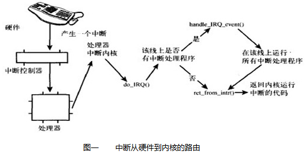


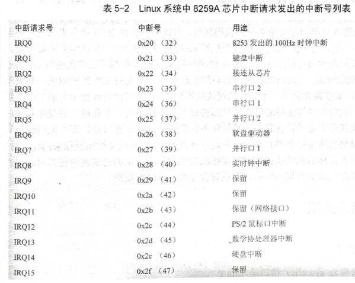

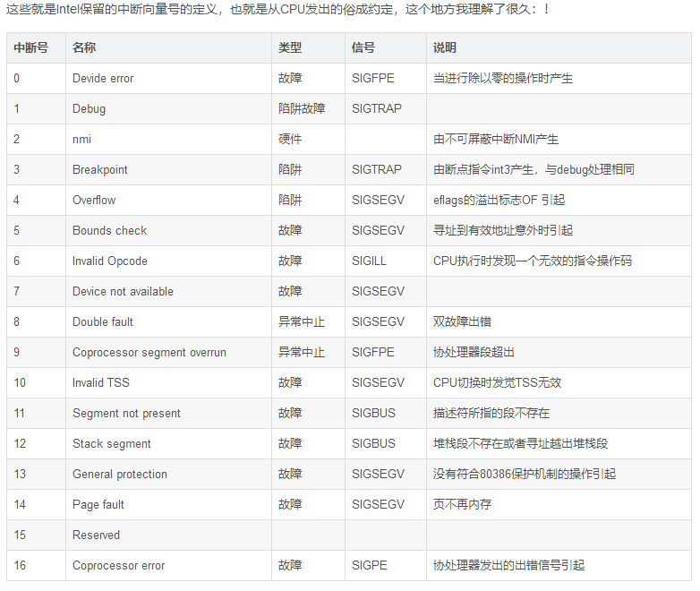
* 以上内容就是大部分硬件故障的中断处理函数的处理过程，剩下的部分就是对8259A中断控制器的中断响应处理和系统调用(俗称**软中断**)
* 分清楚，不管如何都是用的同一个IDT表，但是外设分配的是从32号中断开始，也就是说把0~255个中断向量划分区域用作不同功能。

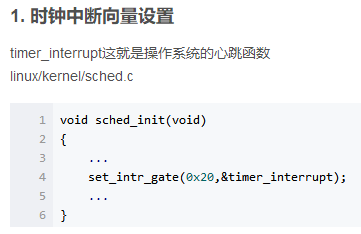

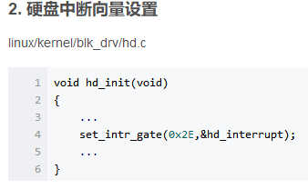


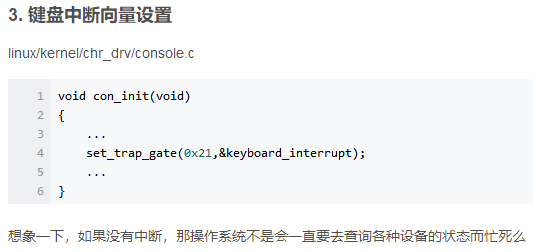

* 系统调用 = 软中断 = 0x80 = 0b1000 0000 = 128号中断

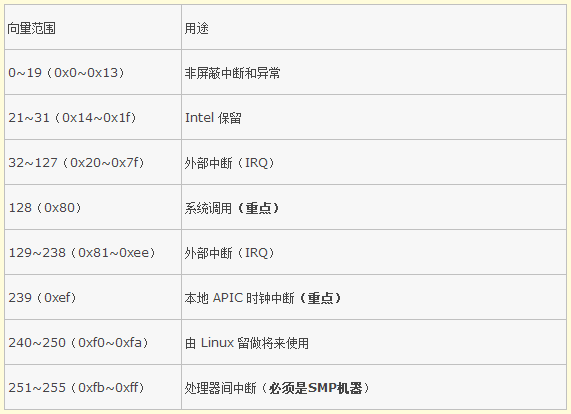

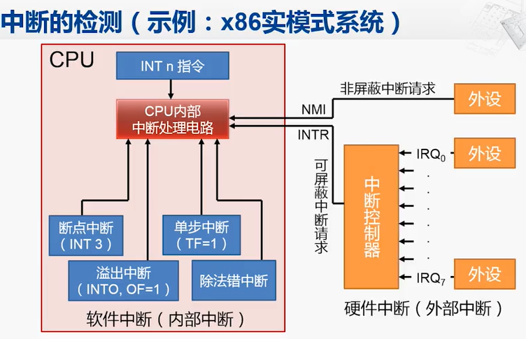


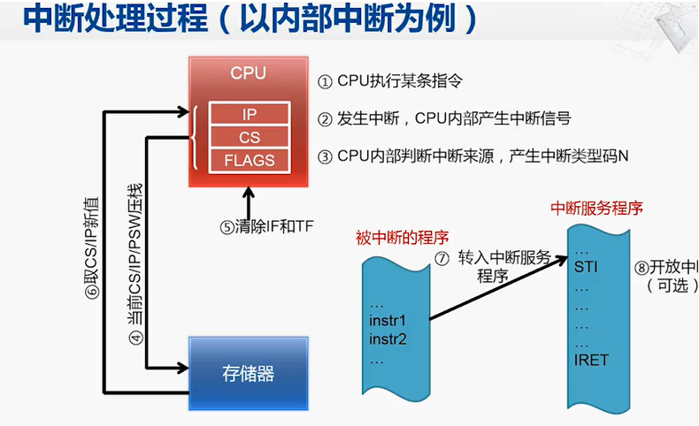

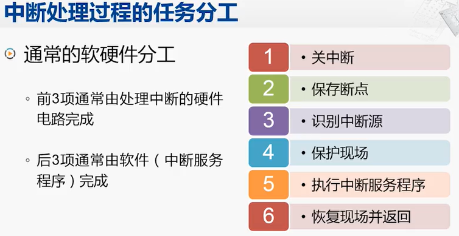

* Intel i386共有256个中断，每个中断都有一个0～255之间的数来表示，**Intel将前32个中断号（0～31）已经固定设定好或者保留未用**。中断号32～255分配给操作系统和应用程序使用。在Linux中，**中断号32～47对应于一个硬件芯片的16个中断请求信号**，这16个中断包括时钟、键盘、软盘、数学协处理器、硬盘等硬件的中断。
* 系统调用设为中断号128，即0x80。


## 中断过程详解

在Intel的文档中,把中断分为两种.一种是异常,也叫同步同断.一种称之为中断,也叫异常中断。

* 同步中断指的是由CPU控制单元产生,之所以称之为同步,是因为只有一条指令执行完毕后才会发出中断.例如除法运算中,除数为零的时候,就会产生一个异常
* 异步中断是由外部设备按照CPU的时钟随机产生的.例如,网卡检测到一个数据到来就会产生一个中断.

### x86的中断处理过程

由于中断是开着的，所以当执行完一条指令后，cs和eip这对寄存器中已经包含了下一条将要执行的指令的逻辑地址。在处理那条指令之前，控制单元会检查在运行前一条指令时是否发生了一个中断或异常。（也就是硬件没执行完一条指令就检查是否发生中断）如果发生了一个中断和异常，那么控制单元执行下列操作：

1. 确定与中断或异常关联的向量i（0≤ i ≤255）
2. 读由idtr寄存器指向的IDT表中的第i项。
3. 从gdtr寄存器获得GDT的基地址，并在GDT中查找，以读取IDT表项中的选择符标识的段描述符。这个描述符指定中断或异常处理程序所在的段的基地址。
4. 确信中断是由授权的（中断）发生源发出的。首先将当前特权级CPL（存放在cs寄存器的低两位）与段描述符（存放在GDT中）的描述符特权级DPL比较。如果CPL小于DPL，就产生一个“通常保护”异常，因为中断处理程序的特权级不能低于引起中断的程序的特权。对于编程异常，则做进一步的安全检查：比较 CPL与处于IDT中的门描述符的DPL，如果DPL小于CPL，就产生一个“通常保护”异常，这最后
一个检查可以避免用户应用程序访问特殊的陷阱门和中断门。
5. 检查是否发生了特权级的变化，也就是说，CPL是否不同于所选择的段描述符的DPL。如果是，控制单元必须开始使用与新的特权级相关的栈，通过执行以下步骤来保证这一点：
```
 A. 读tr寄存器，以访问运行进程的TSS段。
 B. 用与新特权级相关的栈段和栈指针的正确值装载ss和esp寄存器。这些值可以在TSS中找到。
 C．在新的栈中保存ss和esp以前的值，这些值定义了与旧特权级相关的栈的逻辑地址。
```
6. 如果故障已发生，用引起异常的指令地址装载cs和eip寄存器，从而使得这条指令能再次被执行。
7. 在栈中保存eflag、cs和eip的内容。
8. 如果异常产生了一个硬件出错码，则将它保存在栈中。
9. 装载cs和eip寄存器，其值分别是IDT表中第i项门描述符的段选择符和偏移量字段。这些值给出了中断或者异常处理程序的第一条指令的逻辑地址。


控制单元所执行的最后一步就是跳转到中断或异常处理程序。换句话说，处理完中断信号后，控制单元所执行的指令就是被选中处理程序的第一条指令。
上面的处理过程的描述摘自<<深入理解linux内核>>,其中有几点值得注意的地方:
```
1:通过门后,只能提高运行级别.就像上面所述的 “当前特权级CPL（存放在cs寄存器的低两位）与段描述符（存放在GDT中）的描述符特权级DPL比较。如果CPL小于DPL，就产生一个“通常保护” 异常”.在中断处理中,通常把IDT中的相应段选择符设为__KERNEL_CS.即最高的运行级别
2:上面C所述:“在新的栈中保存ss和esp以前的值，这些值定义了与旧特权级相关的栈的逻辑地址”,那 ss,esp以前的值是如何找到的呢?应该是从TSS中.在中断发生的时候,如果检测到运行级别发生了改了,将寄存器SS,ESP中的值保存进TSS的相应级别位置.再加载新的SS,ESP的值,然后从TSS中取出旧的SS,ESP值,再压栈
```
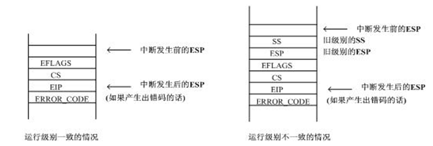

从上图中我们可以看到,硬件自动保存的硬件环境是非常少,要在中断后恢复到以前的环境,还需要保存更多的寄存器值,这是由操作系统完成的.这我们在以后的代码分析中可以看到中断和异常被处理完毕后，相应的处理程序必须产生一条iret指令，把控制权转交给被中断的进程，这将迫使控制单元：
1. 用保存在栈中的值装载cs、eip和eflag寄存器。如果一个硬件出错码曾被压入栈中，并且在eip内容的上面，那么，执行iret指令前必须先弹出这个硬件出错码。
2. 检查处理程序的CPL是否等于cs中的低两位的值。如果是，iret终止返回；否则，转入下一步。
3. 从栈中转载ss和esp寄存器，因此，返回到与旧特权级相关的栈。
4. 检查ds、es、fs及gs段寄存器的内容，如果其中一个寄存器包含的选择符是一个段描述符，并且其DPL值小于CPL，那么，清相关的段寄存器。控制单元这么做是为了禁止用户态的程序利用内核以前所用的段寄存器。如果不清除这些寄存器的话，恶意的用户程序就会利用他们来访问内核地址空间。
注意到4:举例说明一下.如果通过系统调用进入内核态.然后将DS,ES的值赋为__KERNEL_DS(在2.4 的内核里),处理完后(调用iret后),恢复CS,EIP的值,此时CS的CPL是3.因为DS,ES被设为了__KERNEL_DS,所以其DPL是 0,所以要将DS,ES中的值清除.在2.6内核中,发生中断或异常后,将DS,ES的值设为了__USER_DS,避免了上述的清除过程,提高了效率.


## 可屏蔽中断和不可屏蔽中断

* 不可屏蔽中断从源头分，既可由 CPU 内部产生，也可由外部 NMI 针脚产生。不可屏蔽中断通常用于故障处理(如:协处理器运算出错,存储器校验出错,I/O通道校验出错等).
*  典型的非屏蔽中断源的例子是电源掉电，一旦出现，必须立即无条件地响应，否则进行其他任何工作都是没有意义的。典型的可屏蔽中断源的例子是打印机中断，CPU对打印机中断请求的响应可以快一些，也可以慢一些，因为让打印机等待儿是完全可以的。
* 对于软中断，它不受IF位的影响，所以属于非屏蔽中断范畴。还有一点，细心的读者会想到：CPU只有两根中断请求输入线，有多个中断源怎么办? 一般借助于外部电路


## 实例-除零异常中断

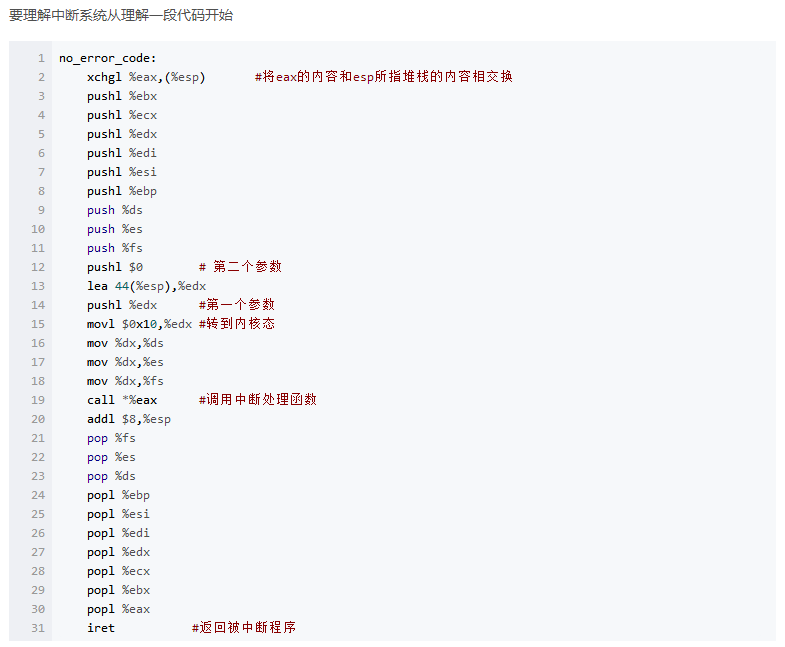

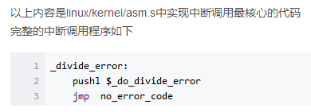

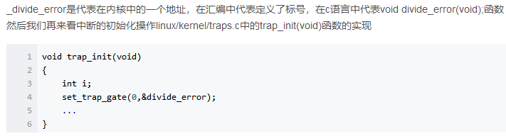

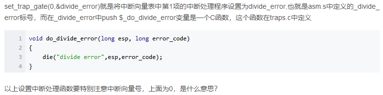


## 不同类型中断区别(硬件中断+异常+系统调用)

* 硬件中断：处理前要发送EOI指令，如果是时钟中断，处理完也要检测信号位图
* 系统调用的中断：最多可带3个参数 ，通过EBX, ECX, EDX传入，处理完也要检测信号位图


## 为什么用FS保存用户段？

**用于执行内核数据空间和用户数据空间之间的数据复制工作。**

优点：

1. 边界检查由CPU自动完成
2. 进入中断时，FS自动保存到内核堆栈，退出中断时自动弹出，不需要特殊处理

## 系统调用过程

1. 保存寄存器原值：DS, FS, ES, EAX

2. 三个参数入栈：EDX, ECX, EBX

3. DS和ES设置成内核数据段0x10，FS设置为用户数据段0x17

4. 测试EAX是否有效

5. 调用相应的C函数

6. 系统调用的返回值入栈

7. 查看执行本次调用的进程的状态，若非就绪或时间片用完，则schedule()（不管有没有schedule()都会进入第八步）

8. 返回到ret_from_sys_all继续执行

9. 若当前进程是进程0或是内核进程，则出栈，退出中断

10. 检查信号位图，调用do_signal()。**ret_from_sys_all中调用do_signal()**

11. 恢复寄存器，退出中断，返回调用程序。完结

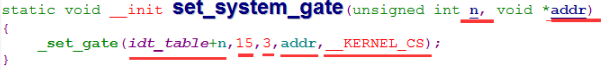

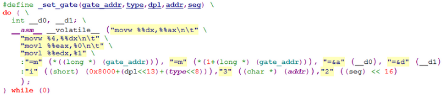

宏_set_gate()有四个参数：（1）gate_addr：描述符desc_struct结构类型的指针，指定待操作的描述符，通常指向数组idt_table中的某个项。（2）type：描述符类型，对应于门格式中的Type字段。（3）dpl：该描述符的权限级别；（4）addr：中断处理程序入口地址的段内偏移量，由于内核段的起始地址总是为0，因此中断处理程序在内核段中的段内偏移量也就是中断处理程序的入口地址（即核心虚地址）。（5）seg指示内核代码段。

## 硬件中断

不带出错码的中断处理过程-asm.s

1. 原寄存器入栈（由硬件完成）：SS, ESP, EFLAGS, CS

2. 中断返回地址入栈：EIP

3. 要调用的函数地址入栈

4. EAX的值与栈顶的值（要调用的函数的地址）交换

5. 其它寄存器入栈：EBX, ECX, EDX, EDI, ESI, EBP, DS, ES, FS

6. 出错号入栈：error_code。如果没有出错号，就0入栈

7. EIP在栈中的地址入栈

8. 所有段寄存器转为内核代码段的段选择符：0x08

9. 调用相关C处理函数

10. 两次出栈（步骤6、步骤7入栈的内容）

11. 弹出除（步骤1、步骤2以外的所有内容）

12. 恢复上下文（硬件完成）

## 段间子程序调用

* 段间调用指返回处 段地址 和 段内偏移量 都将入栈保护
* 段内的调用 与 返回指令 只入栈和退栈段内地址的偏移量


## 中断调用和子程序的调用的异同

1. 两过程定义与作用

子程序是微机基本程序结构中的1种，基本程序结构包括顺序（简单）、分支（判断）、循环、子程序和查表等5种。

子程序是一组可以公用的指令序列，只要给出子程序的入口地址就能从主程序转入子程序。子程序在功能上具有相对的独立性，在执行主程序的过程中往往被多次调用，甚至被不同的程序所调用。一般微机首先执行主程序，碰到调用指令就转去执行子程序，子

程序执行完后，返回指令就返回主程序断点（即调用指令的下一条指令），继续执行没有处理完的主程序，这一过程叫做（主程序）调用子程序过程。

子程序结构可简化程序，防止重复书写错误，并可节省内存空间。计算机中经常把常用的各种通用的程序段编成子程序，提供给用户使用。用户在自己编写的程序中，只要会调用这些子程序，就可大大简化用户编程的困难。


中断是计算机中央处理单元CPU与外设I/O交换数据的一种方式，除此方式外，还有无条件、条件（查询）、存贮器直接存取DMA和I/O通道等四种方式。由于无条件不可靠，条件效率低，DMA和I/O通道两方式硬件复杂，而中断方式CPU效率高，因此一般大多采用中断方式。中断概念是当计算机正在执行某一（主）程序时，收到一中断请求，如果中断响应条件成立，计算机就把正在执行的程序暂停一下，去响应处理这一请求，执行中断服务程序，处理完服务程序后，中断返回指令使计算机返回原来还没有执行完的程序断点处继续执行，这一过程称为中断过程。有了中断，计算机才能具有并行处理，实时处理和故障处理等重要功能。

2. 两过程的联系与区别

2.1 联系

中断与调用子程序两过程属于完全不同的概念，但它们也有不少相似之处。两者都需要保护断点（即下一条指令地址）、跳至子程序或中断服务程序、保护现场、子程序或中断处理、恢复现场、恢复断点（即返回主程序）。两者都可实现嵌套，即正在执行的子程序再调另一子程序或正在处理的中断程序又被另一新中断请求所中断，嵌套可为多级。

正是由于这些表面上的相似处，很容易使学生把两者混淆起来，特别是把中断也看为子程序，这就大错特错了。

2.2 区别

中断过程与调用子程序过程相似点是表面的，从本质上讲两者是完全不一样的。

两者的根本区别主要表现在服务时间与服务对象不一样上。

首先，调用子程序过程发生的时间是已知和固定的，即在主程序中的调用指令（CALL）执行时发生主程序调用子程序，调用指令所在位置是已知和固定的。而中断过程发生的时间一般的随机的，CPU在执行某一主程序时收到中断源提出的中断申请时，就发生中断过程，而中断申请一般由硬件电路产生，申请提出时间是随机的（软中断发生时间是固定的），也可以说，调用子程序是程序设计者事先安排的，而执行中断服务程序是由系统工作环境随机决定的；

其次，子程序完全为主程序服务的，两者属于主从关系，主程序需要子程序时就去调用子程序，并把调用结果带回主程序继续执行。而中断服务程序与主程序两者一般是无关的，不存在谁为谁服务的问题，两者是平行关系；

第三，主程序调用子程序过程完全属于软件处理过程，不需要专门的硬件电路，而中断处理系统是一个软、硬件结合系统，需要专门的硬件电路才能完全中断处理的过程；第四，子程序嵌套可实现若干级，嵌套的最多级数由计算机内存开辟的堆栈大小限制，而中断嵌套级数主要由中断优先级数来决定，一般优先级数不会很大。

## END
