<!-- TOC depthFrom:1 depthTo:6 withLinks:1 updateOnSave:1 orderedList:0 -->

- [要点-五种IO模型](#要点-五种io模型)
	- [总结](#总结)
		- [阻塞IO/非阻塞IO+同步IO/异步IO基本概念](#阻塞io非阻塞io同步io异步io基本概念)
		- [举个栗子](#举个栗子)
		- [Blocking I/O(同步阻塞IO)](#blocking-io同步阻塞io)
		- [Nonblocking I/O(同步非阻塞IO)](#nonblocking-io同步非阻塞io)
		- [IO mutiplexing(IO复用模型select和poll/异步阻塞IO)](#io-mutiplexingio复用模型select和poll异步阻塞io)
		- [single driven I/O(SIGIO)(信号驱动的IO/异步阻塞IO)](#single-driven-iosigio信号驱动的io异步阻塞io)
		- [asynchronous I/O(异步非阻塞IO)](#asynchronous-io异步非阻塞io)
		- [select+poll+epoll优缺点及异同](#selectpollepoll优缺点及异同)
	- [参考](#参考)
	- [END](#end)

<!-- /TOC -->

# 要点-五种IO模型

## 总结

* 首先为什么需要I/O模型呢，因为进程是无法直接操作I/O设备的。其必须通过系统调用请求kernel来协助完成I/O动作。而内核会为每个I/O设维护一个buffer。对于输入而言，等待数据输入到buffer需要时间的，而从buffer复制数据给进程也需要时间的根据等待的模式不同，I/O分为五类。

```
一.Blocking I/O（阻塞IO）
二.Nonblocking I/O(非阻塞IO)
三.IO mutiplexing（select和poll） （IO复用）  
四.single driven I/O （SIGIO）（信号驱动的IO）
五.asynchronous I/O （异步IO）
```

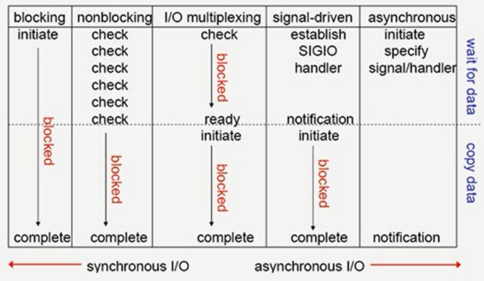

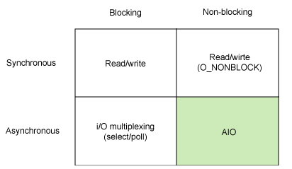

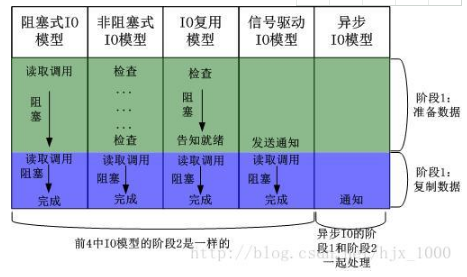

* 同步IO：导致请求进程阻塞，直到IO操作完成；异步IO：不导致请求阻塞；
* 因此，前4中IO模型都属于同步IO，因为他们第二阶段的复制数据过程将阻塞用户进程，只有第5种才是真正的异步IO模型。

### 阻塞IO/非阻塞IO+同步IO/异步IO基本概念

不管是任何模式，内核的处理方式都是一样的，都是

1. wait for data（等待数据）；
2. copy data from kernel to user（拷贝数据到用户层）。
而产生这三种模式的差别在于中间使用的api函数不同。

IO请求的两个阶段：
```
1.等待资源阶段：IO请求一般需要请求特殊的资源（如磁盘、RAM、文件），当资源被上一个使用者使用没有被释放时，IO请求就会被阻塞，直到能够使用这个资源。
2.使用资源阶段：真正进行数据接收和发生。例如输入操作时将数据从内核复制到用户缓存，输出操作时将用户缓存复制到内核。
```

在**等待数据阶段**，IO分为阻塞IO和非阻塞IO。
```
1.阻塞IO： 资源不可用时，IO请求一直阻塞，直到反馈结果（有数据或超时）。
2.非阻塞IO：资源不可用时，IO请求离开返回，返回数据标识资源不可用
```

在**使用资源阶段**，IO分为同步IO和异步IO。
```
1.同步IO：应用阻塞在发送或接收数据的状态，直到数据成功传输或返回失败。
2.异步IO：应用发送或接收数据后立刻返回，数据写入OS缓存，由OS完成数据发送或接收，并返回成功或失败的信息给应用。
```

* select，poll，epoll都是IO多路复用的机制。I/O多路复用就通过一种机制，可以监视多个描述符，一旦某个描述符就绪（一般是读就绪或者写就绪），能够通知程序进行相应的读写操作。但**select，poll，epoll本质上都是同步I/O**，因为他们都需要在读写事件就绪后自己负责进行读写，也就是说这个读写过程是阻塞的，而异步I/O则无需自己负责进行读写，异步I/O的实现会负责把数据从内核拷贝到用户空间。

### 举个栗子

栗子一：

```
有A，B，C，D四个人在钓鱼：
A用的是最老式的鱼竿，所以呢，得一直守着，等到鱼上钩了再拉杆
B的鱼竿有个功能，能够显示是否有鱼上钩，所以呢，B就和旁边的MM聊天，隔会再看看有没有鱼上钩，有的话就迅速拉杆
C用的鱼竿和B差不多，但他想了一个好办法，就是同时放好几根鱼竿，然后守在旁边，一旦有显示说鱼上钩了，它就将对应的鱼竿拉起来
D是个有钱人，干脆雇了一个人帮他钓鱼，一旦那个人把鱼钓上来了，就给D发个短信
```
A = 阻塞I/O

B = 非阻塞I/O

C = I/O复用

D = 异步I/O


栗子二
```
老张爱喝茶，废话不说，煮开水。
出场人物：老张，水壶两把（普通水壶，简称水壶；会响的水壶，简称响水壶）。
1 老张把水壶放到火上，立等水开。（同步阻塞）
老张觉得自己有点傻
2 老张把水壶放到火上，去客厅看电视，时不时去厨房看看水开没有。（同步非阻塞）
老张还是觉得自己有点傻，于是变高端了，买了把会响笛的那种水壶。水开之后，能大声发出嘀~~~~的噪音。
3 老张把响水壶放到火上，立等水开。（异步阻塞）
老张觉得这样傻等意义不大
4 老张把响水壶放到火上，去客厅看电视，水壶响之前不再去看它了，响了再去拿壶。（异步非阻塞）
老张觉得自己聪明了。
```

所谓同步异步，只是对于水壶而言。
普通水壶，同步；响水壶，异步。
虽然都能干活，但响水壶可以在自己完工之后，提示老张水开了。这是普通水壶所不能及的。
同步只能让调用者去轮询自己（情况2中），造成老张效率的低下。

所谓阻塞非阻塞，仅仅对于老张而言。
立等的老张，阻塞；看电视的老张，非阻塞。
情况1和情况3中老张就是阻塞的，媳妇喊他都不知道。虽然3中响水壶是异步的，可对于立等的老张没有太大的意义。所以一般异步是配合非阻塞使用的，这样才能发挥异步的效用。

### Blocking I/O(同步阻塞IO)

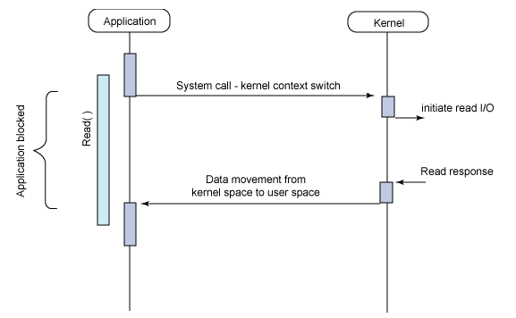

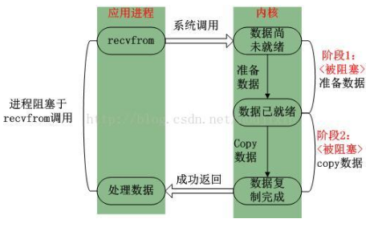


### Nonblocking I/O(同步非阻塞IO)


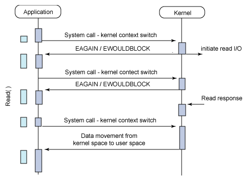

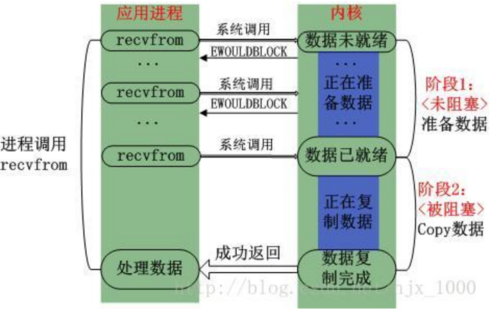


### IO mutiplexing(IO复用模型select和poll/异步阻塞IO)

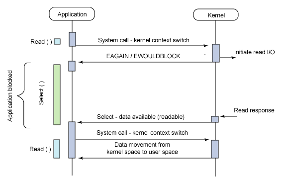

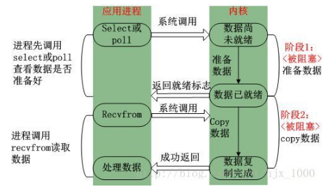

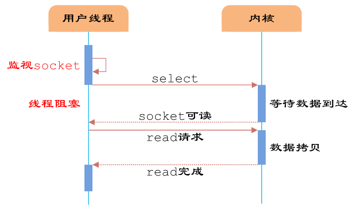


```
使用select函数时统一监视多个文件描述符的：
1、 是否存在套接字接收数据？
2、 无需阻塞传输数据的套接字有哪些?
3、 哪些套接字发生了异常？
```
*  支持阻塞操作的设备驱动通常会实现一组自身的等待队列如读/写等待队列用于支持上层(用户层)所需的BLOCK或NONBLOCK操作。**当应用程序通过设备驱动访问该设备时(默认为BLOCK操作)，若该设备当前没有数据可读或写，则将该用户进程插入到该设备驱动对应的读/写等待队列让其睡眠一段时间，等到有数据可读/写时再将该进程唤醒。**
* select就是巧妙的利用等待队列机制让用户进程适当在没有资源可读/写时睡眠，有资源可读/写时唤醒。

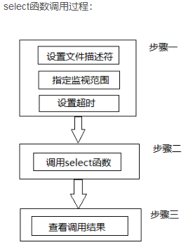


### single driven I/O(SIGIO)(信号驱动的IO/异步阻塞IO)

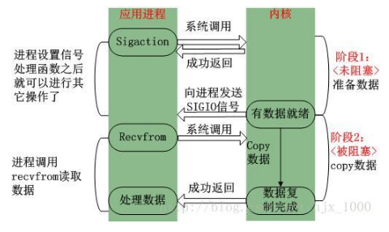


### asynchronous I/O(异步非阻塞IO)

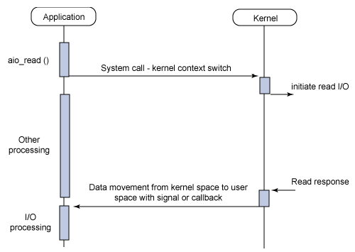

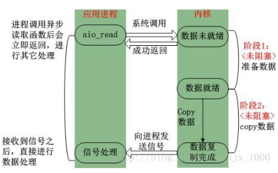


### select+poll+epoll优缺点及异同

* epoll跟select、poll都能提供多路I/O复用的解决方案。在现在的Linux内核里有都能够支持，其中epoll是Linux所特有，而select则应该是POSIX所规定，一般操作系统均有实现

* select：

select本质上是通过设置或者检查存放fd标志位的数据结构来进行下一步处理。这样所带来的缺点是：

1、 单个进程可监视的fd数量被限制，即能监听端口的大小有限。
```
一般来说这个数目和系统内存关系很大，具体数目可以cat /proc/sys/fs/file-max察看。32位机默认是1024个。64位机默认是2048.
```
2、 对socket进行扫描时是线性扫描，即采用轮询的方法，效率较低：
```
当套接字比较多的时候，每次select()都要通过遍历FD_SETSIZE个Socket来完成调度,不管哪个Socket是活跃的,都遍历一遍。这会浪费很多CPU时间。如果能给套接字注册某个回调函数，当他们活跃时，自动完成相关操作，那就避免了轮询，这正是epoll与kqueue做的。
```
3、需要维护一个用来存放大量fd的数据结构，这样会使得用户空间和内核空间在传递该结构时复制开销大

* poll：

poll本质上和select没有区别，它将用户传入的数组拷贝到内核空间，然后查询每个fd对应的设备状态，如果设备就绪则在设备等待队列中加入一项并继续遍历，如果遍历完所有fd后没有发现就绪设备，则挂起当前进程，直到设备就绪或者主动超时，被唤醒后它又要再次遍历fd。这个过程经历了多次无谓的遍历。

它没有最大连接数的限制，原因是它是基于链表来存储的，但是同样有一个缺点：
```
1、大量的fd的数组被整体复制于用户态和内核地址空间之间，而不管这样的复制是不是有意义。                   
2、poll还有一个特点是“水平触发”，如果报告了fd后，没有被处理，那么下次poll时会再次报告该fd。
```

* epoll:

epoll有EPOLLLT和EPOLLET两种触发模式，LT是默认的模式，ET是“高速”模式。LT模式下，只要这个fd还有数据可读，每次 epoll_wait都会返回它的事件，提醒用户程序去操作，而在ET（边缘触发）模式中，它只会提示一次，直到下次再有数据流入之前都不会再提示了，无 论fd中是否还有数据可读。所以在ET模式下，read一个fd的时候一定要把它的buffer读光，也就是说一直读到read的返回值小于请求值，或者 遇到EAGAIN错误。还有一个特点是，epoll使用“事件”的就绪通知方式，通过epoll_ctl注册fd，一旦该fd就绪，内核就会采用类似callback的回调机制来激活该fd，epoll_wait便可以收到通知。

epoll为什么要有EPOLLET触发模式？

如果采用EPOLLLT模式的话，系统中一旦有大量你不需要读写的就绪文件描述符，它们每次调用epoll_wait都会返回，这样会大大降低处理程序检索自己关心的就绪文件描述符的效率.。而采用EPOLLET这种边沿触发模式的话，当被监控的文件描述符上有可读写事件发生时，epoll_wait()会通知处理程序去读写。如果这次没有把数据全部读写完(如读写缓冲区太小)，那么下次调用epoll_wait()时，它不会通知你，也就是它只会通知你一次，直到该文件描述符上出现第二次可读写事件才会通知你！！！这种模式比水平触发效率高，系统不会充斥大量你不关心的就绪文件描述符

epoll的优点：
```
1、没有最大并发连接的限制，能打开的FD的上限远大于1024（1G的内存上能监听约10万个端口）；
2、效率提升，不是轮询的方式，不会随着FD数目的增加效率下降。只有活跃可用的FD才会调用callback函数；
即Epoll最大的优点就在于它只管你“活跃”的连接，而跟连接总数无关，因此在实际的网络环境中，Epoll的效率就会远远高于select和poll。
3、 内存拷贝，利用mmap()文件映射内存加速与内核空间的消息传递；即epoll使用mmap减少复制开销。
```

* select、poll、epoll 区别总结：

1、支持一个进程所能打开的最大连接数

select
```
单个进程所能打开的最大连接数有FD_SETSIZE宏定义，其大小是32个整数的大小（在32位的机器上，大小就是3232，同理64位机器上FD_SETSIZE为3264），当然我们可以对进行修改，然后重新编译内核，但是性能可能会受到影响，这需要进一步的测试。
```
poll
```
poll本质上和select没有区别，但是它没有最大连接数的限制，原因是它是基于链表来存储的
```
epoll
```
虽然连接数有上限，但是很大，1G内存的机器上可以打开10万左右的连接，2G内存的机器可以打开20万左右的连接
```
2、FD剧增后带来的IO效率问题

select、poll
```
因为每次调用时都会对连接进行线性遍历，所以随着FD的增加会造成遍历速度慢的“线性下降性能问题”。
```
epoll
```
因为epoll内核中实现是根据每个fd上的callback函数来实现的，只有活跃的socket才会主动调用callback，所以在活跃socket较少的情况下，使用epoll没有前面两者的线性下降的性能问题，但是所有socket都很活跃的情况下，可能会有性能问题。
```

3、 消息传递方式

select、poll
```
内核需要将消息传递到用户空间，都需要内核拷贝动作
```

epoll
```
epoll通过内核和用户空间共享一块内存来实现的。
```

总结：

综上，在选择select，poll，epoll时要根据具体的使用场合以及这三种方式的自身特点。

1、表面上看epoll的性能最好，但是在连接数少并且连接都十分活跃的情况下，select和poll的性能可能比epoll好，毕竟epoll的通知机制需要很多函数回调。

2、select低效是因为每次它都需要轮询。但低效也是相对的，视情况而定，也可通过良好的设计改善

## 参考

傻眼哥的博客:<https://blog.csdn.net/davidsguo008/article/details/73556811>
未来之歌:<https://blog.csdn.net/y396397735/article/details/55004775>
ZXX专栏:<https://blog.csdn.net/xxxxxx91116/article/details/12083613>

## END
