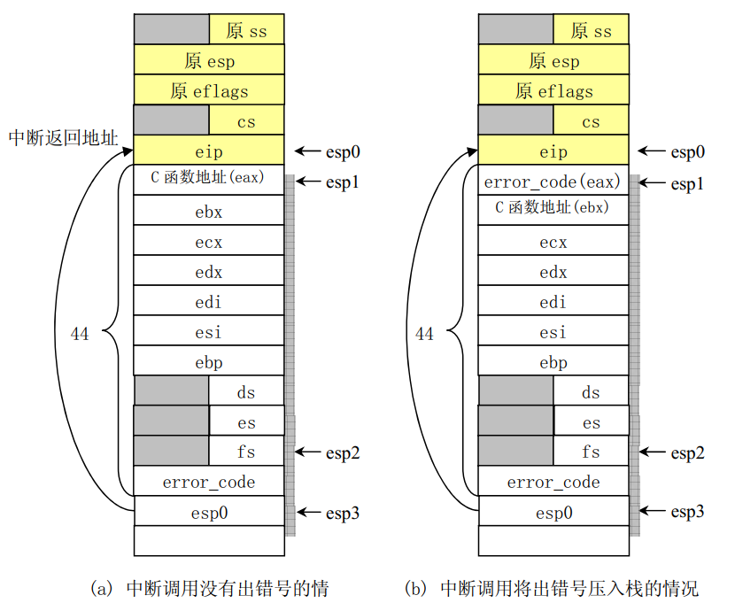

# 勘误

* page161 图5-17，左侧GDT表中所有LSS全都改成TSS。
* page269 第五行  “并检查并显示” 改为 “并检查显示”
* page274 图8-4中原EFLAGS下面一项应该是CS不是ES。并且图画错了，贴出正确的。

* page384 95行代码注释“CURRENT是指住设备号”改为“CURRENT是指主设备号”
* page597 第一行，另一个是目录中的“..” 改为 另一个是目录中的“.”。“..”指的是上层父目录
