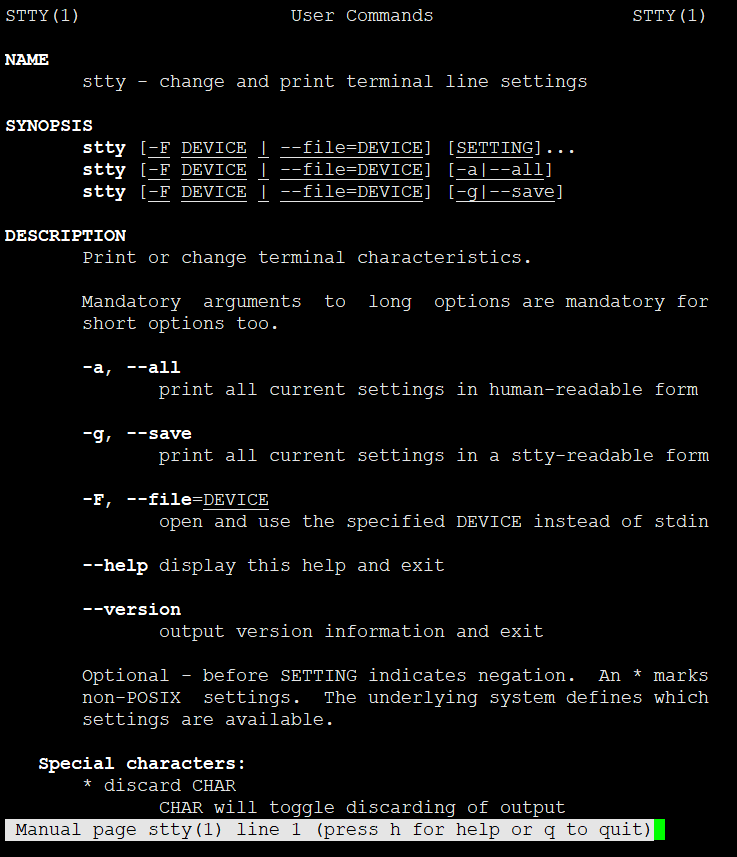
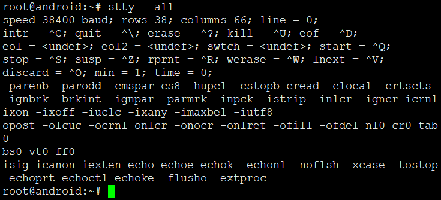
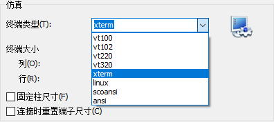
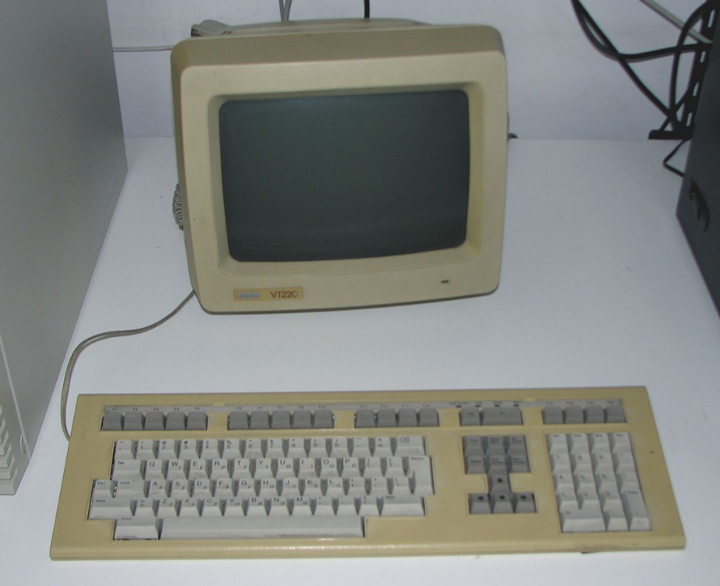
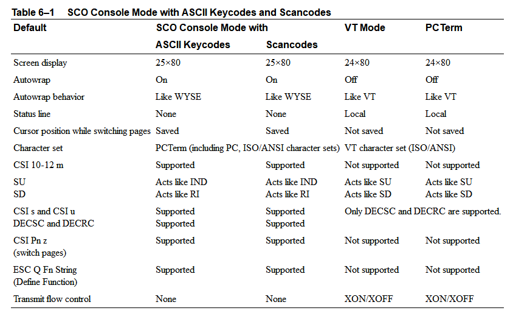

<!-- TOC depthFrom:1 depthTo:6 withLinks:1 updateOnSave:1 orderedList:0 -->

- [第10章-字符设备驱动程序](#第10章-字符设备驱动程序)
	- [stty命令](#stty命令)
	- [终端类型](#终端类型)
		- [VT100](#vt100)
		- [VT102](#vt102)
		- [VT220](#vt220)
		- [VT320](#vt320)
		- [xterm](#xterm)
		- [linux](#linux)
		- [scoansi](#scoansi)
		- [ansi](#ansi)
	- [END](#end)

<!-- /TOC -->

# 第10章-字符设备驱动程序


## stty命令





## 终端类型



* 不同的 termnial type 相当于不同的协议，主要控制 color ， tab ， keycode 这些的东西。 xterm 是 X Window System 自带的 termnial ，支持最广。一般来说设置 terminal type 没什么卵用。毕竟我们不是从上古控制台时代过来的人。

### VT100

终端只负责显示和输入，程序在远程主机上运行。 在PC微机普及的今天，像VT100之类的专用的终端机已经逐渐退出舞台，不过仍有些特殊设备，如带有console口的路由器，网络交换机，10多年前的银行邮局柜台等需要终端机做用户界面。有特殊终端需求的用户可以在电脑上通过软件虚拟终端机配合串口来实现终端仿真。

### VT102

具有广泛的应用终端仿真，标签会，键入命令历史，回溯，多窗口的支持。

### VT220




### VT320

```
The VT320 was an ANSI standard computer terminal introduced by Digital Equipment Corporation (DEC) in 1987.[1] The VT320 was the text-only version, while the VT330 added monochrome ReGIS, Sixel and Tektronix 4010 graphics, and the VT340 added color.
```


```
The 300 series replaced the earlier VT200 series, as a lower-cost system better able to compete with a number of VT220 clones that had entered the market. Foremost among these was the Wyse WY-60, introduced in 1986 with a form factor and feature set similar to the VT220, but including 4010 graphics and selling for only $699, compared to $795 for the base-model VT220 lacking graphics. The VT320 was introduced at $545, something of a surprise,[2] forcing Wyse to lower their prices to $599.

The VT320 was replaced by the VT420 in 1990, but the VT340 remained in production until all of these models were replaced by the VT500 series in 1994.
```

### xterm
```
Terminal emulator for the X Window System
```
XTerm是一个X Window System上的终端模拟器，用来提供多个独立的SHELL输入输出。最先是Jim Gettys的学生Mark Vandevoorde在1984年夏天为VS100写的独立虚拟终端，当时X的开发刚刚开始。

XTerm最先是Jim Gettys的学生Mark Vandevoorde在1984年夏天为VS100写的独立虚拟终端，当时X的开发刚刚开始。很快人们就发现它作为X的一部分比作为独立的程序更为有用，于是它开始针对X而开发。

Gettys曾讲述过有关的故事, “xterm内部如此恐怖的部分原因是它最初被计划开发成一个能驱动多个VS100显示器的单独进程。

作为X参考实现的一个部分后多年，1996年左右，开发的主干转移至了XFree86（从X11R6.3版本派生出来），暂时由Thomas E. Dickey维护。有许多xterm变体可用。大多数的X虚拟终端都是从xterm的变体起步的。

### linux

linux terminal ?? WTF?

### scoansi

```
SCO Console mode is a terminal emulation mode. It uses ANSI sequences with minor modifications to run on a PC, which acts as a SCO UNIX operating system console.
```



### ansi

ansi??WTF?


## END
