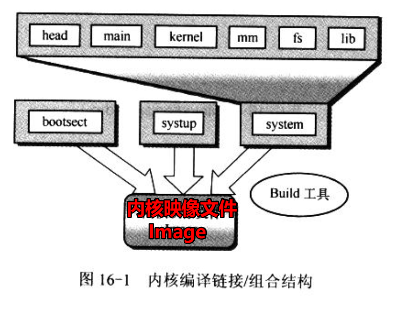
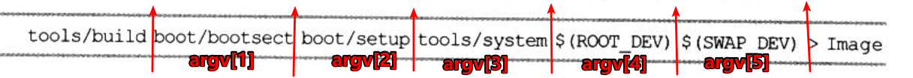
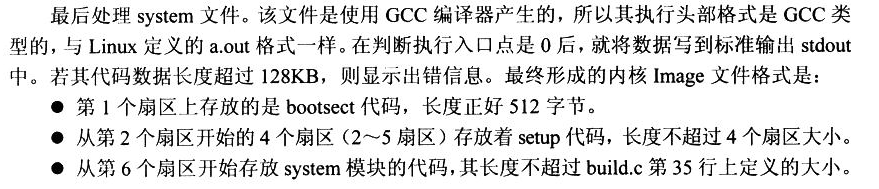

<!-- TOC depthFrom:1 depthTo:6 withLinks:1 updateOnSave:1 orderedList:0 -->

- [第16章-建造工具](#第16章-建造工具)
	- [总结](#总结)
	- [代码](#代码)

<!-- /TOC -->
# 第16章-建造工具

## 总结

* 这一章仅仅基本的文件读写，也比较简单。







* 分别打开三个文件，各种校验，然后写到标准输入1中。命令就是重定向到文件
* 校验规则如下图




## 代码

```
/*
 *  linux/tools/build.c
 *
 *  (C) 1991  Linus Torvalds
 */

/*
 * This file builds a disk-image from three different files:
 *
 * - bootsect: max 510 bytes of 8086 machine code, loads the rest
 * - setup: max 4 sectors of 8086 machine code, sets up system parm
 * - system: 80386 code for actual system
 *
 * It does some checking that all files are of the correct type, and
 * just writes the result to stdout, removing headers and padding to
 * the right amount. It also writes some system data to stderr.
 */

/*
 * Changes by tytso to allow root device specification
 *
 * Added swap-device specification: Linux 20.12.91
 */

 #include <stdio.h>	/* fprintf */
 #include <string.h>
 #include <stdlib.h>	/* contains exit */
 #include <sys/types.h>	/* unistd.h needs this */
 #include <sys/stat.h>
 #include <linux/fs.h>
 #include <unistd.h>	/* contains read/write */
 #include <fcntl.h>

 #define MINIX_HEADER 32
 #define GCC_HEADER 1024

 #define SYS_SIZE 0x3000

 #define DEFAULT_MAJOR_ROOT 3
 #define DEFAULT_MINOR_ROOT 6

 #define DEFAULT_MAJOR_SWAP 0
 #define DEFAULT_MINOR_SWAP 0

/* max nr of sectors of setup: don't change unless you also change
 * bootsect etc */
 #define SETUP_SECTS 4

 #define STRINGIFY(x) #x

void die(char *str)
{
    fprintf(stderr, "%s\n", str);
    exit(1);
}

void usage(void)
{
    die("Usage: build bootsect setup system [rootdev] [> image]");
}

int main(int argc, char **argv)
{
    int i, c, id;
    char buf[1024];
    char major_root, minor_root;
    char major_swap, minor_swap;
    struct stat sb;

    if ((argc < 4) || (argc > 6))
        usage();
    if (argc > 4)
    {
        if (strcmp(argv[4], "FLOPPY"))
        {
            if (stat(argv[4], &sb))
            {
                perror(argv[4]);
                die("Couldn't stat root device.");
            }
            major_root = MAJOR(sb.st_rdev);
            minor_root = MINOR(sb.st_rdev);
        }
        else
        {
            major_root = 0;
            minor_root = 0;
        }
    }
    else
    {
        major_root = DEFAULT_MAJOR_ROOT;
        minor_root = DEFAULT_MINOR_ROOT;
    }
    if (argc == 6)
    {
        if (strcmp(argv[5], "NONE"))
        {
            if (stat(argv[5], &sb))
            {
                perror(argv[5]);
                die("Couldn't stat root device.");
            }
            major_swap = MAJOR(sb.st_rdev);
            minor_swap = MINOR(sb.st_rdev);
        }
        else
        {
            major_swap = 0;
            minor_swap = 0;
        }
    }
    else
    {
        major_swap = DEFAULT_MAJOR_SWAP;
        minor_swap = DEFAULT_MINOR_SWAP;
    }
    fprintf(stderr, "Root device is (%d, %d)\n", major_root, minor_root);
    fprintf(stderr, "Swap device is (%d, %d)\n", major_swap, minor_swap);
    if ((major_root != 2) && (major_root != 3) &&
            (major_root != 0))
    {
        fprintf(stderr, "Illegal root device (major = %d)\n",
                major_root);
        die("Bad root device --- major #");
    }
    if (major_swap && major_swap != 3)
    {
        fprintf(stderr, "Illegal swap device (major = %d)\n",
                major_swap);
        die("Bad root device --- major #");
    }
    for (i = 0; i < sizeof buf; i++) buf[i] = 0;
    if ((id = open(argv[1], O_RDONLY, 0)) < 0)
        die("Unable to open 'boot'");
    if (read(id, buf, MINIX_HEADER) != MINIX_HEADER)
        die("Unable to read header of 'boot'");
    if (((long *) buf)[0] != 0x04100301)
        die("Non-Minix header of 'boot'");
    if (((long *) buf)[1] != MINIX_HEADER)
        die("Non-Minix header of 'boot'");
    if (((long *) buf)[3] != 0)
        die("Illegal data segment in 'boot'");
    if (((long *) buf)[4] != 0)
        die("Illegal bss in 'boot'");
    if (((long *) buf)[5] != 0)
        die("Non-Minix header of 'boot'");
    if (((long *) buf)[7] != 0)
        die("Illegal symbol table in 'boot'");
    i = read(id, buf, sizeof buf);
    fprintf(stderr, "Boot sector %d bytes.\n", i);
    if (i != 512)
        die("Boot block must be exactly 512 bytes");
    if ((*(unsigned short *)(buf + 510)) != 0xAA55)
        die("Boot block hasn't got boot flag (0xAA55)");
    buf[506] = (char) minor_swap;
    buf[507] = (char) major_swap;
    buf[508] = (char) minor_root;
    buf[509] = (char) major_root;
    i = write(1, buf, 512);
    if (i != 512)
        die("Write call failed");
    close (id);


    if ((id = open(argv[2], O_RDONLY, 0)) < 0)
        die("Unable to open 'setup'");
    if (read(id, buf, MINIX_HEADER) != MINIX_HEADER)
        die("Unable to read header of 'setup'");
    if (((long *) buf)[0] != 0x04100301)
        die("Non-Minix header of 'setup'");
    if (((long *) buf)[1] != MINIX_HEADER)
        die("Non-Minix header of 'setup'");
    if (((long *) buf)[3] != 0)
        die("Illegal data segment in 'setup'");
    if (((long *) buf)[4] != 0)
        die("Illegal bss in 'setup'");
    if (((long *) buf)[5] != 0)
        die("Non-Minix header of 'setup'");
    if (((long *) buf)[7] != 0)
        die("Illegal symbol table in 'setup'");
    for (i = 0 ; (c = read(id, buf, sizeof buf)) > 0 ; i += c )
        if (write(1, buf, c) != c)
            die("Write call failed");
    close (id);
    if (i > SETUP_SECTS * 512)
        die("Setup exceeds " STRINGIFY(SETUP_SECTS)
            " sectors - rewrite build/boot/setup");
    fprintf(stderr, "Setup is %d bytes.\n", i);
    for (c = 0 ; c < sizeof(buf) ; c++)
        buf[c] = '\0';
    while (i < SETUP_SECTS * 512)
    {
        c = SETUP_SECTS * 512 - i;
        if (c > sizeof(buf))
            c = sizeof(buf);
        if (write(1, buf, c) != c)
            die("Write call failed");
        i += c;
    }

    if ((id = open(argv[3], O_RDONLY, 0)) < 0)
        die("Unable to open 'system'");
    if (read(id, buf, GCC_HEADER) != GCC_HEADER)
        die("Unable to read header of 'system'");
    if (((long *) buf)[5] != 0)
        die("Non-GCC header of 'system'");
    for (i = 0 ; (c = read(id, buf, sizeof buf)) > 0 ; i += c )
        if (write(1, buf, c) != c)
            die("Write call failed");
    close(id);
    fprintf(stderr, "System is %d bytes.\n", i);
    if (i > SYS_SIZE * 16)
        die("System is too big");
    return(0);
}

```
