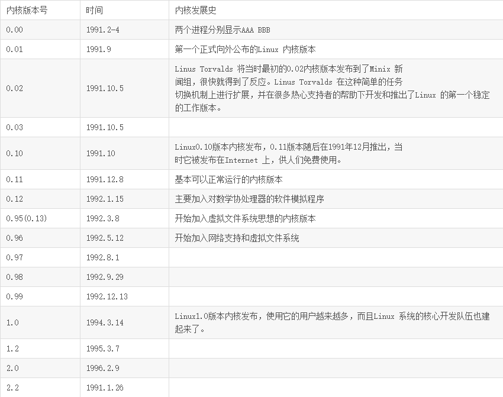
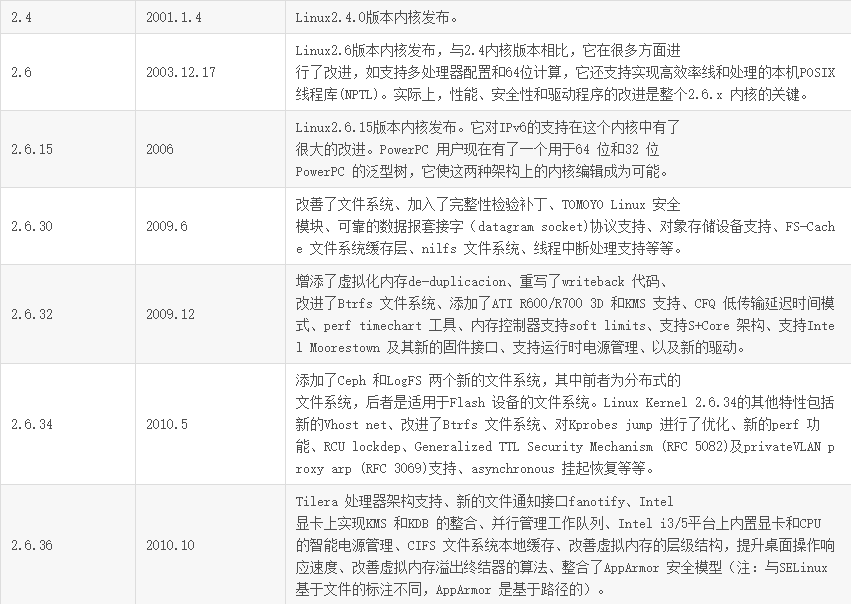
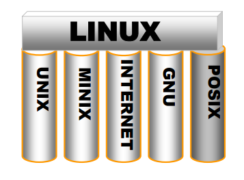
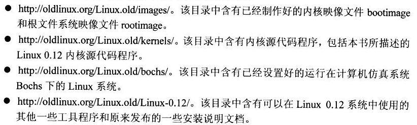

# 第1章-概述

## Linux内核早期主要版本

## 总结

1. 1991.10.5 Linux第一次正式对外公布
2. 一个大佬研发了MINIX，用来教学，但是不对他进行扩展。而Linus抓住了这个机会学习了一波MINIX，开发出了Linux，其机器强悍精简的能力基本模仿自MINIX，其他部分当然UNIX不可获取。所以MINIX开发者在之后调侃道Linus真特么机智，抓住了时机，还不是多亏了他自己不对MINIX进行扩充，让他学到了不少东西。
3. Linus势单力薄，一个人肯定干不了啥事，开源了就开源了，然后继续开源。。but，名气过小，不利推广。所以果断找到了同道中的GNU计划和FSF自由软件基金会创始人，一起合作，一起开源，一起happy~。。虽然gay里gay气。不过这个推广手段真特么有效果。有了Linux，GNU也各种壮大，互利互惠，双赢局面诞生了。。所以呢，你不能仅仅知道Linux，你需要知道的是GNU/Linux，不然GNU老大会不爽滴
4. POSIX标准其实开始定制的很早，但是指定成了Linux也诞生了。反正在UNIX风靡的年代，那时候Linus还没出生呢吧。也许呢，好像十来岁。为什么能移植呢？如果大佬制定了标准，生产了产品，我也生产商品并且符合大佬的标准，那么我的商品和大佬的商品其实都是可以卖的，都是有价值。说白了都可以用，这就是简单的可移植。**定制了标准并且遵守标准->可移植**
5. 典型的古代统一度量衡文字就是定制了标准，那么你不单单秦国可以用，其他国家也可用。造尺子的人不单单可以在秦国做生意，其他国家也可以做生意。皆大欢喜~。。背后其实体现着独裁者统治的思想\&霸权主义\&削弱文化\&融合。。文化战役。。不单单要统治你的国家还要统治你的文化，控制民心，老百姓的归属感其实能吃饱饭就行了。。呃，不知道说的对不对
6. POSIX是有IEEE和ISO/IEC开发的一组标准
7. 老外就喜欢定义各种标准，酱紫全世界都用，还是有一种吊里吊气的样子，毕竟人家牛逼。老外也很喜欢搞专利，搞商业化，你要用人家的就必须给钱，并且只有符合我标准的才有最佳效果。
8. 这其实更符合达尔文的物竞天择，适者生存的道理。就算是标准，不符合的也得淘汰。所以标准也在不断更新。
9. POSIX标准指定的时候Linux还没生，但是Linux却无意间基本符合POSIX，这是为何？因为Linux参考了UNIX，POSIX参考了UNIX，完美~。在发布前两个月Linus在搜集POSIX资料，so，这家伙情报工作做得还是可以的。
10. 可移植==兼容，兼容在整个计算机发展史有这巨大的作用和意义。
11. Linus在开发期间也是花费了不少时间和精力。。好奇老外是怎么入门系统开发的？他不单单用了MINIX，学了MINIX，还挑毛病。抠出有用的东西，嫌弃一些杂七杂八的有的没的模块。人总是这样，看一样东西久了了解的透彻了就想改进，想换，典型的出轨理论。
12. 开发期间还在人家论坛叫嚣MINIX-386不够优秀，结果一楼评论直接说“阅读源代码”。突然想起国内某论坛也出现酱紫场面，然后二楼三楼四楼五楼全是脏话，果然很天朝。
13. **理论毕竟是理论，省略了太多细节，而这些细节虽然没有太多理论含量，却是一个系统必要的组成部分，就像麻雀身上的羽毛。**
14. Linus被怼看源码之后果然去看源码了，然后还看出了花，移植了Bash到MINIX-386，并且乐此不彼。估摸着这一次探索给了他开发Linux的激情。因为，欲望，扩展的欲望，MINIX已经无法满足了他的需求了。。。。所以，你懂得
15. GCC编译器、GDB、Bash早在Linux出现就有了。Linux用他们强化了Linux，呃，也不能这么说，没有这些开源项目铁定莫有Linux
16. Linux在论坛叫嚣自己的系统没有一行MINIX源代码，其实吧，你看过源码，又说没参考源码，是傻子都不信。委婉的说只是参考了源码，但是不全用人家的东西，并且改进的面目全非。如此更恰当哦~
17. 1991年10月5日，Linus对外发布Linux系统（Free Minix-like kernel sources for 386-AT），类MINIX系统的适用386处理器，AT硬盘的开源操作系统内核。仅仅是内核哦，并不完善的功能。
18. 10月5号也就成了很多Linux发行版发布的良辰吉日。比如RedHat就喜欢选择这个日子。
19. 事实上，其实Linux每页0.00版本，主要是Linus在80386机器上做实验的时候成功在时钟中断控制下两个任务切换运行时，某种程度上增强了他写OS的念头，算是个开端把。
20. Linux 0.01版本源码中仅出现一次版权声明，这个时候毕竟年轻也傻，虽然开源，但是不能绝对开源，至少，说明是哪个爸爸开发的，你需要准守什么规范来使用我的源码等待。
21. 程序员总会有误操作丢失数据的问题，Linus就丢失了0.02和0.03版本的内核源代码。所以，备份还是很重要的。
22. Linux 0.10还是别人发布的，这Linus内心什么想法。居然直接0.10了也，不过这个版本被增加了很多功能，算是强大了一笔了吧。已经开始支持mount/umount了也，现在的年轻人估计还用不全这两个命令。这个发布的大佬就是-->北美第一位内核研发者Ted Ts'o。这，不管怎么说，像个中国大佬。。这个大佬还干了一件事情，就是LSB（Linux Standard Base）。刚说的标准规范可移植，就是这个，因为发行版多了，你特么要用Linux内核搞发行版就规矩一点，保持一下Linux应有的规范好不好。所以，这个规范就定制了很多发行版应该尽可能遵守的规范，比如文件夹命名，目录树结构等等相关规范。

23. 从这个版本开始Linus就开始为所以文件添加版权头信息，嘿嘿，被别人改了一波捷足先登估计心里不好受。还改了启动引导代码，分成两个部分。bootloader其实是boot和loader两部分，boot负责加载loader且boot就是引导扇区，loader主要用来加载内核及其他工作。因为loader放到boot里面空间不够，只有512B，所以。。单独开来吧。boot/boot.s 分割成 boot/bootsec.c 和 boot/setup.s
24. 0.12之后应该是0.13，但是Linus把它弄成0.95，因为有个让他激动不已的想法。但是结果，并没有测试好，灾难一般难用。吸取教训吧骚年，以后发布的时候测试一波先。
25. Linux操作系统一开始没有称之为Linux而是怪物FREAX，表示异想天开，怪诞的产物。发布到某某服务器上，但是服务器管理员很不喜欢这个名字，别切维护的时候很麻烦，你想啊，得把FREAX和Linus联系起来要多费脑细胞，所以延用以前的各种做法，按照作者的名字来命名。谐音也可以，所以叫Linux。
26. Linus有一本自传书，我还真有，他个人觉得直接用自己名字或者谐音太自负了。但是拗不过服务器管理员，所以就狠狠自负了一把。
27. 内核源码中顶层目录还有个**CREDITS文件**，里面列出了贡献众多的前400个名字和联系方式。

28. Linux五大支柱：UNIX、MINIX、GNU计划、互联网
  * UNIX最初的开放源代码版本为Linux提供了实现的基本原理和算法
  * GNU计划为Linux提供了丰富且免费的各种实用工具
  * POSIX标准的出现为Linux提供了实现兼容性的参考指南
  * MINIX提供开源代码作为参考
  * Internet为Linux发展壮大提供了途径
29. http://oldlinux.org网站提供一波资源可以看看

30. Linux 0.12引导启动程序结构基本与现有内核一致
31. Linux 内核网络代码基本自成一体，与内核机制关系不是非常大
