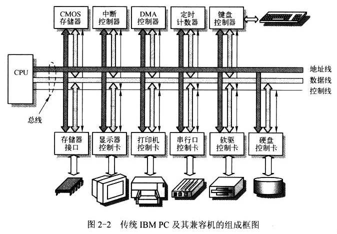
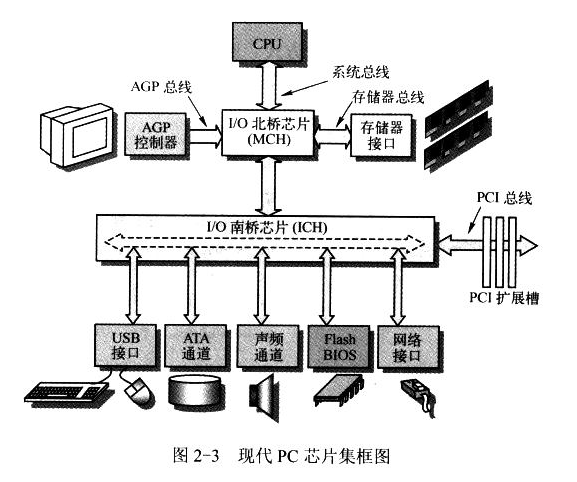
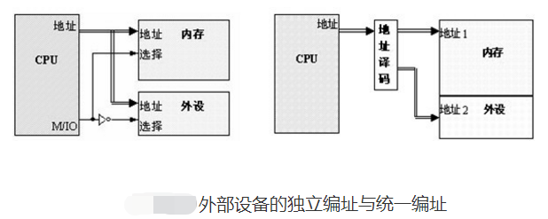
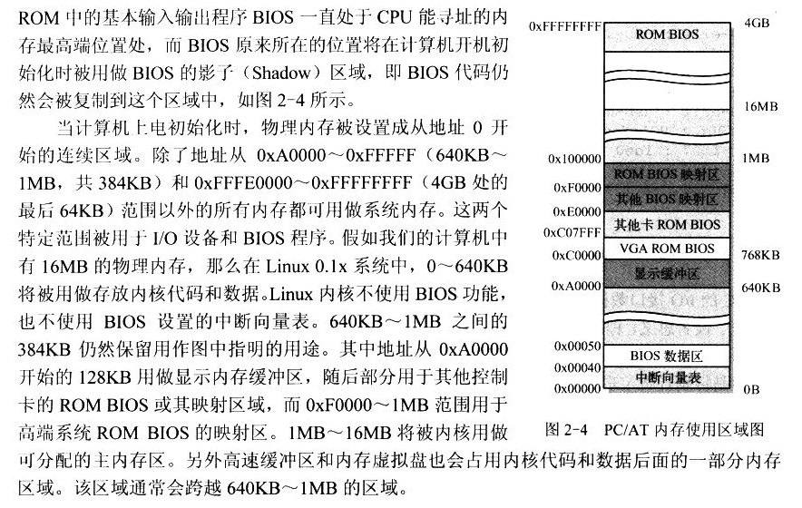
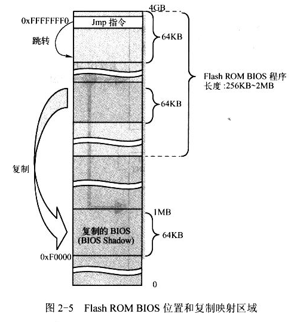
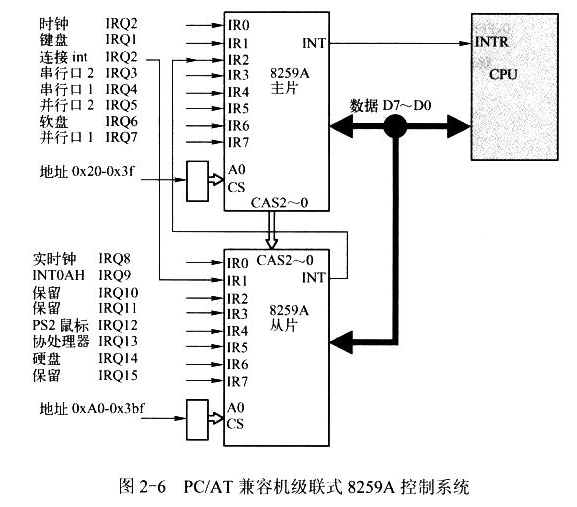
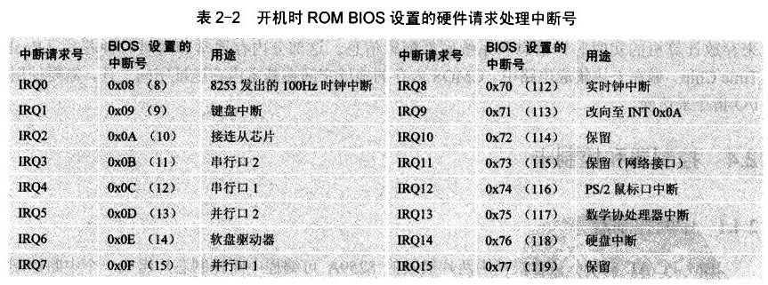
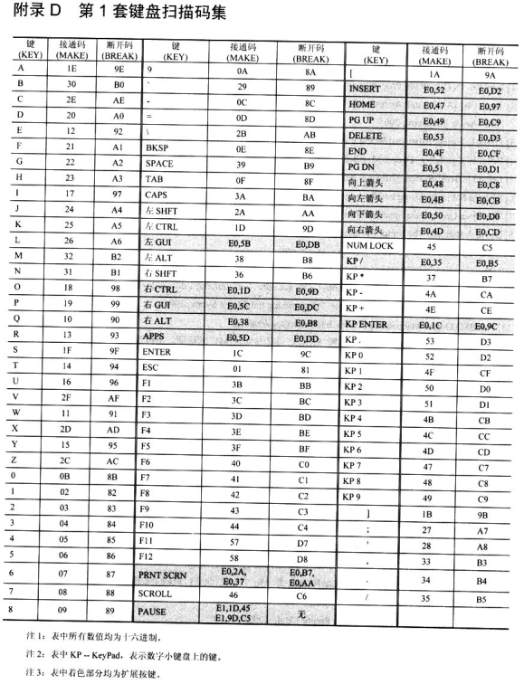

<!-- TOC depthFrom:1 depthTo:6 withLinks:1 updateOnSave:1 orderedList:0 -->

- [第2章-微型计算机组成结构](#第2章-微型计算机组成结构)
	- [总结](#总结)
		- [统一编制与独立编址](#统一编制与独立编址)
		- [主存储器-BIOS-COMS存储器](#主存储器-BIOS-COMS存储器)
		- [控制器和控制卡](#控制器和控制卡)

<!-- /TOC -->
# 第2章-微型计算机组成结构

## 总结

* 软件其实就是控制硬件操作和动作的指令流
* IBM PC AT是美国国际商用机器公司（IBM）于1984年发布、1987年停产的个人电脑产品，正式名称是IBM 5170 PC AT。
* “AT”是英文“先进技术”（Advanced Technology）的缩写，这是由于它引入了标准的16位ISA总线以及采用了当时最新的英特尔80286处理器。
* PC/AT是IBM公司自PC机发布后的第二代升级产品（也有人认为在此之前发布的PC/XT是第二代产品）。尽管早期的产品存在着与磁盘存储部件相关的瑕疵，它最终还是迅速流行于商用及普通用户市场，成为了PC工业最持久的事实标准。至今，由于软件兼容性的原因，最新的PC系统都还支持PC/AT机的总线结构。
* 北桥用来控制CPU、内存、AGP视频接口等高速接口，也叫作内存控制Hub
* 南桥用来控制PCI总线、IDE硬盘接口、USB接口等低速接口，也叫作IO控制Hub
* **控制器**和存储器一般固定集成在计算机主板，中断控制器、DMA控制器、定时计数器、键盘控制器等
* **控制卡**则是通过扩展插槽和主板上的系统总线连接。
* **总线插槽**是系统的地址总线、数据总线、控制总线与扩展设备控制器一体的符合某种标准的接口。这个标准可多了。ISA工业标准结构、EISA扩展工业标准结构、PCI外围组件互联、AGP加速图形端口、PCIE加速PCI总线等
* 这年头已经不需要南桥芯片喽~其实南桥存在就是缓解速率不匹配的问题，各种缓存存在的意义也是这个为了缓解这个问题，解决不了，只能缓解。
* 如何访问控制器、控制卡呢？？这几引入了端口的概念，端口其实全称叫I/O端口地址，就是控制器或控制卡的访问地址，通过读写这个特定的地址可以达到控制相应硬件设备的目的。
* 那么这个访问地址如何设定呢？是放到地址空间的某一个段落还是在地址空间以外从新开辟一个地址空间专门用于这种硬件设备访问控制地址？这就引出了两种，一个是统一编址，一个是独立编址





### 统一编制与独立编址

* 统一编址就是放到存储器寻址地址空间的范围内，这里存储器指内部存储器，也是也叫作内存映像，访问内存等价于访问控制器或控制卡
* 独立编址就是放到另外的地址空间（I/O地址空间），可是处理器怎么知道有两个地址空间？？
* I/O端口编址和存储器的编址相互独立，即I/0端口地址空间和存储器地址空间分开设置，互不影响。采用这种编址方式，对I/O端口的操作使用输入/输出指令(I/O指令)。
* I/O独立编址的优点是：不占用内存空间；使用I/O指令，程序清晰，很容易看出是I/O操作还是存储器操作；译码电路比较简单(因为I/0端口的地址空间一般较小，所用地址线也就较少)。其缺点是：只能用专门的I/O指令，访问端口的方法不如访问存储器的方法多。
* 两种编址方式各有优点和缺点，究竟采用哪一种取决于系统的总体设计。在一个系统中也可以同时使用两种方式，前提是首先要支持I/O独立编址。**Intel的x86微处理器都支持I/O独立编址，因为它们的指令系统中都有I/O指令，并设置了可以区分I/O访问和存储器访问的控制信号引脚。**而一些微处理器或单片机，为了减少引脚，从而减少芯片占用面积，不支持I/O独立编址，只能采用存储器统一编址。
* 也就是说，独立编址是因为有应急支持，访问控制信号引脚，那么你用特殊指令访问端口的时候，使能这个引脚跳转独立空间。既然是硬件实现，那么指令肯定是写的死死地
* 内存和外设公用同一段地址空间，内存和外设公用一根地址总线。假设一个处理器的地址线为32根，那么他的存储空间为4G，内存可能分到0-3G，外设可能分到3G-4G的地址空间，也就是说内存和外设的地址空间加起来为4G，嵌入式所用的基于ARM内核的芯片采用的是统一编址方式
* 独立编址是说，内存和外设分别编址，同样一个32根地址线的处理器，内存可用的地址空间为4G，外设可用的地址空间也为4G，同样的地址怎么区分是访问内存还是外设呢，独立编址里采用了不同的地址总线来区分是访问内存还是访问外设，也就是说，独立编址就是内存一根总线，外设一根总线，他们互不干涉，通过指令来加以区分，目前主流电脑上一般都采用独立编址。
* 统一编址：外设接口中的IO寄存器（即IO端口）与主存单元一样看待，每个端口占用一个存储单元的地址，将主存的一部分划出来用作IO地址空间，如，在PDP-11中，把最高的4K主存作为IO设备寄存器地址。I/O端口占用了存储器的地址空间，使存储量容量减小（ARM体系结构就是用这种统一编址）。
* 统一编址也称为“I/O内存”方式，外设寄存器位于“内存空间”（很多外设有自己的内存、缓冲区，外设的寄存器和内存统称“I/O空间”）。
* 独立编址（单独编址）：**IO地址与存储地址分开独立编址，I/0端口地址不占用存储空间的地址范围，这样，在系统中就存在了另一种与存储地址无关的IO地址，CPU也必须具有专用与输入输出操作的IO指令（IN、OUT等）和控制逻辑。**独立编址下，地址总线上过来一个地址，设备不知道是给IO端口的、还是给存储器的，于是处理器通过MEMR/MEMW和IOR/IOW两组控制信号来实现对I/O端口和存储器的不同寻址。如，intel 80x86就采用单独编址，CPU内存和I/O是一起编址的，就是说内存一部分的地址和I/O地址是重叠的。
* 独立编址也称为“I/O端口”方式，外设寄存器位于“I/O（地址）空间”。只有独立编址才有I/O空间的概念
* 对于x86架构来说，通过IN/OUT指令访问（单独编址）。PC架构一共有65536个8bit的I/O端口，组成64K个I/O地址空间，编号从0~0xFFFF，有16位，80x86用低16位地址线A0-A15来寻址。连续两个8bit的端口可以组成一个16bit的端口，连续4个组成一个32bit的端口。I/O地址空间和CPU的物理地址空间是两个不同的概念，例如I/O地址空间为64K，一个32bit的CPU物理地址空间是4G。如，在Intel 8086 Ubuntu 16 下用“cat /proc/ioports”可看到：
```
root@ubuntu16x32:~/github/linux-0.12/bochs# cat /proc/ioports
0000-0cf7 : PCI Bus 0000:00
  0000-001f : dma1
  0020-0021 : pic1
  0040-0043 : timer0
  0050-0053 : timer1
  0060-0060 : keyboard
  0064-0064 : keyboard
  0070-0077 : rtc0
  0080-008f : dma page reg
  00a0-00a1 : pic2
  00c0-00df : dma2
  00f0-00ff : PNP0C04:00
    00f0-00ff : fpu
  0290-029f : pnp 00:04
  03f8-03ff : serial
  0400-0453 : pnp 00:01
    0400-0403 : ACPI PM1a_EVT_BLK
    0404-0405 : ACPI PM1a_CNT_BLK
    0408-040b : ACPI PM_TMR
    0420-042f : ACPI GPE0_BLK
    0430-0433 : iTCO_wdt.0.auto
    0450-0450 : ACPI PM2_CNT_BLK
  0454-0457 : pnp 00:03
  0458-047f : pnp 00:01
    0460-047f : iTCO_wdt.0.auto
  04d0-04d1 : pnp 00:05
  0500-057f : pnp 00:01
  0680-069f : pnp 00:01
0cf8-0cff : PCI conf1
0d00-ffff : PCI Bus 0000:00
  1000-100f : pnp 00:01
  164e-164f : pnp 00:01
  e000-efff : PCI Bus 0000:03
    e000-e0ff : 0000:03:00.0
      e000-e0ff : r8169
  f000-f03f : 0000:00:02.0
  f040-f05f : 0000:00:1f.3
  f060-f07f : 0000:00:1f.2
    f060-f07f : ahci
  f080-f083 : 0000:00:1f.2
    f080-f083 : ahci
  f090-f097 : 0000:00:1f.2
    f090-f097 : ahci
  f0a0-f0a3 : 0000:00:1f.2
    f0a0-f0a3 : ahci
  f0b0-f0b7 : 0000:00:1f.2
    f0b0-f0b7 : ahci
  ffff-ffff : pnp 00:01
    ffff-ffff : pnp 00:01
```
* 对于某一既定的系统，它要么是独立编址、要么是统一编址，具体采用哪一种则取决于CPU的体系结构。 如，PowerPC、m68k等采用统一编址，而X86等则采用独立编址，存在IO空间的概念。目前，大多数嵌入式微控制器如ARM、PowerPC等并不提供I/O空间，仅有内存空间，可直接用地址、指针访问。但对于Linux内核而言，它可能用于不同的CPU，所以它必须都要考虑这两种方式，于是它采用一种新的方法，将基于I/O映射方式的或内存映射方式的I/O端口通称为“I/O区域”（I/O region），不论你采用哪种方式，都要先申请IO区域：request_resource()，结束时释放它：release_resource()。
* 访问IO端口有2种途径：I/O映射方式（I/O－mapped）、内存映射方式（Memory－mapped）。前一种途径不映射到内存空间，直接使用intb()/outb()之类的函数来读写IO端口；后一种MMIO是先把IO端口映射到IO内存（“内存空间”），再使用访问IO内存的函数来访问IO端口。




* EISA/PCI总线结构的有64KB 独立I/O地址空间，而ISA工业标准总线结构只有1024个I/O端口供使用也就是1024B=1KB
* PC的I/O接口控制方式大致有三种，
  * 程序循环查询方式-死等，效率低，成本低，CPU浪费资源参与
  * 中断处理方式-提前设定好中断向量及中断处理服务程序
  * DMA方式-硬件支持，效率高成本高，需要CPU参与的工作少


### 主存储器-BIOS-COMS存储器

* 传统的CPU寻址能力只有1MB，在其后发展过程中为了兼容，持续保持各个架构的套路，就算是现在的PC，开机后依然是实模式，依然是只能用1MB物理内存空间。经过资源获取、部署、指令跳转等操作变成32位甚至64位CPU模式。
* BIOS一直都是，一开始就是规定的放在内存的最高处，就算现在的PC架构也是，但是运行的时候还是加载到1MB低物理内存地址里面。
* 一上电开机，第一条指令执行前，硬件就已经部署了1MB物理地址空间。区域作用划分的都很清除。该干啥干啥，这都是死的东西，OS开发的时候遵守酱紫的规则，不该用的空间不用就是。



* BIOS程序比较固定，走固定路线固定套路，效率也比较低，所以OS开发一般只在开机的时候借助BIOS辅助启动，之后就废弃掉BIOS提供的一些功能。
* 一上电瞬间加载的第一条指令地址CS:IP指向0xF000:0xFFF0 = 0xFFFF0，也就是1MB的最高16B处，这里能执行什么鬼程序，所以肯定是一个跳转，不然日子分分钟走到头。
* 哦不，其实这里错了，后面对了，前面错了。因为，其实CS应该是0xF000,但是段基地址是0xFFFF,0000也就是说，竟然一开始就访问高端内存1MB？？？？没错，书上就是这个意思。
* **《操作系统真象还原》**里面就有错误了，如果没记错的话。虽然一开始是实模式，但是，实模式不能访问高端内存么？？这个实模式不纯而已，可以说一开始是具有访问高端内存能力的模式，所以一上电依然可以访问高端内存，并且拷贝到低端执行，然后，再把自己的模式切换成不纯实模式。下图就是很好的解释。
* 这个，高端内存的BIOS是怎么拷贝到低端1MB内存的？书上的解释，怎么说呢，做法也很奇葩，反正就是CPU模式切换成能访问高端内存的模式，拷贝完了再切换实模式。。。这，可以，很高效，毕竟为了兼容。
* 书上图画的挺好的，多截几张。首先拷贝数据



* 明确一点，不管架构如何，BIOS总是放最高处，开机的时候总能访问最高地址物理内存，然后进行复制到低端1MB内存继续执行。
* **高端内存中的BIOS分为两个部分，一部分是拷贝1MB物理地址可执行的BIOS，另一部分就是可在低端1MB执行的BIOS**。。怎么听起来有点绕~
* 然后还有一个很神奇的玩意儿CMOS，也就是BIOS中的参数，它独立编址的哦，书上说的基本内存地址空间外，那不就是独立的内存地址空间，并且要特殊指令访问，所以，必定是独立编址。
* CMOS是个硬件存储器，只有64B或者128B，还需要电池供电，不然就丢数据。所以主板上有小电池。它适合另外一个实时时钟放一起的，你觉得，电脑关机后很久开机为嘛时间还是对的？还不是因为有东西供电，让主板记录自己过得日子的分分秒秒，这个就是那个小电池供电的缘故，不单单维持了BIOS的数据，而且，不断计数，这个计数也比较简单，当然是我觉得硬件比较简单，毕竟没玩过实时时钟芯片。不管怎也也估摸着就是个晶振跳来跳去。。容我瞎说一把


### 控制器和控制卡

* **8259A可编程中断控制芯片**，首先吐槽一下特么的数字命名，怎么记？不用记？可是用到了如何提及这种芯片？。。直接中断控制器，over
* BIOS阶段会初始化中断控制器芯片，建立中断向量表及其处理服务例程。但是并不给Intel接收，OS会自己再初始化一波。Linux会在内核初始化期间重新初始化中断控制器。







* Linux并不买账，就算你BIOS献殷勤帮忙初始化了，但是，老子不用。老子自己重新部署一遍。
* **8237芯片-DMA控制器**，说好的DMA是硬件，所以就是硬件，没毛病。想要用DMA进行数据传输，必须先对DMA控制器进行编程。它毕竟是硬件帮助你数据传输，传输的时候CPU可以干别的事情，并行工作，更高效，当然硬件就是贵。
* DMA使用前必须设置，有三个寄存器需要设置，8位和16位，但是实模式只能一次性搞定8位寄存器，16位就需要分两次进行。
* **可编程定时/计数器**其实就是晶振啦啦，CPU的心跳，每隔10ms发一个信号，就好比心跳包，证明自己还活着。CPU就会进行调度、统计资源使用之类的脏活累活。
* 键盘控制器为了兼容，总是把扫描码转换成最古老的第一套扫描集。这，再次体现兼容的蛋疼及其必要性。
* 引脚不够用了，把键盘控制器的两个引脚用来作为CPU复位和A20地址线开启。
* 这献上歪歪的扫描集




* 计算机设备之间的通信就是通信协议。规定了，语法，语义和时序。
* 同步串行/异步串行其实都是串行通信，本质上双方都是一个单位一个单位通信，只是异步把基本单位扩大了，2个及其以上的基本单位作为通信最小单位，但如果变成1个基本单位那就是同步串行了， 只是多了个概念。
* 对磁盘控制器的编程其实就是通过I/O端口设置控制器中的相关寄存器，并通过寄存器获取操作的结果。
* 扇区的数据传输，采用DMA信号，由DMA控制器进行传输。这个用于过时软盘的策略。这年头的温盘采用高速数据块进行传输。节省DMA。
* 硬件其实不可少，如果你不了解你的资源，你就不知道能开发成啥样，就算知道也很容易异想天开。所以操作系统开发，其实就是立足于现有硬件资源进行的开发，并且硬件资源的使用，其实就是**面向各个控制器、控制卡里面的寄存器进行编程**，怎么操作他们呢？就是I/O特权指令或者说特殊指令，他们属于有的I/O地址空间，用普通的内存操作不得行的哦，根本访问不到，这是硬件特性。
