<!-- TOC depthFrom:1 depthTo:6 withLinks:1 updateOnSave:1 orderedList:0 -->

- [第3章-内核编程语言和环境](#第3章-内核编程语言和环境)
	- [总结](#总结)
		- [as86汇编器](#as86汇编器)
		- [GNU as汇编](#gnu-as汇编)
		- [C语言程序](#c语言程序)
		- [C与汇编程序的互相调用](#c与汇编程序的互相调用)
		- [Linux 0.12 目标文件格式](#linux-012-目标文件格式)
		- [Make程序和Makefile文件](#make程序和makefile文件)

<!-- /TOC -->

# 第3章-内核编程语言和环境

## 总结

### as86汇编器
* as86虽然可以编译16位和32位程序，但是Linux仅用它来编译boot/bootsect.s和boot/setup.s。主要是因为其16位支持特色。其实完全可以用as代替，没问题的。作者也就想让你了解一下as86这么个玩意儿，虽然古董，但是有用。毕竟曾经在MINIX上风靡一时。
* as86采用Intel汇编
* Bruce Evans是MINIX操作系统32位版本的主要修改编制者之一。Linus很敬佩他，狗腿子一个，称他“Bruce is my hero!”。Linus从Bruce学到了很多东西，基本没有他教Linus，就没有Linux了。包括很多对于MINIX的缺点都是两个人讨论出来的，也正是两个人的探讨，嫌弃MINIX的一些缺点才让Linus萌生编写OS的念头。。。这，不知道Bruce有莫有后悔？~
* 汇编器编译产生的目标文件至少包括3个段或区segment or section
  - 正文段：代码段，包括**代码**和**只读数据**
  - 数据段：可读写数据且**已经初始化**
  - 未初始化数据段：**目标文件没有为该段保留空间**，但是链接的时候会把该段内容填充0
* 伪操作符=汇编伪指令=汇编指示符
  - 例如 .global begtext,begdata,begbss
* 一个汇编源文件主要包括辣么几部分，赋值语句+伪操作符语句+机器指令语句
  - 赋值语句=定义一个符号常量
  - 伪操作符语句=指示符+0个或多个操作数，不会产生机器码，仅作用于汇编阶段指示汇编器动作
  - 机器指令语句=机器指令的助记符=操作码+0个或多个操作数
* 以!或;开始的语句其后面均为注释

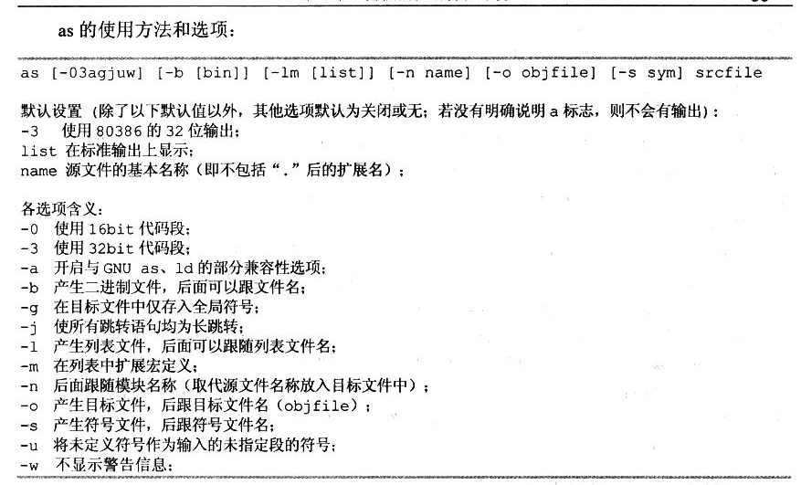

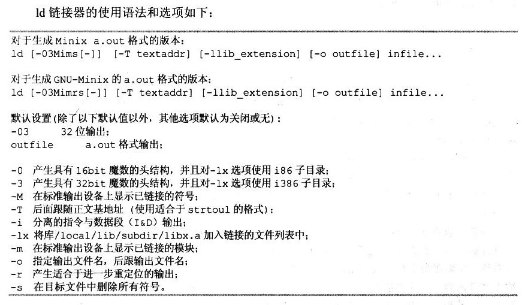

* 命令不用死记硬背，用到了再查。

### GNU as汇编

* GNU as最初模仿BSD 4.2的汇编器进行开发，说明BSD还是很屌的
* AT&T 和 Intel汇编的区别

* as汇编器具备预处理功能
  - 删除多余空格字符和制表符
  - 删除所有注释符
  - 字符常量转换成对应的数字
* 但是as没有包含对宏定义的处理，也没用文件包含的功能。这些功能也就gcc在用，可以改变文件后缀为.S，让as使用GCC的CPP预处理功能。
* as还把#开头的行内容当做行注释，如果编译期间不进行预处理，那么头文件包含#include就会被过滤掉
* 文件最后语句必须有换行符
* 不允许使用数字开头命名符号
* 反斜杠 \ 可以拼接多行
* 字符串必须双引号，字符必须单引号

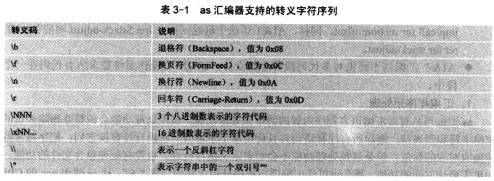

* 整数
  - 十六进制 0x 或 0X开头
  - 二进制 0B或0b开头
  - 八进制 0开头
  - 负数前进加 - 即可
* 重定位至关重要，必须掌握
* 绝对地址区，在重定位时候特例，不管怎样。老子就是要占据那个地址。这就是绝对地址区的特权，因此很容易重复地址而覆盖
* 未定义区域 - 汇编的时候不能确定坐在区域

### C语言程序

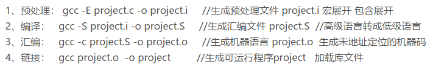

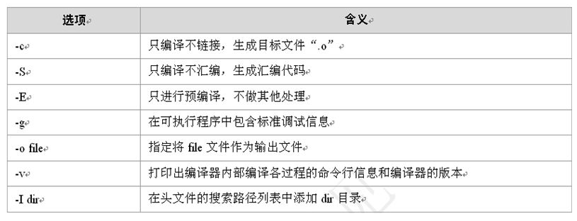

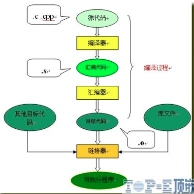

1. 预处理器：将.c 文件转化成 .i文件，使用的gcc命令是：gcc –E，对应于预处理命令cpp；
2. 编译器：将.c/.h文件转换成.s文件，使用的gcc命令是：gcc –S，对应于编译命令 cc –S；
3. 汇编器：将.s 文件转化成 .o文件，使用的gcc 命令是：gcc –c，对应于汇编命令是 as；
4. 链接器：将.o文件转化成可执行程序，使用的gcc 命令是： gcc，对应于链接命令是 ld；
5. 加载器：将可执行程序加载到内存并进行执行，loader和ld-linux.so。

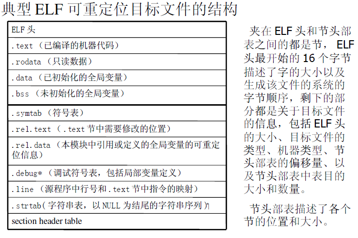

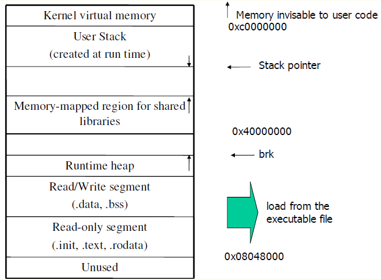

* 处理目标的常用工具。UNIX系统提供了一系列工具帮助理解和处理目标文件。GNUbinutils 包也提供了很多帮助。这些工具包括：
	- ar ：创建静态库，插入、删除、列出和提取成员；
	- strings ：列出目标文件中所有可以打印的字符串；
	- strip ：从目标文件中删除符号表信息；
	- nm ：列出目标文件符号表中定义的符号；
	- size ：列出目标文件中节的名字和大小；
	- readelf ：显示一个目标文件的完整结构，包括ELF 头中编码的所有信息。
	- objdump ：显示目标文件的所有信息，最有用的功能是反汇编.text节中的二进制指令。
	- ldd ：列出可执行文件在运行时需要的共享库。

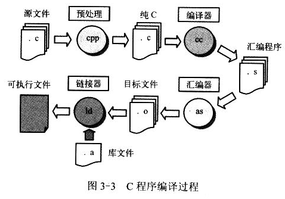

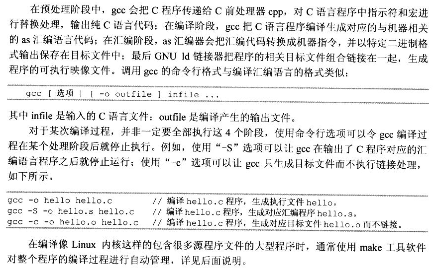

* C语言内嵌汇编。C语言不能直接操作寄存器，所以，所有直接操作寄存器的活儿都得内嵌汇编来完成。

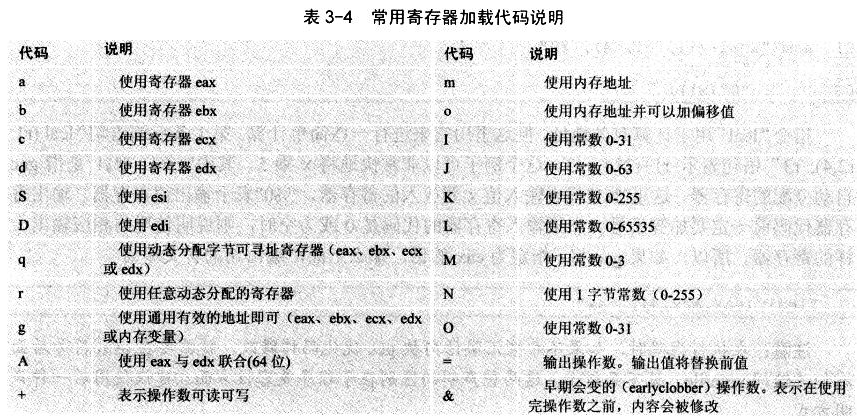

* __asm__是GCC关键字asm的宏定义

			#define __asm__ asm

__asm__或asm用来声明一个内联汇编表达式，所以任何一个内联汇编表达式都是以它开头的，是必不可少的。

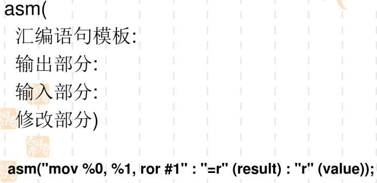

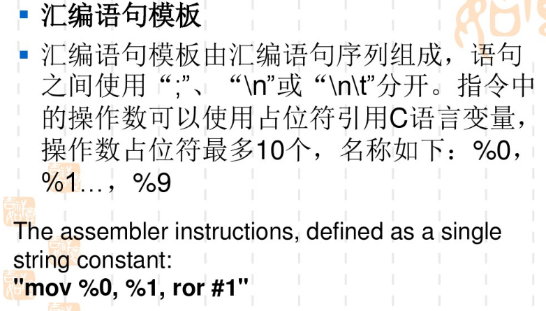

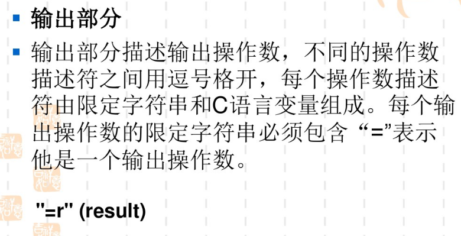

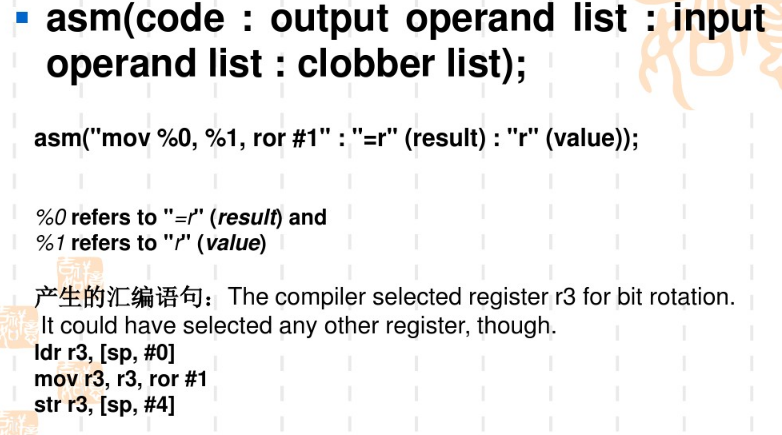

* volatile 关键字可以让gcc不要做过多不必要的优化。
* 内联函数主要是一些比较精简的代码函数，希望能够快速执行。
* ISO C99标注和gcc的内联有较大区别，把gcc使用的inline static当成inline

### C与汇编程序的互相调用

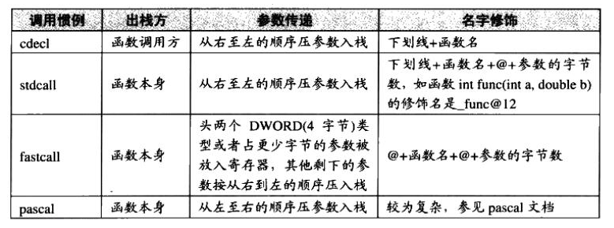

### Linux 0.12 目标文件格式

* 编译器用于对程序进行编译产生二进制代码和数据目标文件，链接器则用于对相关的所有目标文件进行组合处理，形成一个可被内核加载执行的目标文件
* as86和ld86是MINIX专用的目标文件格式

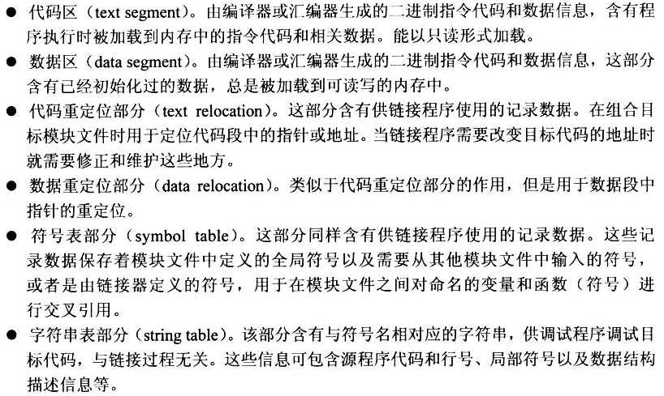

* 只有固定了格式才能解析，并且兼容性可移植性等等。说白了，你懂套路就能解析，不懂拉倒。
* 基本只有模块文件也就是目标文件包含重定位信息，可执行文件相关字段a_trsize和a_drsize都为0。

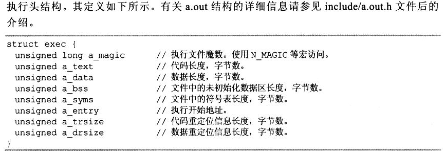

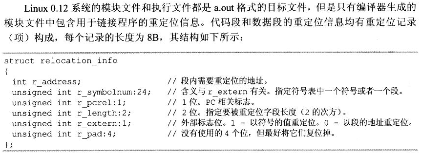

* 强调一下，重定位信息只供链接器使用。每一条重定位信息都有专门的格式，如上图所示。

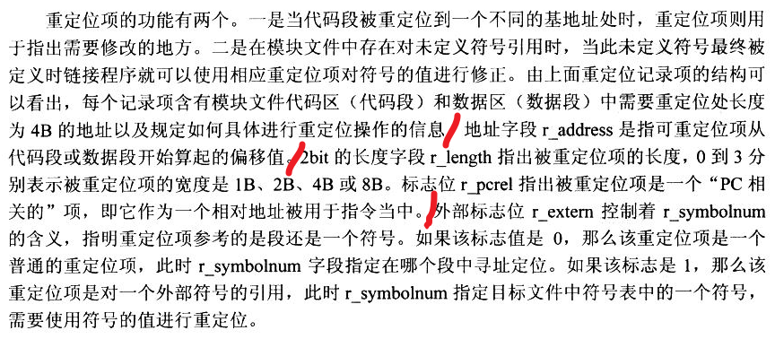

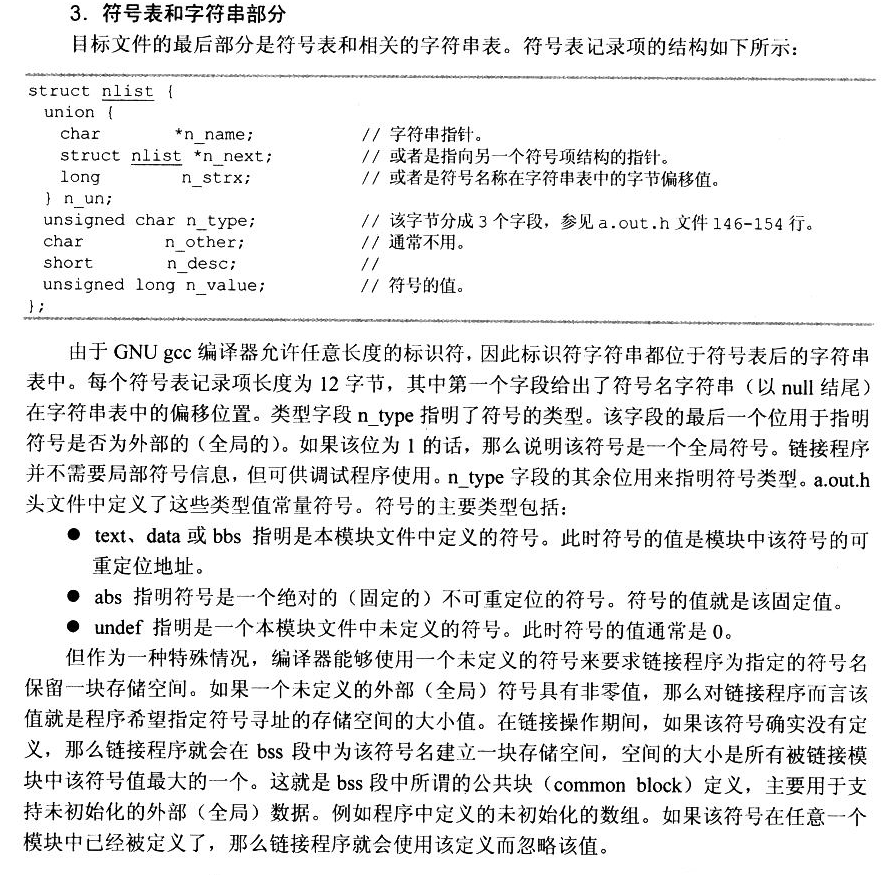

* strip命令可以剥离符号表信息，其实吧，符号信息就是某个地址对应了那个标号。这个，很容易知道哪个变量，哪个函数的地址了。逆向的时候求之不得，逆向难点就在于，搞不清楚起点终点，变量是啥，什么用。
* C语言说白了就是一堆函数围绕一堆杂七杂八数据进行操作的过程。突然想到《105个男人与三个女人的故事》。如果你能搞清楚具体的变量和具体的操作是什么意思，从哪个地址开始的。。那么逆向还难个锤子四不四~

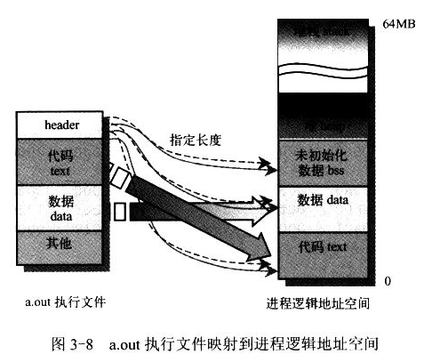

* Linux 0.12中进程的逻辑地址空间大小为64MB。进程在逻辑地址空间从0地址处开始，区别于现代系统0x0804,8000开始

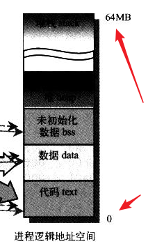

* 对于linux下的elf可执行文件来说,代码段的起始地址0x08048000既是逻辑地址,也是线性地址也是虚拟地址

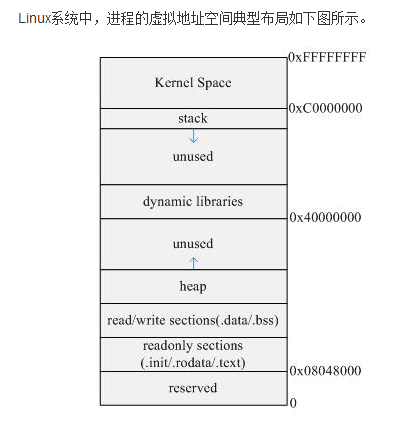

* 由上图可知，32位平台中，进程虚拟地址范围为0x00000000-0xFFFFFFFF（共4GB），其中0x00000000-0xBFFFFFFF（共3GB）为用户空间，位于高地址部分的1GB为内核空间，范围为0xC0000000-0xFFFFFFFF。整个进程虚拟地址可分为几个部分

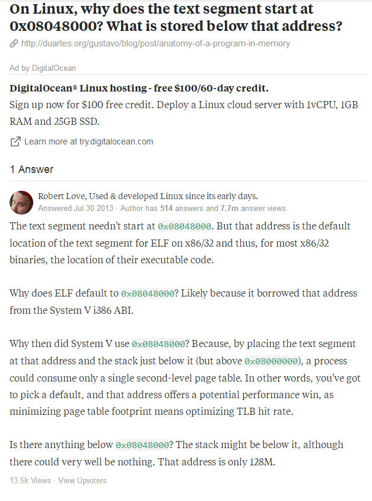

* 为嘛一定要在0x0804,8000这个位置开始呢？其实这是默认位置，也是可以改的。博客中提到因为历史遗留，为了兼容呗。反正Linux里面提到历史都是兼容，提到兼容都是历史。

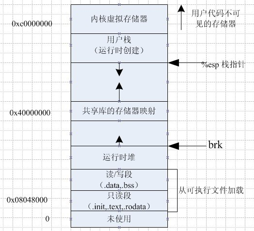

* 在学习**《深入理解计算机系统》**中链接这一章中，数据讲一个可执行文件包含多个段。在Linux系统中代码段总是从0x08048000处开始，数据段在接下来的4KB对齐的地址处，运行时堆在接下来的读写段之后的第一个4KB对齐的地址处，并通过调用malloc库网上增长，开始于地址0x40000000处的段是为共享库保留的，用户栈总是从地址0xbfffffff处开始，并向下增长，从栈的上部开始于地址0xc0000000处的段是为操作系统驻留存储器部分的代码和数据保留的。
* 在深入理解计算机系统中有介绍。
		0x08048000 (32bit OS)
		0x00400000 (64bit OS)

* 内核日志后台程序klogd用于记录内核异常时对应的地址及其指令，那么这个地址如果仅仅是地址，你又能获取什么有用信息？所以内核编译的时候会把编译好的符号和地址及其所在区域类型弄成一个表格放到**System.map**文件中。这个文件分三列，每一行一条地址信息
* 第一列是地址，第二列是所在区域，第三列是符号名称

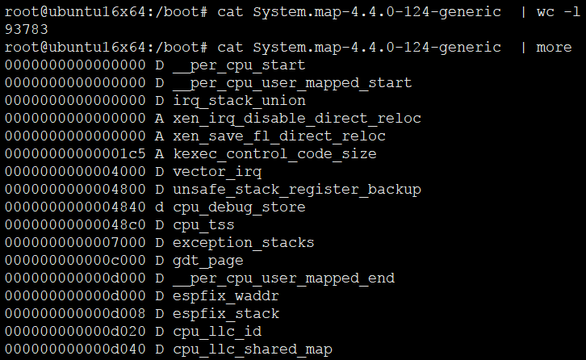

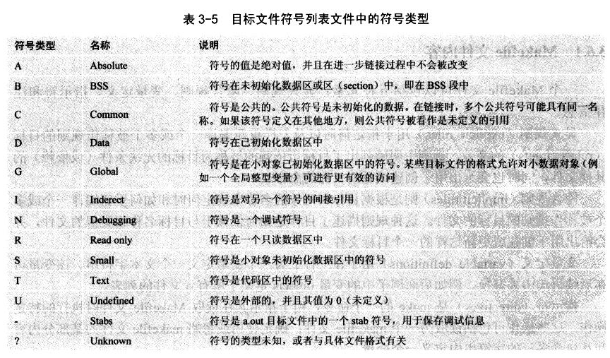

* 虽然内核不需要System.map，但是其他辅助程序需要啊，怎么跟内核交互，怎么交互。总的有个入口。怎么获取内核中的全局变量，这是典型的引用。所以System.map是内核为了方便别人使用才给出的。但是实际安全级别要求高的场景肯定不会轻易给出来。甚至有些重要的内核数据，也不会给出来，比如system call的地址，如果知道了就可以改系统调用表了。一开始Linux内核会提供，到了高版本就不再给出来，你自己倒腾去。安全要紧。

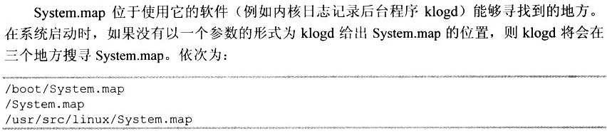

* 一般一个boot分区会包含多个内核镜像，如果你升级了，默认会保留原有内核镜像，除非手动删除，当然这个不同版本不一样，有些过了多久可以自动清理，这些都是比较easy的功能。多个内核镜像肯定包含多个System.map，命名有规律。一般都是“System.map-`uname -r`”

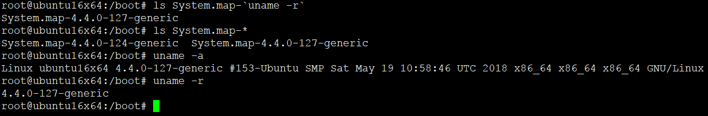

### Make程序和Makefile文件

* 伪目标-并没有实际目标存在，只是要骗make去执行一条shell命令
* 默认情况执行第一条规则

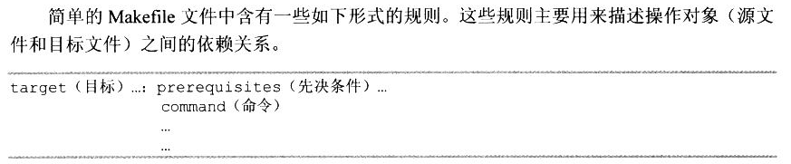

* Makefile还有很对规则书上没有提到，具体参看本章节目录下《GNU Make 使用手册》中文版pdf手册

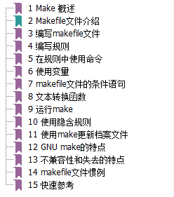
