<!-- TOC depthFrom:1 depthTo:6 withLinks:1 updateOnSave:1 orderedList:0 -->

- [第4章-80x86保护模式及其编程](#第4章-80x86保护模式及其编程)
	- [总结](#总结)
	- [80x86系统寄存器和系统指令](#80x86系统寄存器和系统指令)
	- [保护模式内存管理](#保护模式内存管理)
	- [分段机制](#分段机制)
		- [段寄存器](#段寄存器)
	- [分页机制](#分页机制)
	- [中断](#中断)
		- [内部中断](#内部中断)
	- [保护](#保护)
		- [CPL+DPL+RPL](#cpldplrpl)
		- [跨段执行-就是改变 CS 段寄存器](#跨段执行-就是改变-cs-段寄存器)
		- [一致代码段与非一致代码段](#一致代码段与非一致代码段)
		- [调用门](#调用门)
			- [调用门运行步骤](#调用门运行步骤)
			- [call far 指令对堆栈的影响](#call-far-指令对堆栈的影响)
		- [中断门](#中断门)
		- [任务门](#任务门)
		- [陷阱门](#陷阱门)
		- [TSS-任务状态段](#tss-任务状态段)
		- [任务门+中断门+陷阱门+调用门比较](#任务门中断门陷阱门调用门比较)
	- [中断和异常处理](#中断和异常处理)
	- [任务管理](#任务管理)
	- [保护模式编程初始化](#保护模式编程初始化)
	- [参考](#参考)

<!-- /TOC -->
# 第4章-80x86保护模式及其编程

## 总结

* 这章节提到的内容非常重要，非常有用。虽然有些机制Linux内核并没有用到，但是了解体系结构必须的。
* 这章写的真特么经典，必须赞一波~
* 现代操作系统，都是运行处于保护模式的CPU之上的。所以，掌握好保护模式，才能学好操作系统。
* 段机制和页机制是保护模式的基础，也是实现现代操作系统的基础。只有深刻掌握和理解 CPU 的段页机制，你才能掌握操作系统底层的一些原理。
* 需要注意的是，**段机制和页机制是 CPU 这个硬件提供的功能，并不是操作系统提供的**。操作系统只是利用了 CPU 的这个功能。如果你不学习 CPU 提供的功能，你如何去理解操作系统如何去使用这种功能的呢？
* **深刻理解保护模式，才能真正理解内核的工作原理。**

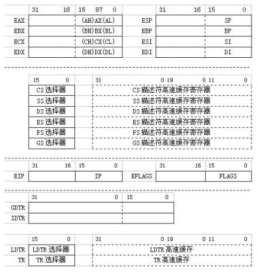

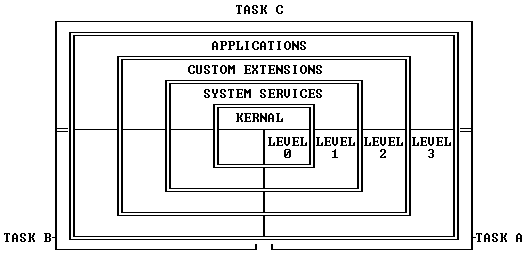

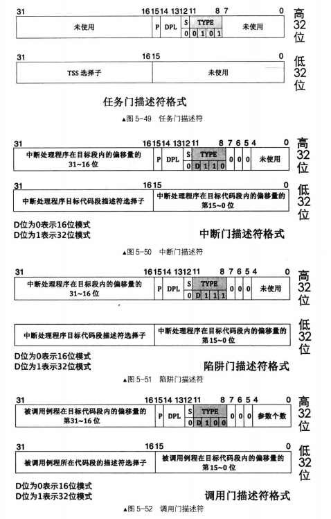

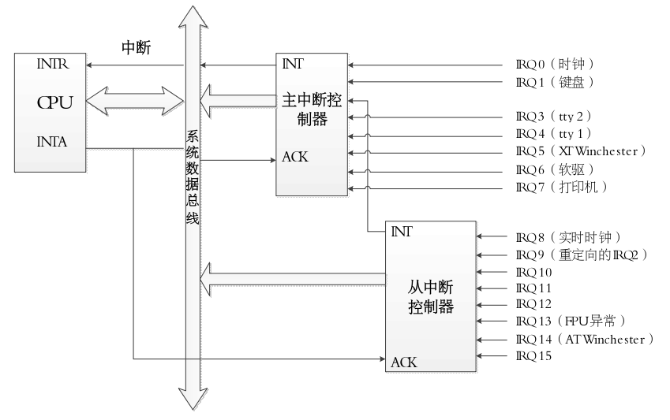

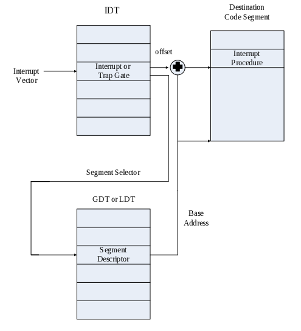

## 80x86系统寄存器和系统指令

## 保护模式内存管理

## 分段机制

* 一般情况下，数据段是非一致的，权限高的可以访问权限低的。代码段要求平级访问，就算权限高也不能访问。访问者没有必要也不可能降低身份去访问权限低的代码。
* 处理器从高特权级降低到低特权级：中断处理程序返回到用户态的时候。
* 代码段有一致性和非一致性，但是数据段总是非一致性。
* 一致性代码段 = 共享代码段 = 特权级变化访问高特权级代码
* 非一致性代码段 = 代码段必须平级访问 = 非一致性数据段可以高级别访问

### 段寄存器

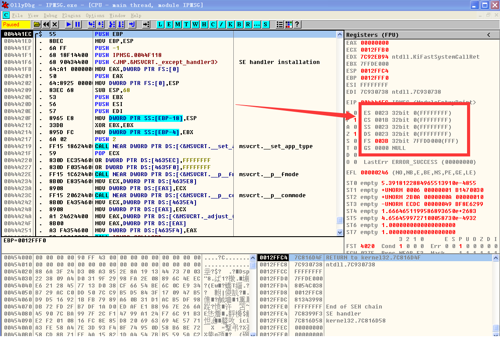

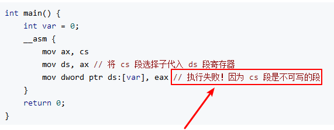

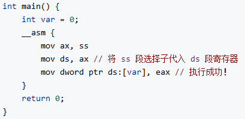

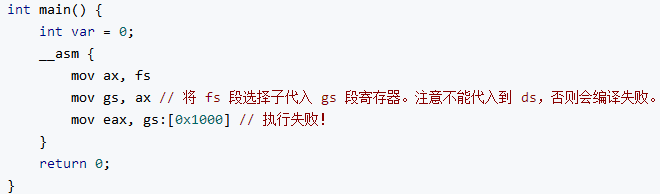

* 代码段必须不可写，其他段根据段属性划分可读可写。
* 我们在执行mov ds, ax这样的指令的时候，明明 ax 只有 16 位，可是，段寄存器却有96位？这又是怎么回事？
* GDT 表是全局描述符表，LDT 表是局部描述符表。当我们写段寄存器的时候，只给了16位，剩下80位并未给出，其实这80位的数据将通过查 GDT 表或者 LDT 表来获得。GDT 表和 LDT 表实际上就是一个大数组，数组中的每一项占用 8 个字节。
* 16位选择子作为索引去GDT表查找对应段描述符

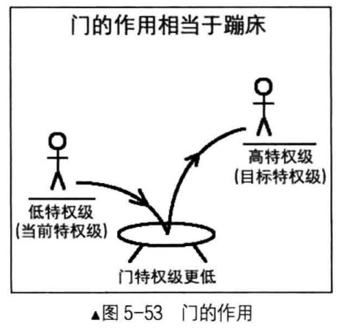

* 除了任务门，中断门、陷阱门、调用门都对应到一段例程，对应一段函数，而不是描述符对应内存区域。
* 为嘛门描述符需要给出基址？门描述符基于段描述符

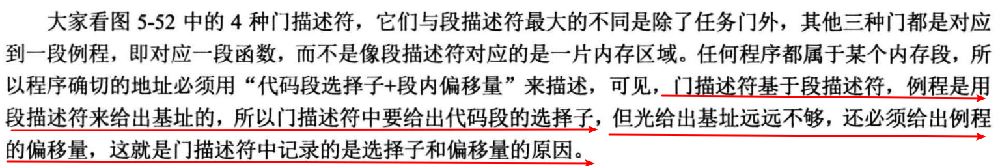

* **门描述符 = 选择子 + 偏移量**
* 调用门可以放在GDT、LDT中，但是陷阱门和中断门仅位于IDT中，任务门可以放GDT、LDT、IDT中。


* 存放在IDT中不好直接访问？int [NUM]指令访问
* 除了任务门以外其他三个门都是访问例程，门里面包含了偏移，所以访问的时候给出的偏移量并不起作用。

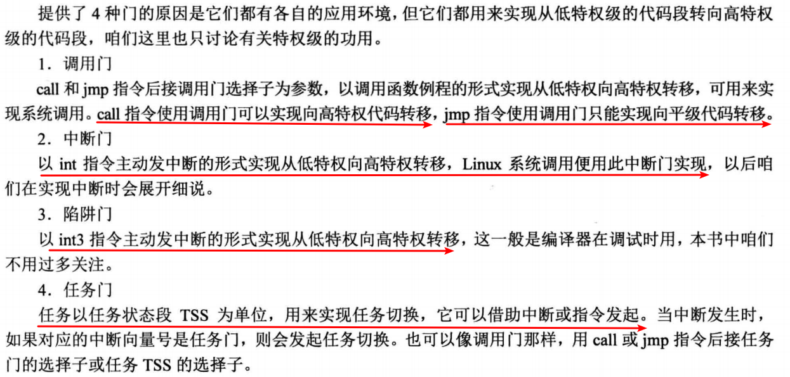

* 保护模式下离不开描述符，描述符离不开选择子
*


## 分页机制


## 中断

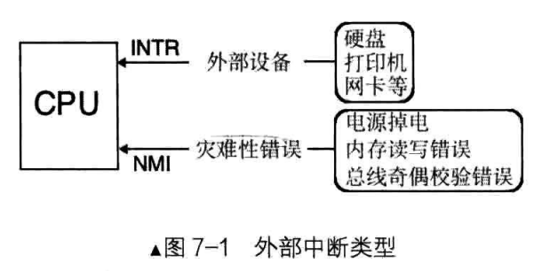

* 外部硬件中断通过NMI或INTR这里两根信号线通知CPU


* Linux把中断分成上半部分和下半部分。**上半部分在关中断下执行，下半部分在开中断下执行（可被嵌套）**

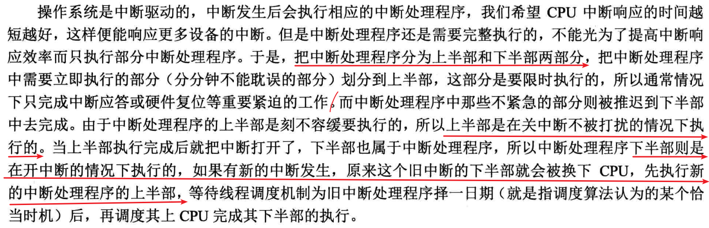

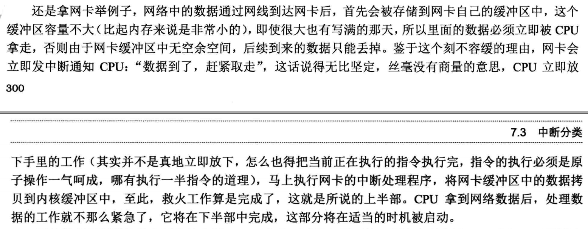

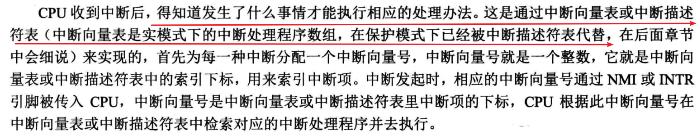

* 进入保护模式必须先配置好GDT和IDT

### 内部中断

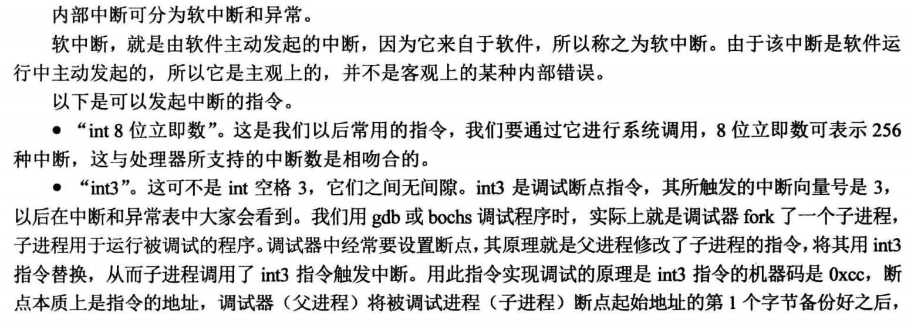

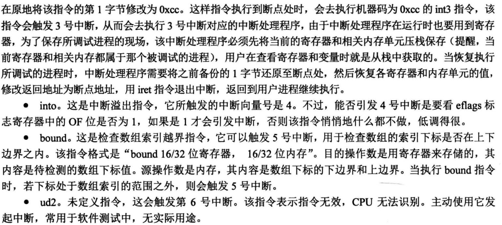


* CPU内部的中断包括软中断和硬中断都是不受IF位影响

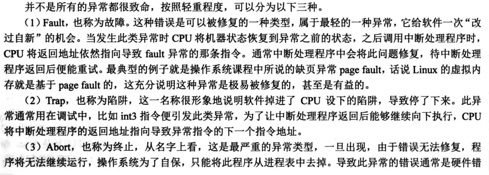


* int [number] 中断也是在中断向量表中的

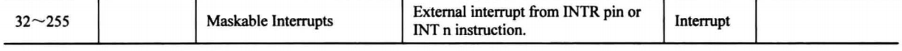


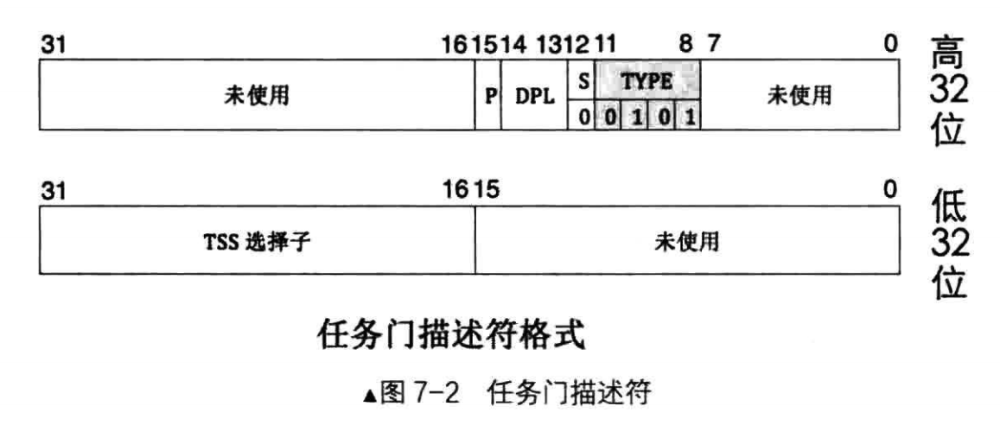

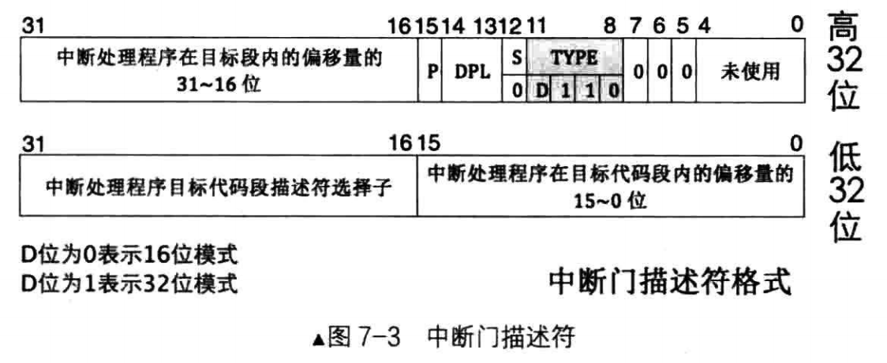

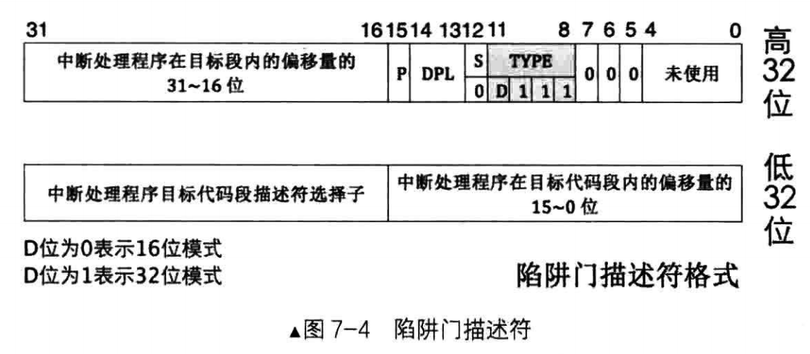

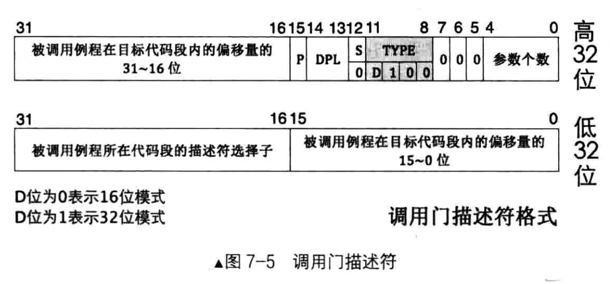

* 所有IDT中的描述符都叫门

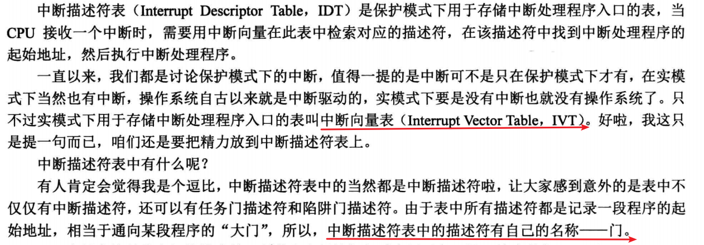

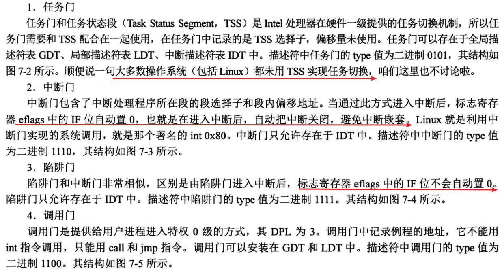

* 调用门不能放到IDT表中
* 一个中断源就会产生一个中断向量，每个中断向量都对应中断描述符表中的一个门描述符，任何中断源都通过中断向量对应到中断描述符表中的门描述符，通过该门描述符就找到了对应的中断处理程序。
* 中断发生后，采取什么样的动作是由中断处理程序决定的，但该程序是在中断描述符表中找到的，该表决定了中断信号落到哪个程序上，中断向量相当于子弹，门描述符相当于靶子，中断描述符表相当于祖击手，人家指哪就打哪，门描述符位置错了子弹就打错地方了
* 处理器只支持256个中断也就是说0~255中断向量号。


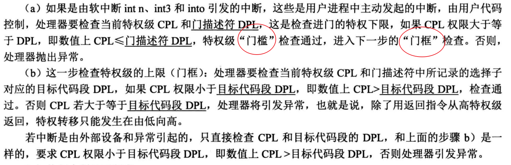

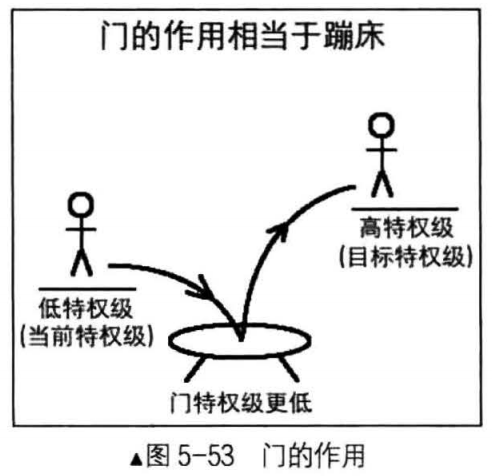

* 重复贴图~本章内容好多

## 保护

### CPL+DPL+RPL

* DPL是段描述符的特权级。它的含义是，**如果你(处于某个当前特权级下的程序)想访问我这个段，你应当具备什么样的级别。**

```
比如某个政府机构，它规定了，只允许市长及其以上级别的人才能进入。这个机构要求的级别就是 DPL（=0），而市长本人的这个职称就是 CPL（=0）。倘若你一个村长（CPL=3）想进这个地方，必然会被拒绝。
```

* **RPL的值只存在于段选择子中**。注意，不是段寄存器中，不是段寄存器中，不是段寄存器中。段选择子就是一个数字，前面讲过，它有三段结构，分别是“**索引-TI指示-RPL**”它的含义是**当前我想以 RPL 这个级别来请求你把这个段选择子置入段寄存器**。实际上 RPL 并没有什么用。因为请求者任何时刻都可以让 RPL = 0。但是如果请求者是 CPL = 3 的程序，用 RPL = 0 的级别来请求 DPL = 0的数据段，必然会失败。

```
省长以省长的身份去办事情的时候（CPL=0的程序以RPL=0的级别去请求DPL=0的数据段），肯定没什么问题。省长以平民的身份去办事情的时候（CPL=0的程序以RPL=3的级别去请求DPL=0的数据段），肯定会失败。
平民以省长的身份去办事情的时候（CPL=3的程序以RPL=0的级别去请求DPL=0的数据段），结果可想而知……失败！！！
```

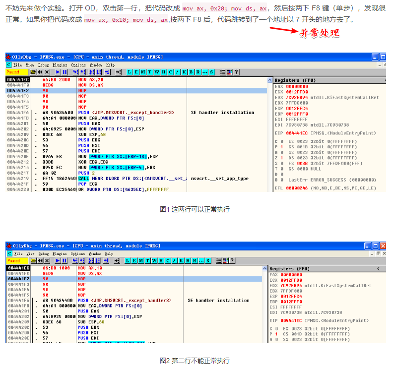

* 3环只能加载DPL为3的数据段
* 0环可以加载DPL=0,1,2,3 的数据段

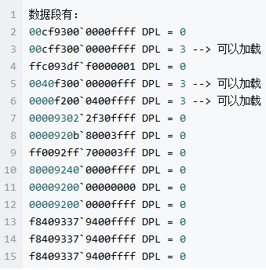

* 数据段权限检查，本质上就是检查能不能把段选择子代入到段寄存器。如果代入成功，表明权限检查通过。如果代入不成功，说明权限不够（CPL在数值上太大了）。**数据段权限检查**。为什么不是段权限检查？因为数据段权限检查简单。这确实是一个无懈可击的理由。相比于数据段的权限检查，代码段权限检查要更加严格。
* 选择子为0的不能使用。GDT第0项不用，LDT第0项可以用，但一般不用。0选择子可以加载但是不能访问，访问就出错，你懂得~一般保护性异常。
* 为什么 CPU 要给代码赋予不同的权限？这是为了防止你任意妄为。在 Windows 中，如果你随意更改了内核的重要数据，操作系统必然面临着危险——蓝屏。
* 为了防止这种情况发生，CPU 把执行权限分成了4个等级，0，1，2，3. 其中 0 表示最高级，可以执行任意代码，而执行权限为 3 的程序，只能执行普通的指令。Windows 和 Linux 只使用了 0 和 3 这两种。
*  **CPU 的有些指令，只能在 0 环执行。有些内存的访问，也只能在 0 环。这就是所谓的保护。硬件级别的保护**
* 代码段描述符中，有DPL字段，它是专门用来描述代码段级别的。分析GDT表中段描述符发现有0环的代码段和3环代码段。这里的DPL表示，**只允许特定级别**的下的程序跳过来执行，除非被我同意，低特权级的程序才能跳进来执行。所谓的特定级别下的程序，是指的当前CPL的级别是否符合对方代码段DPL字段要求，什么要求？权限高一点
* CPU 是不允许 CPL = 3 的程序直接跳转到 DPL=0 的代码中去执行，这是必须的呀，一跃成上帝想得美
* CPL = 当前特权级 = 始终保存在 cs 或者 ss 段寄存器的低 2 位。

```
如果你细心观察，你总会发现，cs 的最低2位一定是2进制 11，也就是3. 你绝对不可能看到这个值变成 0. 因为 OD 本身就是运行在 3 环的调试器。这是不是意味着，当前特权级永远不会变成 0？

如果你想在 VC6.0 中写程序，直接去读取高 2G 地址的数据，一定会报错。如果你当前的特权级被提升为 0 环（简称提权），这时候再去读取高 2G 地址数据，就没有问题了。然而提权并不是这么简单。
跨段执行，就是指改变当前的 cs 段寄存器，把另一个代码段的描述符加载到 cs 段寄存器。千万不要想当然的使用 mov ax, 0x08; mov cs, ax，编译器都不会让你通过。前面你也发现，也不存在lcs这样的指令加载段寄存器。
```

### 跨段执行-就是改变 CS 段寄存器

* **跨段执行**，就是指改变当前的 cs 段寄存器，把另一个代码段的描述符加载到 cs 段寄存器。千万不要想当然的使用``` mov ax, 0x08; mov cs, ax```，编译器都不会让你通过。也不存在lcs这样的指令加载段寄存器。
* 改变 cs 段寄存器，可以使用 jmp far 和 call far 等等。注意，除了这两个指令，还有别的，这里不能讲太多。原因还是那样，因为它简单。
```
指令 jmp 可以实现跨段执行代码，但是它并不能提权（无法改变当权特权级），也就是说，即便你跨到了 DPL = 0 的段，你的 CPL 也不会发生任何改变。 除非你原来就是 0 特权级。
```
* 使用 jmp 跨到 0 环代码段，也是有要求的，除非这个0环代码段描述符同意（这就是所谓的一致代码段）。


### 一致代码段与非一致代码段

* 一致代码段 = 共享段。你跑到零环区域执行，代码段属于0环，但是0环允许你执行，并且你执行的权限依然是你的CPL权限。当然，只能用于共享的段，其他别想了，涉及到搞特权级才能运行的指令在设计时不会让你运行的，就算有，就当操作系统设计者傻了，CPU也会做检查，有软有硬防护。
* 当段描述符描述代码段时，TYPE 字段的 c 位置 1 说明该段是一致代码段，否则是非一致代码段。

```
只有得到段描述符的同意，才允许 低权限 的程序跳转进去执行。这种段称为一致代码段。
而有些代码段描述符，绝对不允许 低权限的程序跳转进去执行，这种段称为非一致代码段。
```
* 只有一致代码段，才允许低特权级的程序跳转进去访问。

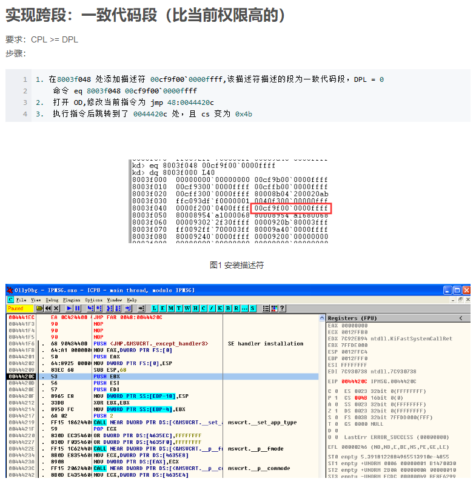

```
源特权级CPL=3，目的特权级DPL=0
cs变成0x4b ，B的二进制表示为1011，最低两位表示特权级3，也就是说虽然跳转过去，但是特权级没有变化哟
```
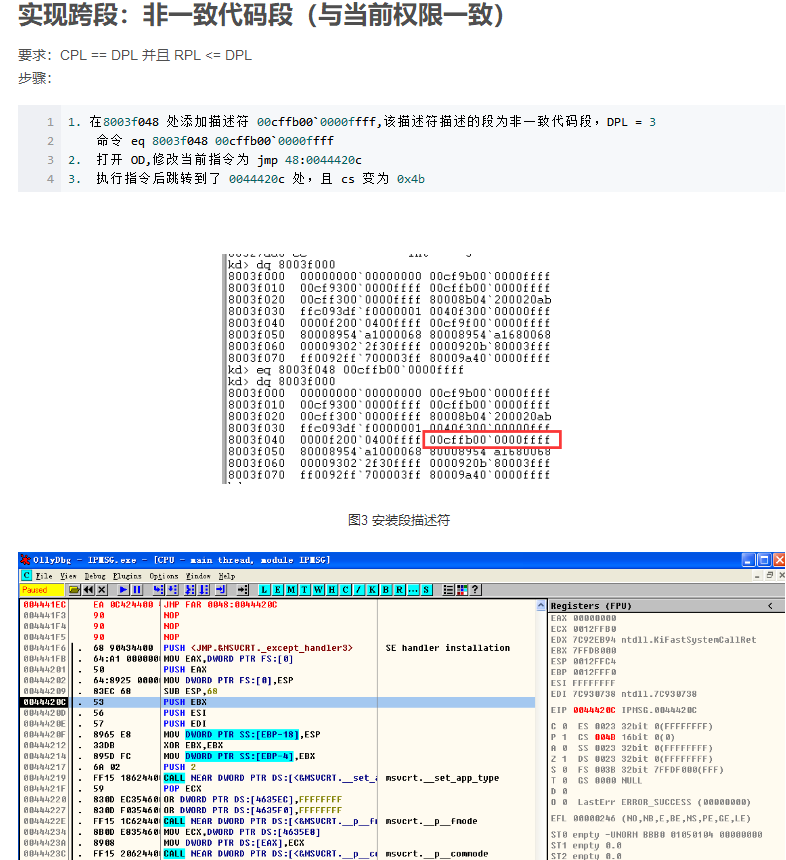

```
源特权级CPL=3，目的特权级DPL=3
cs变成0x4b ，B的二进制表示为1011，最低两位表示特权级3，跟自身特权级一样
```
* **无论如何，jmp far 也无法更改 CPL。即使你的 RPL = 0，也是徒劳。** 有没有办法更改 cs 段寄存器，同时也更改 CPL？

* 一致性代码段的特点就是，转移后的特权级不变成DPL，而是保持转移前的低特权级。**听从、依从转移前的特权级**。既然权限没有变，那就是说明仅仅只是跑到特权级代码段中用低特权执行了一波代码就走而已。


### 调用门


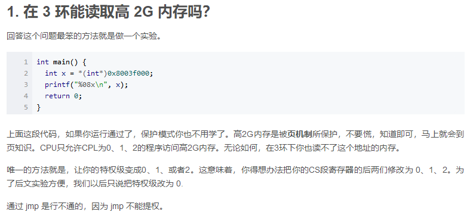

* 调用门，是CPU提供给我们的一个功能，它允许 3 环程序（CPL=3）通过这扇“门”达到修改 cs 段寄存器的目的，同时达到提权的目的。

```
“门”，是一种系统段描述符（段描述符的 S=0），这个描述符的结构和数据段描述符和代码段描述符有很大区别，这种描述符中嵌入了选择子。
如果你在“门”嵌入DPL=0的代码段选择子，那么你在 3 环，就可以通过这扇门，到达0环领空，这时候你的CPL=3就变成CPL=0。
```

* 调用门就具备了这种功能。你可以在调用门中嵌入选择子 0x0008，这个选择子指向的是 DPL = 0的代码段。然后使用 call far + 调用门描述符的段选择子，跨段到 0x0008 指向的代码段。


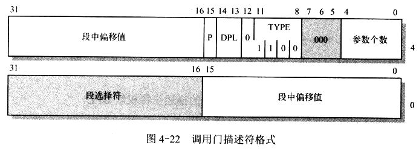

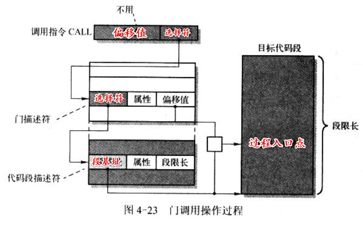

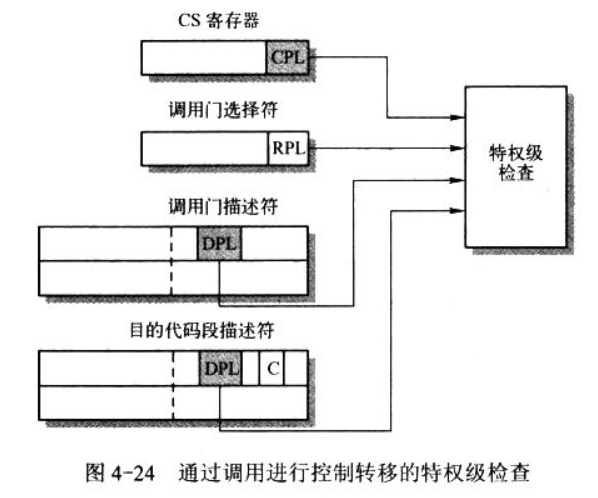

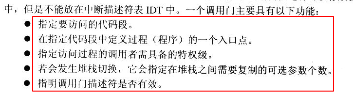


#### 调用门运行步骤

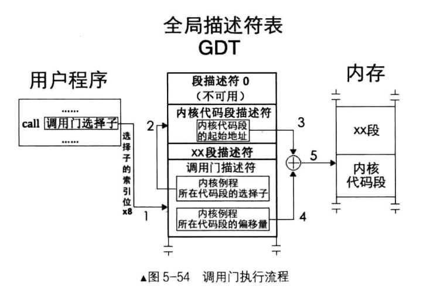

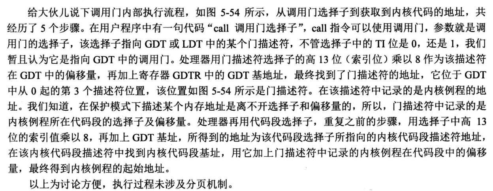


* 务必记住，硬件实现了参数传递。

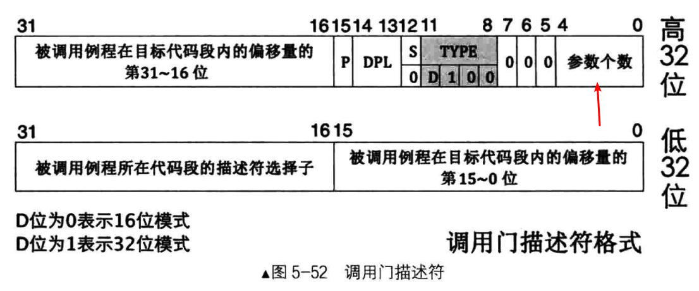

* 参数个数由5个bit表示，所以最多32个参数

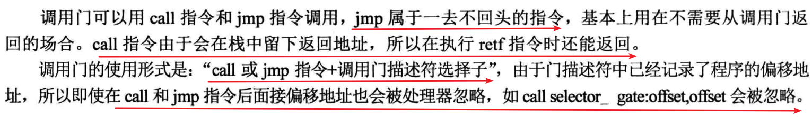

* 务必记住，忽略偏移量

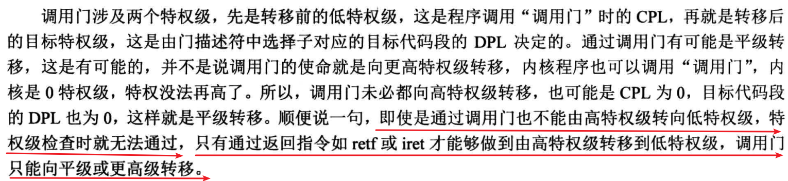

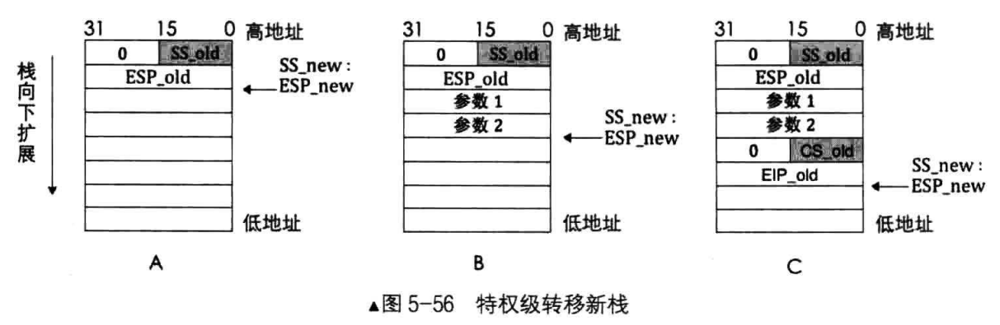

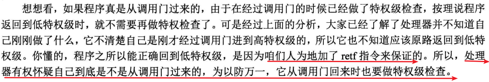

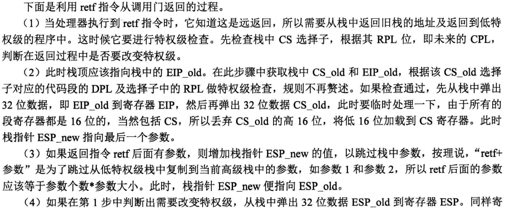

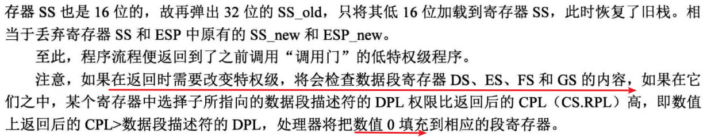

* 这个retf返回比较重要，构造返回过程。Linux系统初始化阶段跳转到init1进程，从内核态跳转到用户态，就要构造一个环境供retf跳转。
* 返回过程中必须要检查，并且是**处理器检查DS、FS、GS中选择子**所指向的数据段描述符的DPL是否比目标特权级别高，如果高了就是异常，自动填充0。

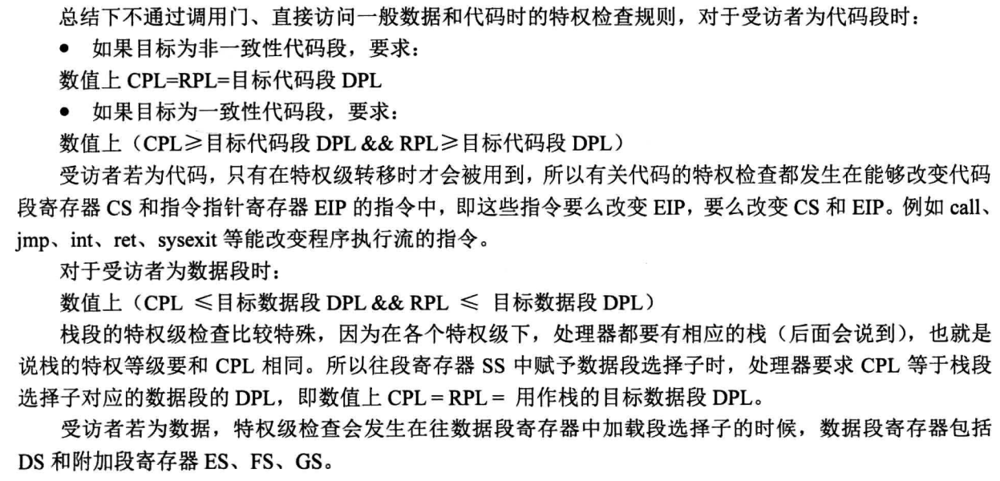


#### call far 指令对堆栈的影响

* CPU需要始终保持CS中的CPL和SS中的CPL一致

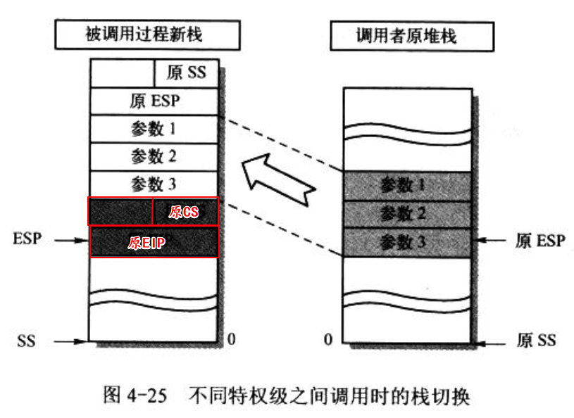

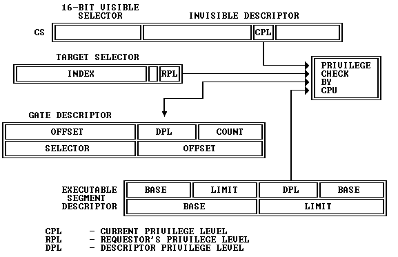

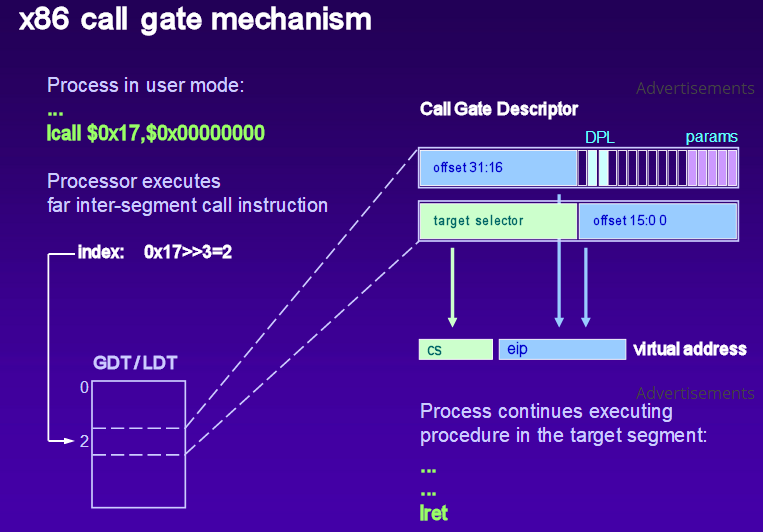

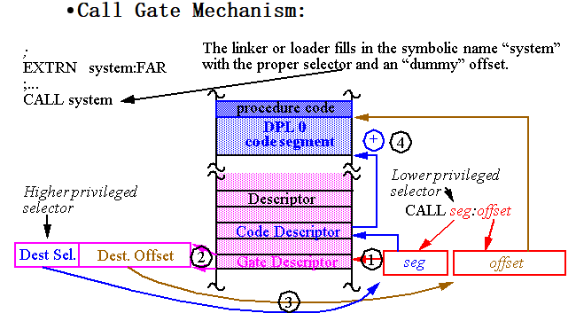

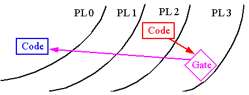

* 当使用调用门进行提权的时候，程序由3环进入0环，这时候需要切换栈，也就是说要更改 ss 段选择子和 esp 的值。这时候 CPU 会自动的帮我们把原始 3 环的 ss, esp, 参数（如果有的话）, cs 和 eip 复制到这个 0 环栈中去。**一定要注意，这是 CPU 自动帮我们做的事情，和 OS 没有任何关系。**
* 切换栈，需要 0 环 ss 段选择子和 esp ，这些值 CPU 是如何找到了呢？TSS


### 中断门

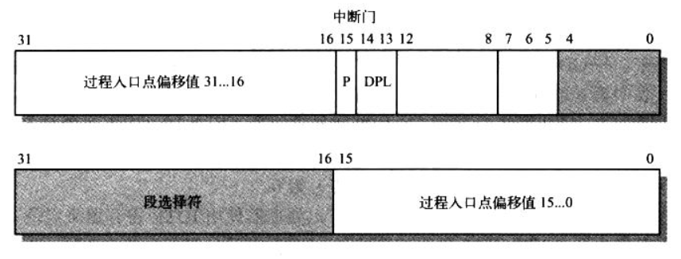

* Windows和Linux大量使用了中断门。调用门虽然是 CPU 提供给使用者提权的一种手段，CPU提供的手段，但是Windows/Linux中却并未使用。
* 中断门也可以实现提权。**调用门是安装在 GDT 表中的，但是中断门并不是，它是安装在一个被称作 IDT（中断描述符表）中的**，它同 GDT 一样，**每个元素占 8 个字节**。
* 中断门的五六位通常是ee或者8e


* **调用门是安装在GDT表中的，但是中断门并不是，它是安装在一个被称作IDT（中断描述符表）中的**，它同 GDT 一样，每个元素占 8 个字节。
* 和调用门稍稍有点不一样的地方是，中断门提权会在堆栈中多压入一个值——EFLAGS。
* **IDT表中各种类型的门，都可以通过 int [index] 汇编指令进入**。有一点需要说明的是，使用 int 指令进入中断门，会影响栈。如果从 3 环进入 0 环，有两件事情要做。这些值都是被 CPU 自动保存起来的，和操作系统没有任何关系，这是 CPU 本身固有的特性。
	* **切换成 0 环栈**
	* **在 0 环栈压入 ss3, esp3, eflags3, cs3, eip3( ss3 等后面的 3 表示的是 3 环下的栈，栈顶指针，eflags, 3环代码段选择子和返回地址。)**
* 很少有使用中断门从 3 环进入 3 环的，这种设计感觉有点傻。


### 任务门

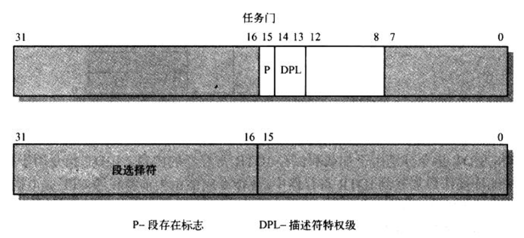

* call/jmp可以访问一个任务段，来达到切换一堆寄存器的目的。但是，CPU同时又提供了另一种方法让我们访问任务段——任务门。
* 任务门是安装在 IDT 表中的
* IDT 表中只可以安装 3 种门：中断门、陷阱门和任务门
* 既然都可以使用 call/jmp 来访问任务段了，为什么又弄个任务门来访问段，何必多此一举？仔细想想，使用 int 指令加索引号，是不是比call/jmp加选择子要方便。因为一个 int 0x20 指令（假设我在 IDT[20]处安装了一个任务门描述符）就可以让我切换一堆寄存器。
* 所有的门描述符的里头都嵌入着另一个段的选择子。比如中断门和陷阱门中嵌入了代码段的选择子。任务门也不例外，它里头嵌入了任务段的选择子。
* **CPU提供任务门，是为了方便访问任务段**。在CPU发生二重错误的时候，会直接跳到 8 号中断，而 8 号中断就是任务门（这是Windows xp 系统设计的任务门），这意味着什么？一旦进入 8 号中断，CPU 会切换一堆寄存器，这时候无论发生什么错误都没什么关系，通过一堆寄存器的切换，CPU 保证能跳到一个正确的地方去执行（除非那个地方也被破坏了），紧接着做一些后续处理（比如收集错误信息），**系统蓝屏**。


### 陷阱门

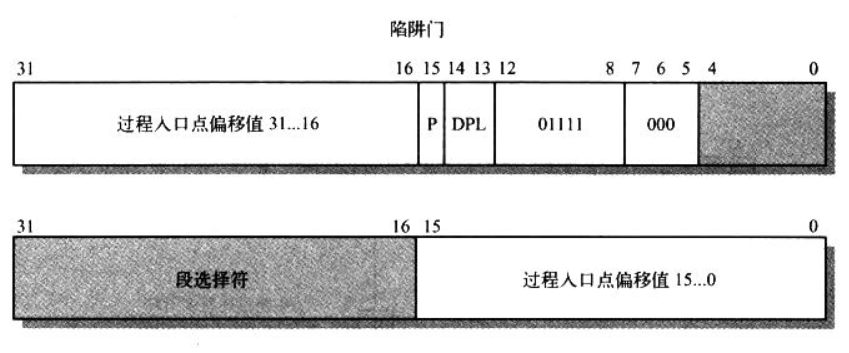

* 进入中断门，CPU会把EFLAGS中的IF位置1，而进入陷阱门，CPU并不修改 IF 位。


### TSS-任务状态段

* **TSS 段是们于内存中的一段数据**
* **TSS 段描述符是描述 TSS 段的基址和大小，并且安装在 GDT 表中**
* **任务门中嵌入了TSS段选择子，任务门安装在 IDT 表中**

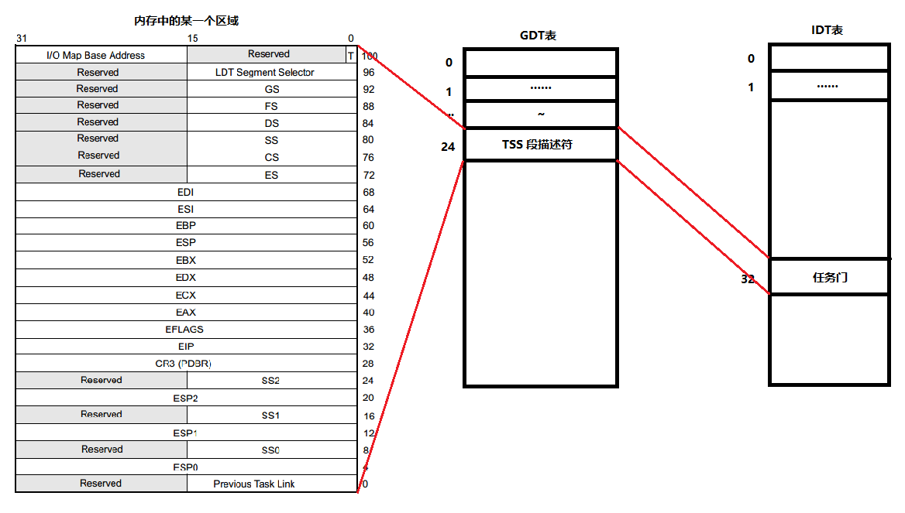

* 任务是不可以递归调用的，任务不能调用自己，任务调用别的任务的时候，新任务会把老任务的TSS选择子保存起来方便回到老任务。俗称。。保留前任

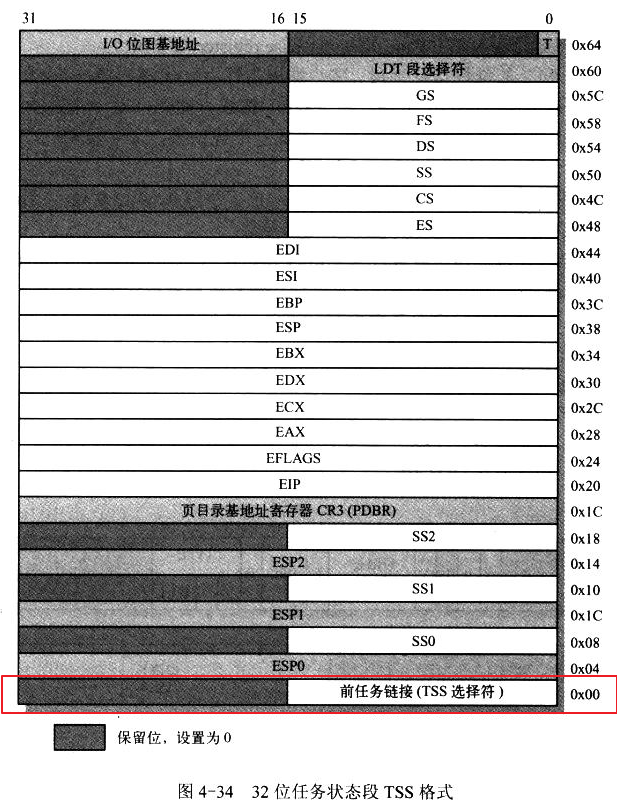

* **任务切换也会切换到另一个LDT**
* **任务切换也会切换CR3寄存器值，每个任务都有自己的一套页表**
* 使用处理器来实现任务切换时可选的，也可以使用软件实现，Linux就是如此

### 任务门+中断门+陷阱门+调用门比较

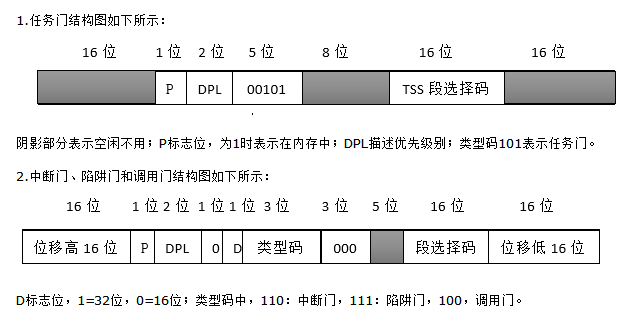

* 在x86种有四种门：中断门、陷阱门、调用门、任务门,这些是**CPU从硬件层**提供的支持。
* 中断描述符IDT表示一个系统表，它与中断或异常向量相联系。每一个中断或异常向量在这个系统表中有对应的中断或异常处理程序入口地址。中断描述符的每一项对应一个中断或异常向量，每个向量由8个字节组成。因此，最多需要256*8=2048字节来存放IDT。
* 在运行中断之前，必须初始化IDT（中断描述符表）。
* IDT包含三种类型的中断描述符：**任务门、中断门、陷阱门**。描述符的第40~43位用于区分不同的描述符（每个描述符有8个字节/64bit）。
* 任务门和其他三种门相比，在任务门中不需要用段内位移，因为任务门不指向某一个子程序的入口，TSS本身是作为一个段来对待的，而中断门、陷阱门和调用门则都要指向一个子程序，所以必须结合使用段选择码和段内位移。此外，任务门中相对于D标志位的位置永远是0.
* 中断门和陷阱门在使用上的区别不在于中断是外部产生的还是有CPU本身产生的，而在于通过中断门进入中断服务程序时CPU会自动将中断关闭（将EFLAGS寄存器中IF标志位置0），以防止嵌套中断产生，而通过陷阱门进入服务程序时则维持IF标志位不变。这是二者唯一的区别。
* 将真正的实现提权——当前特权级从3变为0。当然，CPU 不会让你就这么简单的从3环跨到0环。但是，CPU又必须提供一套方法，来让你完成这个功能。
* DPL = 0 的非一致代码段，是绝对不允许不同特权级的程序跳转进来。可是，我给以给你开个后门，让你进来，然后给你最高权限，允许你胡作非为。这个后门，必须由我（操作系统）来指定，而且只允许你跳转到我指定的地方。
* 所谓的后门，其实有很多，比如中断门，陷阱门，任务门。它们都可以实现提权。
* 陷阱门和中断门是调用门的特殊类，专门用于异常和中断的处理程序。


## 中断和异常处理


##任务管理


## 保护模式编程初始化


## 参考

* CSDN博客 - OS 学习笔记导航 - <https://blog.csdn.net/q1007729991/article/details/52538571>
