<!-- TOC depthFrom:1 depthTo:6 withLinks:1 updateOnSave:1 orderedList:0 -->

- [第5章-linux内核体系结构](#第5章-linux内核体系结构)
	- [总结](#总结)
		- [Linux内核模式](#linux内核模式)
		- [Linux内核对内存的管理和使用](#linux内核对内存的管理和使用)
		- [系统时间](#系统时间)
		- [进程控制](#进程控制)
		- [Linux 0.12 采用的文件系统](#linux-012-采用的文件系统)
		- [Linux内核源代码目录结构](#linux内核源代码目录结构)
		- [内核系统与应用程序的关系](#内核系统与应用程序的关系)
		- [Linux/Makefile文件](#linuxmakefile文件)
	- 

<!-- /TOC -->
# 第5章-linux内核体系结构

## 总结

### Linux内核模式

* Linux 0.12采用整体式结构的单内核模式。结构紧凑，执行速度快，缺点是，层次结构性不强。

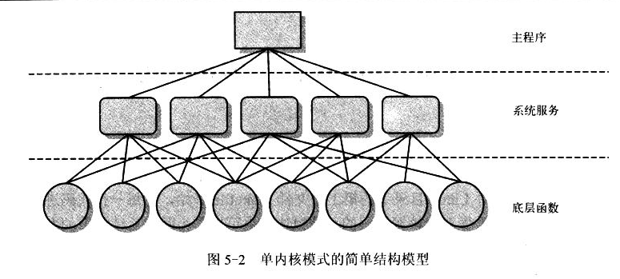

* 内核分成五个模块：进程调度模块、内存管理模块、文件系统模块、进程间通信模块、网络接口模块

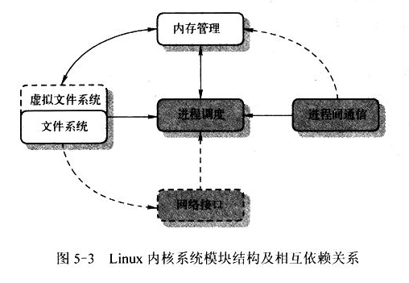

      虚线表示Linux 0.12还没有实现。典型的VFS也只在0.95版本才有。

这句话很关键，进程调度模块跟其他模块关联最大。从图中进程调度的度（处度、入度）就可看出。所以平常为嘛进程调度极度重要，就是因为它复杂，调度的时候得考虑其他子系统的状态。说白了，就是N中状态机转换机制。

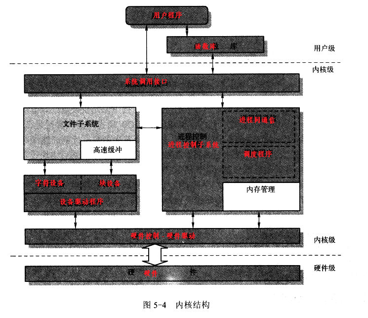

### Linux内核对内存的管理和使用

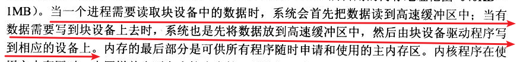

* 必须搞清楚三个地址：虚拟地址、线性地址、物理地址
  - 虚拟地址：由于程序产生的由段选择符和段内偏移地址两部分组成
  - 逻辑地址：其实就是段内偏移地址
  - 线性地址：虚拟地址到物理地址之间的中间层，是处理器可寻址的内存空间的地址
  - 物理地址：CPU外部总线上寻址物理内存的地址信号

* 虚拟存储

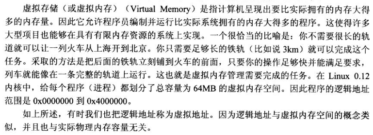

* Linux 0.12只给每个程序划分了64MB的虚拟地址空间，也就是0x00000000 到 0x400,0000

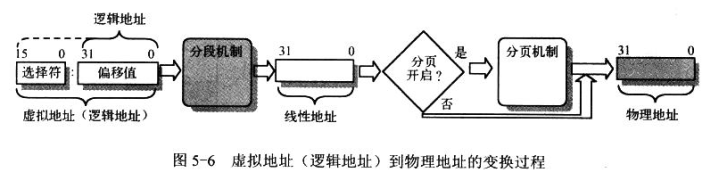

* 利用二级或者外部存储空间，使程序能够不受时机物理内存容量的限制。虚拟内存空间要比时机物理内存容量大得多。

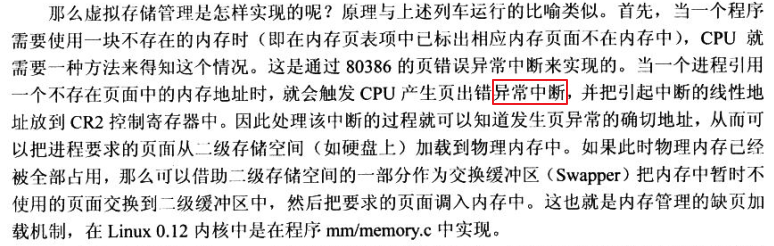

* 保护模式依然是 段：偏移 访问内存，但是为了保护段，需要添加段保护信息，所以就把曾经直接用来表示段基址的寄存器作为一个索引去访问一个大表格，每个表项就是一个内存段的各种信息，包括访问权限、地址等

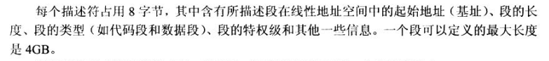

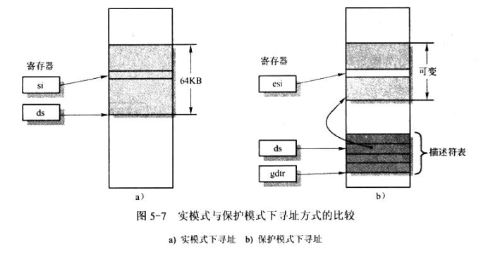

* 段：偏移   这是永恒不变的道理
* GDT、LDT、IDT

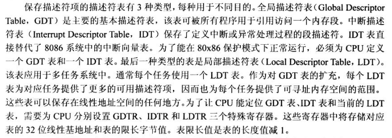

GDT和IDT不可获取，但是LDT可有可无。虽然英特尔建议用LDT，你也可以不听它的呀~

* 为了让CPU能够快速定位这三个表格，CPU还特定设置了硬件来记录其地址，那就是GDTR、LDTR、IDTR，因为这些表格都是在内存中的，那么无非就是存一个地址+表格大小，限定了这个表格的范围。

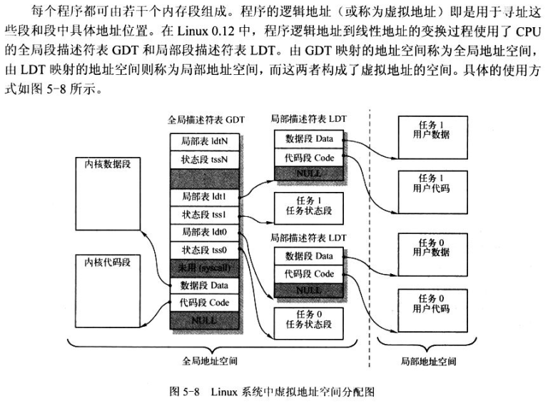

* LDT也是在GDT中的，LDT不可能在IDT，IDT也必须在GDT。IDT也不可能在LDT
* 任务状态段TSS也是在GDT中，可以在LDT肿么？Linux 0.12不得行哦~理论上是可以的，毕竟Intel大佬说可以。

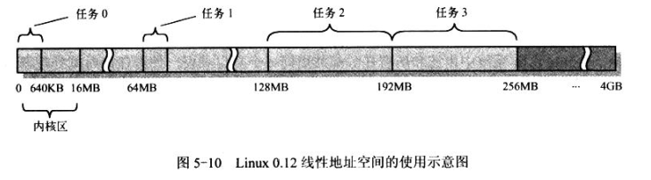

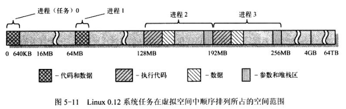

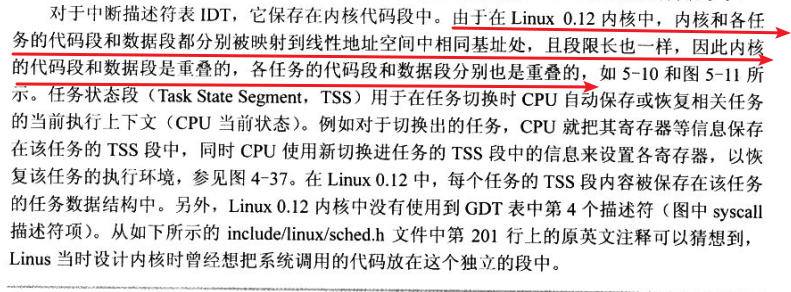

这句话好奇怪，不是应该一个进程一个地址空间么？怎么是代码段、数据段各一个空间？？应该是没表述清楚把。

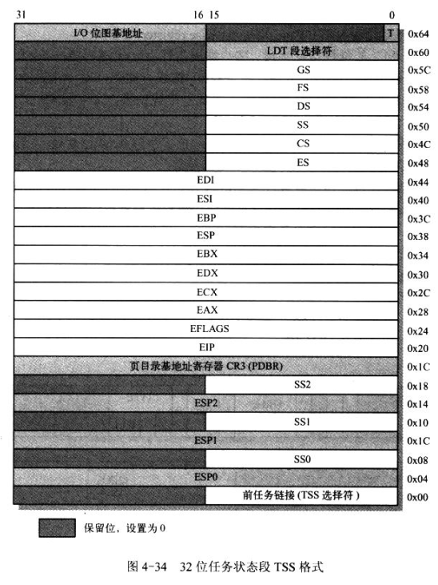

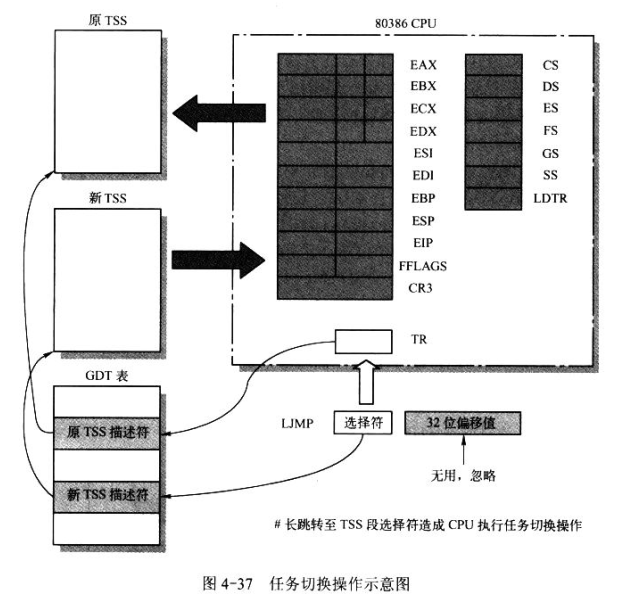

* 分页其实方便了内存管理。分配容易，释放难。能够管理好零散的内存块，分页增强了分段的性能。当然没有分段就没有分页，分页地址变换也是建立在分段的基础上，不可能直接取代分段。典型的分页，每个物理页框4KB。分配内存的时候以4KB为单位进行分配

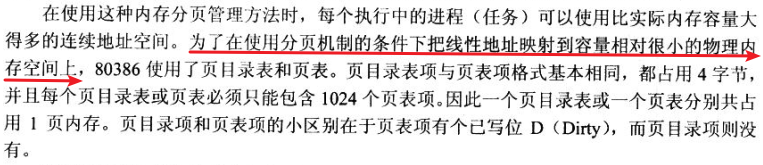

这里巧妙地安排页目录表和页表大小分别是4KB，刚好可以存1024个表项，这可不是偶然。

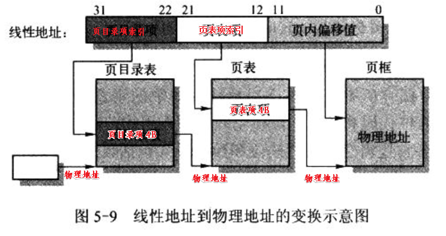

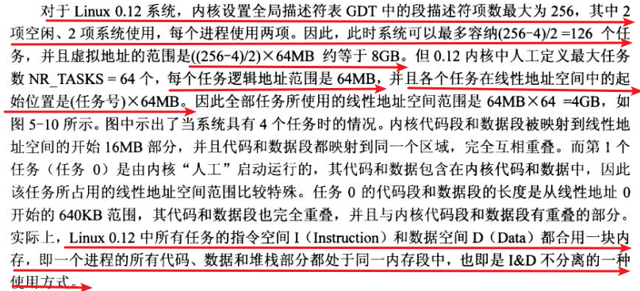

* Linux 0.12奇特之处，其实就算线性地址空间重叠了也没有毛病啊，反正你的空间你的，我的空间我的。互不干扰的。

### 系统时间

* jiffies变量用来统计系统启动以来系统中产生的总节拍数。该变量在系统启动时被初始化为0，接下来没进行一次时钟中断，jiffies自动加1。因此，知道了总的节拍数，然后再除以Hz，即可知系统的运行时间（jiffies/Hz）。
* 对于jiffies+Hz的含义，jiffies表示当前的系统时钟中断数，Hz表示一秒后的时钟中断的增加量，假设time=jiffies+Hz，正如上面所说 ，内核正是利用节拍数来计算系统时钟和系统运行时间的，则通过jiffies+Hz即可间接表示一秒钟。
* 如果系统中某个程序运行一段时间后，需要比较该运行时间是否超过一秒，即可通过比较time和程序运行后的jiffies值来判断是否超过一秒。当然此时，我们需要考虑jiffies变量的回绕问题，不可直接用if（time > jiffies）来比较，linux系统提供了4个宏定义来解决用户空间利用jiffies变量进行时间比较时可能产生的回绕现象

### 进程控制

### Linux 0.12 采用的文件系统

* Linux 0.12 用了MINIX文件系统
* 必不可少
	- etc
	- bin
	- usr
	- usr/bin
	- var
* Linux启动盘如何加载根文件系统？根据启动扇区的509、510字节组成的一个字判断从何加载。当然这个判断固定死的，可以说就是一个switch。这一个字的数值为0表示从当前驱动器加载，如果为磁盘分区设备号，就到相应分区加载根文件系统。

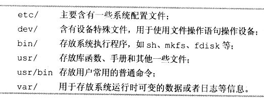

### Linux内核源代码目录结构

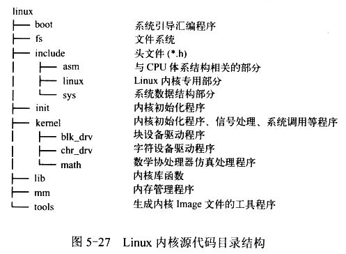

* Linux家的Makefile会嵌套调用子目录下的Makefile。
* Makefile根据时间戳绝对哪些要编译。

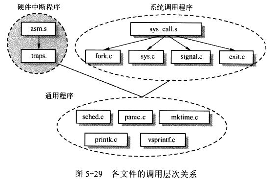

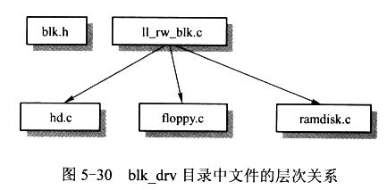

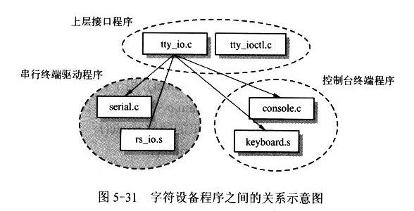

### 内核系统与应用程序的关系

* 库函数提供更丰富的功能，但是效率低。系统调用提供高效精简的功能。

### Linux/Makefile文件

##
