<!-- TOC depthFrom:1 depthTo:6 withLinks:1 updateOnSave:1 orderedList:0 -->

- [第7章-初始化程序](#第7章-初始化程序)
	- [main.c程序](#mainc程序)
	- [环境初始化工作](#环境初始化工作)
	- [getty历史](#getty历史)
		- [控制终端](#控制终端)
		- [控制台终端](#控制台终端)
		- [伪终端（/dev/pty/）](#伪终端devpty)
		- [串行端口终端（/dev/ttySn）](#串行端口终端devttysn)
	- [/etc/issue和/etc/motd的问题](#etcissue和etcmotd的问题)
	- [printf系列可变参数本质](#printf系列可变参数本质)
		- [参考链接](#参考链接)
	- [总结](#总结)

<!-- /TOC -->

# 第7章-初始化程序

## main.c程序

* 初始化阶段
  * 首先如何分配使用系统物理内存
  * 调用内核各个部分的初始化函数分别对内存管理、中断处理、块设备、字符设备、进程管理以及硬盘和软盘等硬件进行初始化
  * 在完成这些初始化后，系统各部分以及处于可运行状态。
  * 程序手动移到进程0运行
  * 进程0调用fork()创建init进程

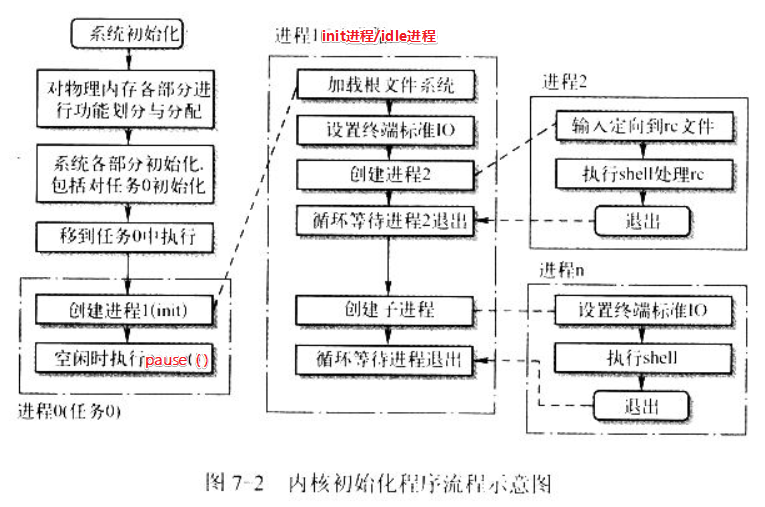

* init功能分为四个部分
  * 安装根文件系统
  * 显示系统信息
  * 运行系统初始资源配置rc中的命令
  * 执行登录shell程序

## 环境初始化工作


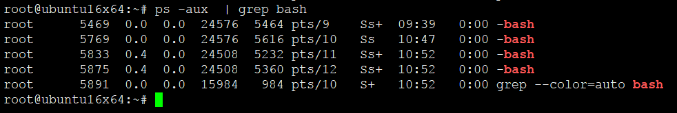

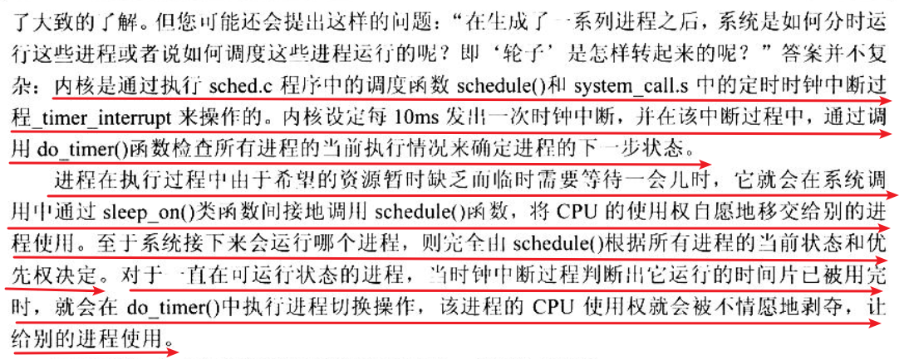

## getty历史

* getty(get teletype writer)，取得电传打字机。
* 终端是一种字符型设备，它有多种类型，通常使用tty来简称各种类型的终端设备。tty是Teletype的缩写。Teletype是最早出现的一种终端设备，很象电传打字机，是由Teletype公司生产的。在Linux系统的设备特殊文件目录/dev/下

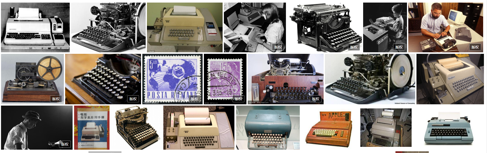

1. 串口端口终端（/dev/ttySn）
2. 控制终端（/dev/tty）
3. 伪终端（/dev/pty/）
4. 控制台终端（/dev/ttyn, /dev/console）
5. 虚拟终端（/dev/pts/n）


* tty(终端设备的__统称__)
```
tty一词源于teletypes，或者teletypewriters，原来指的是电传打字机，是通过串行线用打印机键盘通过阅读和发送信息的东西，后来这东西被键盘与显示器取代，所以现在叫终端比较合适。终端是一种字符型设备，它有多种类型，通常使用tty来简称各种类型的终端设备。
```
*  pty（虚拟终端__pseudo-terminal__)
```
但是如果我们远程telnet到主机或使用xterm时不也需要一个终端交互么？是的，这就是虚拟终端pty(pseudo-tty)
```
*  pts/ptmx(pts/ptmx结合使用，进而实现pty)
```
pts(pseudo-terminal slave)是pty的实现方法，与ptmx(pseudo-terminal master)配合使用实现pty。
```

### 控制终端

```
/dev/tty
```


* 如果当前进程有控制终端（Controlling Terminal）的话，那么/dev/tty就是当前进程的控制终端的设备特殊文件。
* 可以使用命令”ps –ax”来查看进程与哪个控制终端相连。对于你登录的shell，/dev/tty就是你使用的终端，设备号是（5,0）。
* 使用命令 ”tty”可以查看它具体对应哪个实际终端设备。/dev/tty有些类似于到实际所使用终端设备的一个联接。


### 控制台终端

```
/dev/ttyn
/dev/console
```

* 在UNIX系统中，计算机显示器通常被称为控制台终端（Console）。它仿真了类型为Linux的一种终端（TERM=Linux），并且有一些设备特殊文件与之相关联：tty0、tty1、tty2等。
* 当你在控制台上登录时，使用的是tty1。使用Alt+[F1—F6]组合键时，我们就可以切换到tty2、tty3等上面去。
* tty1 –tty6等称为虚拟终端，而tty0则是当前所使用虚拟终端的一个别名，系统所产生的信息会发送到该终端上。
* 因此不管当前正在使用哪个虚拟终端，系统信息都会发送到控制台终端上。
* 你可以登录到不同的虚拟终端上去，因而可以让系统同时有几个不同的会话期存在。
* 只有系统或超级用户root可以向/dev/tty0进行写操作，


### 伪终端（/dev/pty/）


* 伪终端（Pseudo Terminal）是成对的逻辑终端设备，例如/dev/ptyp3和/dev/ttyp3（或着在设备文件系统中分别是 /dev/pty/m3和/dev/pty/s3）。
* 它们与实际物理设备并不直接相关。如果一个程序把ttyp3看作是一个串行端口设备，则它对该端口的读/写操作会反映在该逻辑终端设备对的另一个上面（ttyp3）, 而ttyp3则是另一个程序用于读写操作的逻辑设备。这样，两个程序就可以通过这种逻辑设备进行互相交流，而其中一个使用ttyp3的程序则认为自己正在与一个串行端口进行通信。这很象是逻辑设备对之间的管道操作。
* 对于ttyp3（s3），任何设计成使用一个串行端口设备的程序都可以使用该逻辑设备。但对于使用ptyp3的程序，则需要专门设计来使用ptyp3（m3）逻辑设备。
* 例如，如果某人在网上使用telnet程序连接到你的计算机上，则telnet程序就可能会开始连接到设备ptyp2（m2）上（一个伪终端端口上）。此时一个getty程序就应该运行在对应的ttyp2（s2）端口上。当telnet从远端获取了一个字符时，该字符就会通过m2、s2传递给 getty程序，而getty程序就会通过s2、m2和telnet程序往网络上返回”login:”字符串信息。这样，登录程序与telnet程序就通过“伪终端”进行通信。通过使用适当的软件，就可以把两个甚至多个伪终端设备连接到同一个物理串行端口上。

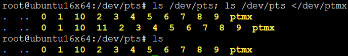

* 可见在重定向/dev/ptmx的时候在/dev/pts目录下多了个设备节点11，而当上面这个shell结束的时候再次ls /dev/pts目录，设备节点11又消失了。__每open /dev/ptmx就会得到一个新的文件描述符，并且在/dev/pts/目录下生成一个与这个文件描述符对应的新的设备节点 __

### 串行端口终端（/dev/ttySn）

* 串行端口终端（Serial Port Terminal）是使用计算机串行端口连接的终端设备。
* 计算机把每个串行端口都看作是一个字符设备。有段时间这些串行端口设备通常被称为终端设备，因为那时它的最大用途就是用来连接终端。
* 这些串行端口所对应的设备名称是/dev/tts/0（或/dev /ttyS0）、/dev/tts/1（或/dev/ttyS1）等，设备号分别是（4,0）、（4,1）等，分别对应于DOS系统下的COM1、 COM2等。
* 若要向一个端口发送数据，可以在命令行上把标准输出重定向到这些特殊文件名上即可。例如，在命令行提示符下键入如下命令，会把单词”test”发送到连接在ttyS1（COM2）端口的设备上。


　　```echo test > /dev/ttyS1```
　　

## /etc/issue和/etc/motd的问题

* /etc/motd

```
/etc/motd即messageoftoday（布告栏信息）,每次用户登录时,/etc/motd文件的内容会显示在用户的终端.系统管理员可以在文件中编辑系统活动消息,例如：管理员通知用户系统何时进行软件或硬件的升级、何时进行系统维护等.如果shell支持中文,还可以使用中文,这样看起来更易于了解.

注：window操作系统也有相关的功能，有的公司员工的工作机是统一管理，用的是windows ，当员工早上来登入工作机可能看到一些如提示信息，/etc/motd实现的作用跟它差不多。
```
* /etc/issue

```
/etc/issue文件的使用方法与/etc/motd文件相差不大,它们的主要区别在于：当一个网络用户或通过串口登录系统上时,/etc/issue的文件内容显示在login提示符之前,而/etc/motd内容显示在用户成功登录系统之后.（我们在用ctrl+alt+f1~f7登录到终端tty1~tty6时，会显示提示符字符串，这些字符串就是写在/etc/issue下，可以用vi /etc/issue打开看）

还有一个/etc/issue.net文件，它提供给telnet远程登录程序使用的。默认情况下/etc/issue文件和/etc/issue.net内容一样，如需要，可根据自己需要修改。
```
```
issue 内的各代码意义
本地端时间的日期；
/l 显示第几个终端机接口；
/m 显示硬件的等级 (i386/i486/i586/i686...)；
/n 显示主机的网络名称；
/o 显示 domain name；
/r 操作系统的版本 (相当于 uname -r)
/t 显示本地端时间的时间；
/s 操作系统的名称；
/v 操作系统的版本.
```
## printf系列可变参数本质

* 首先剧透，printf = vsprintf + write。
  - vsprintf进行字符串格式化
  - write写到终端
* 这里还需要编译器配合，本质上是编译器帮忙搞了一波内建功能buildin。虽然说参数可变，但是你编译的时候，参数四不四已经固定了？因为格式化字符串的内容和参数列表不可能在运行的时候改变的哦，这个要分清。就好像万精油一样，不管什么输出都可以用它，但是前提是，必须在编译之前用，编译后就固定了。这点其实就是泛型
* 本质上是编译器帮忙处理，识别了传递的参数个数啊，参数类型啊，然后帮忙字节对齐访问参数。之所以可变，全都是编译器累死累活帮忙。


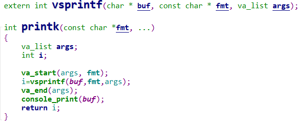

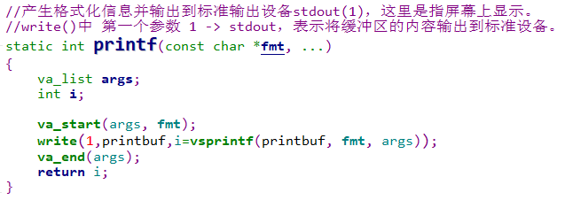


```
int vsprintf(char *buf, const char *fmt, va_list args)
{
	int len;
	int i;
	char * str;
	char *s;
	int *ip;

	int flags;		/* flags to number() */

	int field_width;	/* width of output field */
	int precision;		/* min. # of digits for integers; max
				   number of chars for from string */
	int qualifier;		/* 'h', 'l', or 'L' for integer fields */

	for (str=buf ; *fmt ; ++fmt) {
		if (*fmt != '%') {
			*str++ = *fmt;
			continue;
		}

		/* process flags */
		flags = 0;
		repeat:
			++fmt;		/* this also skips first '%' */
			switch (*fmt) {
				case '-': flags |= LEFT; goto repeat;
				case '+': flags |= PLUS; goto repeat;
				case ' ': flags |= SPACE; goto repeat;
				case '#': flags |= SPECIAL; goto repeat;
				case '0': flags |= ZEROPAD; goto repeat;
				}

		/* get field width */
		field_width = -1;
		if (is_digit(*fmt))
			field_width = skip_atoi(&fmt);
		else if (*fmt == '*') {
			/* it's the next argument */
			field_width = va_arg(args, int);
			if (field_width < 0) {
				field_width = -field_width;
				flags |= LEFT;
			}
		}

		/* get the precision */
		precision = -1;
		if (*fmt == '.') {
			++fmt;
			if (is_digit(*fmt))
				precision = skip_atoi(&fmt);
			else if (*fmt == '*') {
				/* it's the next argument */
				precision = va_arg(args, int);
			}
			if (precision < 0)
				precision = 0;
		}

		/* get the conversion qualifier */
		qualifier = -1;
		if (*fmt == 'h' || *fmt == 'l' || *fmt == 'L') {
			qualifier = *fmt;
			++fmt;
		}

		switch (*fmt) {
		case 'c':
			if (!(flags & LEFT))
				while (--field_width > 0)
					*str++ = ' ';
			*str++ = (unsigned char) va_arg(args, int);
			while (--field_width > 0)
				*str++ = ' ';
			break;

		case 's':
			s = va_arg(args, char *);
			len = strlen(s);
			if (precision < 0)
				precision = len;
			else if (len > precision)
				len = precision;

			if (!(flags & LEFT))
				while (len < field_width--)
					*str++ = ' ';
			for (i = 0; i < len; ++i)
				*str++ = *s++;
			while (len < field_width--)
				*str++ = ' ';
			break;

		case 'o':
			str = number(str, va_arg(args, unsigned long), 8,
				field_width, precision, flags);
			break;

		case 'p':
			if (field_width == -1) {
				field_width = 8;
				flags |= ZEROPAD;
			}
			str = number(str,
				(unsigned long) va_arg(args, void *), 16,
				field_width, precision, flags);
			break;

		case 'x':
			flags |= SMALL;
		case 'X':
			str = number(str, va_arg(args, unsigned long), 16,
				field_width, precision, flags);
			break;

		case 'd':
		case 'i':
			flags |= SIGN;
		case 'u':
			str = number(str, va_arg(args, unsigned long), 10,
				field_width, precision, flags);
			break;

		case 'n':
			ip = va_arg(args, int *);
			*ip = (str - buf);
			break;

		default:
			if (*fmt != '%')
				*str++ = '%';
			if (*fmt)
				*str++ = *fmt;
			else
				--fmt;
			break;
		}
	}
	*str = '\0';
	return str-buf;
}

```

* 参考一波博客文章，例子很简单，上面的函数实现比较实用，所以长的一笔

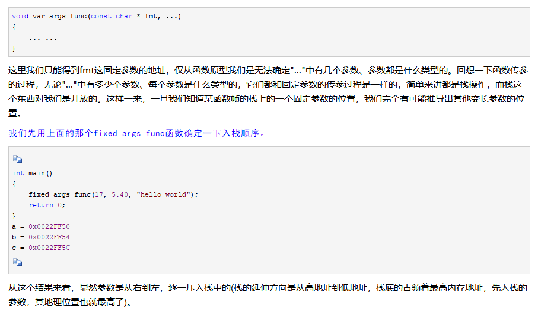


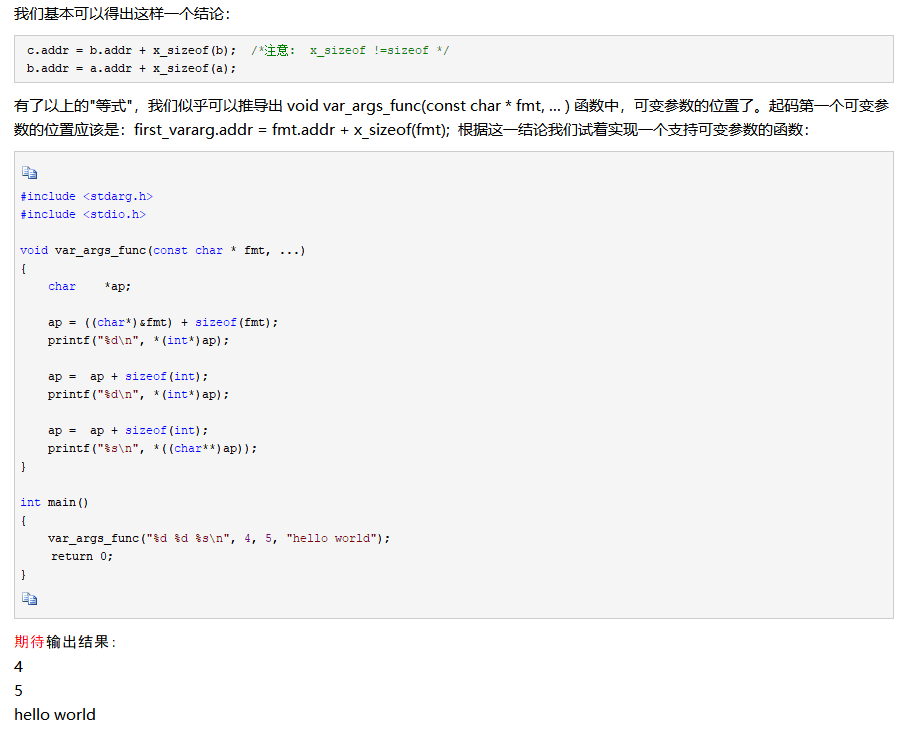

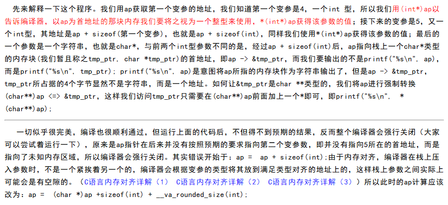

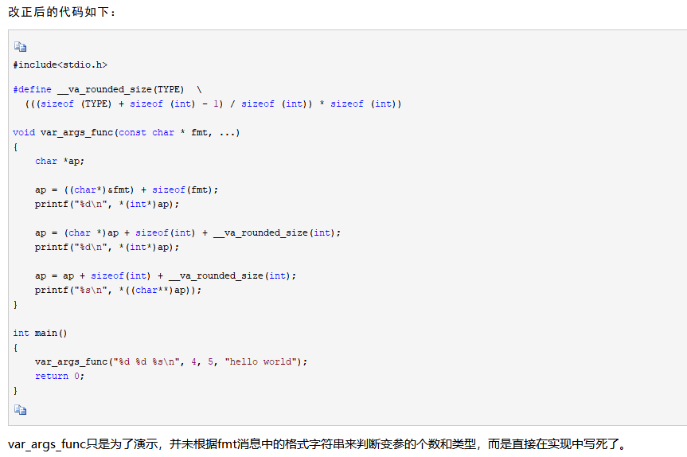


### 参考链接

<https://www.cnblogs.com/cpoint/p/3368993.html>


## 总结
